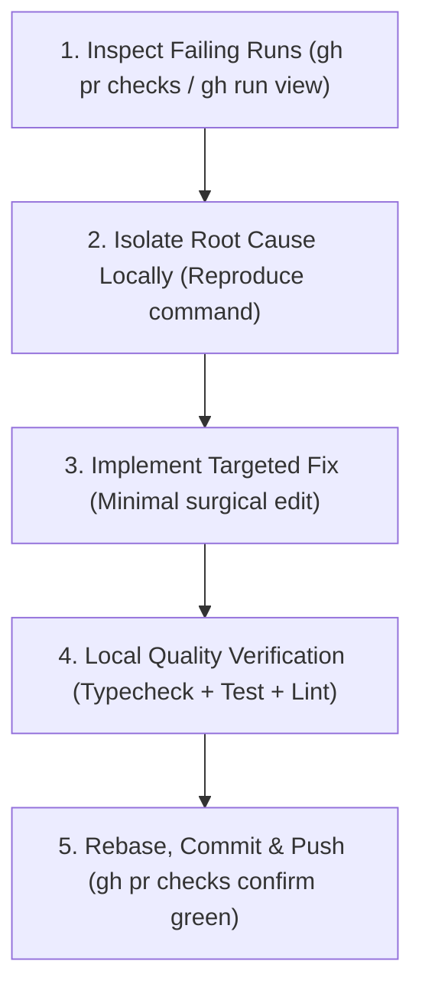

# CI/CD Doctor

## Overview
A systematic diagnosis and remediation guide for GitHub Actions CI/CD failures, CodeQL security findings, and multi-package monorepo test gates.

## When to Use
- Pull Request has failing GitHub Actions checks (`gh pr checks <id>` shows red `X`).
- ESLint reports static analysis errors (e.g. `react-hooks/set-state-in-effect`).
- CodeQL security analysis raises alert annotations (e.g. `Uncontrolled data used in path expression`).
- Monorepo subproject tests or Python `pytest` / `ruff` checks fail in CI.

## Core Operational Workflow



---

## 🛠️ Common CI Failure Categories & Fixes

### 1. ESLint React 19 Hook Violations
- **Symptom:** `error: Calling setState synchronously within an effect can trigger cascading renders (react-hooks/set-state-in-effect)`
- **Root Cause:** Calling `setState` or calling a synchronous fetch wrapper directly inside the body of `useEffect`.
- **Fix:** Refactor `useEffect` to use an asynchronous inner function with an `isMounted` guard:
  ```tsx
  useEffect(() => {
    let isMounted = true;
    async function loadData() {
      try {
        const res = await fetch('/api/endpoint');
        if (res.ok && isMounted) {
          const data = await res.json();
          setState(data);
        }
      } catch {
        // Fallback handling
      }
    }
    loadData();
    return () => { isMounted = false; };
  }, []);
  ```

### 2. CodeQL Path Traversal / Uncontrolled Input
- **Symptom:** `CodeQL / Uncontrolled data used in path expression (CWE-22 / CWE-73)`
- **Root Cause:** Using `process.env.HOME` or request parameters directly in `path.join()`.
- **Fix:** Anchor paths strictly with `path.resolve` and verify prefix containment:
  ```ts
  const baseHome = path.resolve(os.homedir());
  const targetDir = path.resolve(baseHome, '.app', 'data');
  if (!targetDir.startsWith(baseHome)) {
    throw new Error('Path traversal detected');
  }
  ```

### 3. Git Push Rejection on CI Branch
- **Symptom:** `error: failed to push some refs (Updates were rejected because the remote contains work)`
- **Root Cause:** GitHub Actions or bot commits updated the remote branch.
- **Fix:** Always pull with rebase before pushing:
  ```bash
  git pull --rebase origin <branch-name>
  git push origin <branch-name>
  ```

---

## 🛑 Red Flags & Rationalization Table

| Excuse / Rationalization | Technical Reality |
|---|---|
| "CI is just flaky, I will re-run the job" | Genuine failures indicate non-deterministic code or missing environment variables. Investigate the failure log first. |
| "I'll disable the ESLint rule with `eslint-disable`" | Disabling rules masks performance regressions and cascading re-renders. Fix the underlying React lifecycle. |
| "Tests pass on my local machine so CI error is invalid" | CI runs with clean environments and strict node versions. Align local node/pnpm versions and test serially. |

---

## 🧪 Verification Commands

Before pushing any CI fix, execute the full local validation pipeline:
```bash
# Web Dashboard
cd apps/sak_agent_dashboard
pnpm run lint
pnpm tsc --noEmit
pnpm test
pnpm run build

# Python Core
cd ../..
uv run ruff check .
uv run pytest tests/
```
