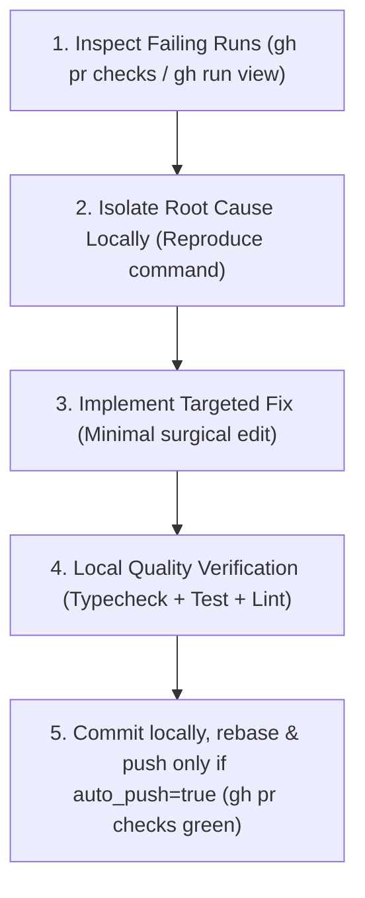

# CI/CD Doctor

## Overview
A systematic diagnosis and remediation guide for GitHub Actions CI/CD failures, CodeQL security findings, and multi-package monorepo test gates.

## When to Use
- Pull Request has failing GitHub Actions checks (`gh pr checks <id>` shows red `X`).
- ESLint reports static analysis errors (e.g. `react-hooks/set-state-in-effect`).
- CodeQL security analysis raises alert annotations (e.g. `Uncontrolled data used in path expression`).
- Monorepo subproject tests or Python `pytest` / `ruff` checks fail in CI.

## Configuration

This skill reads per-project settings from `.claude/ci-cd-doctor.local.md` (YAML
frontmatter, gitignored — not committed). **Before triaging, read that file. If
the file is absent, use the defaults shown below. If `enabled` is `false`, skip
this skill entirely (quick-exit) and do not triage.**

```yaml
---
enabled: true                                  # master toggle; false = skip this skill entirely
auto_push: false                              # false (default) = commit locally, do NOT push or open a PR
verification_suites: ["dashboard", "python"]   # which verification blocks to run
---
```

| Field | Default | Meaning |
|---|---|---|
| `enabled` | `true` | When `false`, skip this skill's guidance entirely (quick-exit). |
| `auto_push` | `false` | Controls Step 5. `false` (default): commit the fix locally and report it for owner review — do **not** push or open a PR (this repo requires a non-author approval to merge; an agent auto-pushing is out of bounds). `true`: rebase, push, and confirm `gh pr checks` is green. |
| `verification_suites` | `["dashboard", "python"]` | Selects which blocks to run in the Verification Commands section. Set `["python"]` for a Python-only project, `["dashboard"]` for dashboard-only. |

**Parsing (`jq` is not installed in this repo):** extract a field from the
frontmatter with `grep`/`sed`, stripping any inline `# comment` and surrounding
whitespace/quotes (the example frontmatter above carries inline comments), e.g.
`grep '^auto_push:' .claude/ci-cd-doctor.local.md | sed 's/^[^:]*: *//; s/#.*//; s/[[:space:]]*$//; s/^"//; s/"$//'`
→ `false`. Treat a missing file or any parse error as "use defaults."

## Core Operational Workflow



---

> **Step 5 respects `auto_push`** (see Configuration): when `auto_push` is `false`
> (the default), commit the fix locally and report it for owner review — do **not**
> push or open a PR. When `true`, rebase, push, and confirm `gh pr checks <id>` is green.

## 🛠️ Common CI Failure Categories & Fixes

### 1. ESLint React 19 Hook Violations
- **Symptom:** `error: Calling setState synchronously within an effect can trigger cascading renders (react-hooks/set-state-in-effect)`
- **Root Cause:** Calling `setState` or calling a synchronous fetch wrapper directly inside the body of `useEffect`.
- **Fix:** Refactor `useEffect` to use an asynchronous inner function with an `isMounted` guard:
  ```tsx
  useEffect(() => {
    let isMounted = true;
    async function loadData() {
      try {
        const res = await fetch('/api/endpoint');
        if (res.ok && isMounted) {
          const data = await res.json();
          setState(data);
        }
      } catch {
        // Fallback handling
      }
    }
    loadData();
    return () => { isMounted = false; };
  }, []);
  ```

### 2. CodeQL Path Traversal / Uncontrolled Input
- **Symptom:** `CodeQL / Uncontrolled data used in path expression (CWE-22 / CWE-73)`
- **Root Cause:** Using `process.env.HOME` or request parameters directly in `path.join()`.
- **Fix:** Anchor paths strictly with `path.resolve` and verify prefix containment
  with a **path-boundary** check. A bare `startsWith` is a substring test, not a
  path check — it is fooled by a sibling directory like `/home/user-evil` when
  `baseHome` is `/home/user`, so it must not be used on attacker-controlled input:
  ```ts
  const baseHome = path.resolve(os.homedir());
  const targetDir = path.resolve(baseHome, '.app', 'data');
  if (targetDir !== baseHome && !targetDir.startsWith(baseHome + path.sep)) {
    throw new Error('Path traversal detected');
  }
  ```

### 3. Git Push Rejection on CI Branch
- **Symptom:** `error: failed to push some refs (Updates were rejected because the remote contains work)`
- **Root Cause:** GitHub Actions or bot commits updated the remote branch.
- **Fix:** Always pull with rebase before pushing:
  ```bash
  git pull --rebase origin <branch-name>
  git push origin <branch-name>
  ```

---

## 🛑 Red Flags & Rationalization Table

| Excuse / Rationalization | Technical Reality |
|---|---|
| "CI is just flaky, I will re-run the job" | Genuine failures indicate non-deterministic code or missing environment variables. Investigate the failure log first. |
| "I'll disable the ESLint rule with `eslint-disable`" | Disabling rules masks performance regressions and cascading re-renders. Fix the underlying React lifecycle. |
| "Tests pass on my local machine so CI error is invalid" | CI runs with clean environments and strict node versions. Align local node/pnpm versions and test serially. |

---

## 🧪 Verification Commands

Before pushing any CI fix, execute the full local validation pipeline — run only the blocks whose names appear in `verification_suites` (see Configuration; default is both). `dashboard` runs the `# Web Dashboard` block; `python` runs the `# Python Core` block. These mirror `.github/workflows/ci.yml` and `subprojects.yml` so a local "green" tracks CI — running a subset can produce a false green:
```bash
# Web Dashboard  (mirrors subprojects.yml: lint → typecheck → test → build)
cd apps/sak_agent_dashboard
pnpm install --frozen-lockfile   # once, on a fresh checkout
pnpm lint
pnpm typecheck
pnpm test
pnpm build

# Python Core  (mirrors ci.yml: ruff → mypy/bandit → pytest)
cd ../..
uv run ruff check personas/sakthai/sakthai tests
uv run ruff format --check personas/sakthai/sakthai tests
uv run mypy personas/sakthai/sakthai
uv run bandit -c pyproject.toml -r personas/sakthai/sakthai
uv run pytest tests/ -m "not integration" -q
```
