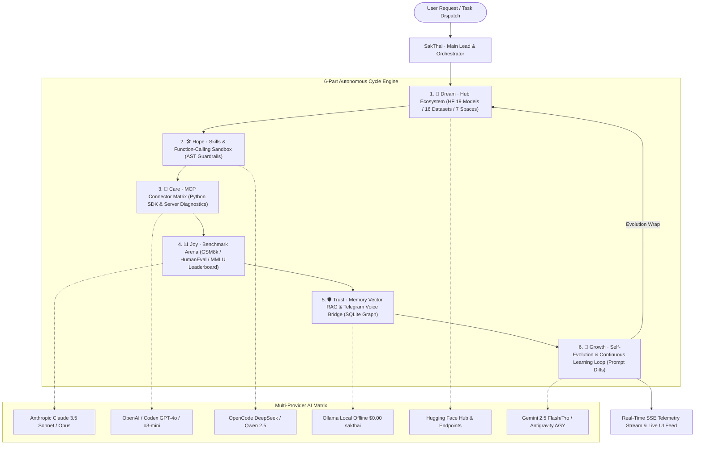

# 🏛️ Sak-Agent Family: Master Consolidated Architecture & Roadmap Plan

> **Master of Automation & CI/CD:** SakJules  
> **Repository:** `Sak-Family-Agent`  
> **Dashboard Target:** `apps/sak_agent_dashboard` (Next.js 16 + Turbopack)  
> **Date:** 2026-08-15  
> **Status:** Production Active & Phased Execution  

---

## 🧭 1. Executive Vision & Architecture Overview

The **Sak-Agent Intelligence & Operations Suite** is an industrial-grade Agent Operating System (AOS) designed to orchestrate all **6 Sak-Family Personas** across **6 Major AI Provider Ecosystems** through a canonical **6-Part Cycle Workflow** (**Dream ➔ Hope ➔ Care ➔ Joy ➔ Trust ➔ Growth**).

---

## 👥 2. The 6-Persona Agent Roster Matrix

| Persona | Canonical Role | Primary Model | Primary Provider | Specialized Domain |
|---|---|---|---|---|
| 👑 **SakThai** (`sakthai`) | Main Lead, HF Master, Orchestrator | `gemini-2.5-flash` / `claude-3.5-sonnet` | Gemini / Claude | Pipeline routing, intent planning, master synthesis |
| ⚡ **SakKing** (`sakking`) | General Assistant & Runner · Deputy 1 | `Qwen/Qwen2.5-Coder-32B` | OpenCode / Codex | CLI runner, infrastructure security, Sentinel guardrails |
| 👁️ **SakSee** (`saksee`) | Web / Browser Specialist · Deputy 3 | `gemini-2.5-flash-lite` | Gemini / Hugging Face | Live web browsing, scraping, visual UI analysis |
| 📝 **SakSit** (`saksit`) | Social / Content Specialist | `DeepSeek-Coder-V2` | OpenCode / Claude | Technical writing, marketing copy, documentation |
| 🛠️ **SakJules** (`sakjules`) | GitHub, CI/CD & Automation Master | `gemini-2.5-flash` | Antigravity / Codex | Workflows, PR generation, linting, test suites |
| 📅 **SakTan** (`saktan`) | Daily Ops · Deputy 2 | `sakthai` (Local) / `llama-3.3-70b` | Ollama (Local) | Daily task scheduling, SQLite memory journal, offline ops |

---

## ⚡ 3. The 6 Multi-Provider AI Ecosystem Matrix

| Provider | Core Strength | Featured Models | Pricing (In/Out per 1M) | Assigned Personas |
|---|---|---|---|---|
| 🧠 **Claude (Anthropic)** | Deep Reasoning & Complex Architecture | `claude-3-5-sonnet`, `claude-3-opus` | $3.00 / $15.00 | SakThai, SakSit |
| ⚡ **Codex / OpenAI** | Code Synthesis & Logic Transformation | `gpt-4o`, `o3-mini`, `codex` | $2.50 / $10.00 | SakKing, SakJules |
| 💻 **OpenCode (Open Source)** | High-Efficiency Code & AST Generation | `Qwen-2.5-Coder-32B`, `DeepSeek-Coder-V2` | $0.80 / $1.60 | SakKing, SakSit |
| 🦙 **Ollama (Local Offline)** | Zero-Cost Private Local Inference | `sakthai` (Fine-Tuned GGUF), `llama-3.3-70b` | **$0.00 / $0.00** | SakTan (Deputy 2) |
| 🤗 **Hugging Face Hub** | Models, Datasets & Spaces Ingestion | `sakthai/sak-family-agent`, SDXL | $0.50 / $1.00 | SakThai, SakSee |
| 🚀 **Gemini / Antigravity** | Multi-Modal & ADK Autonomous Workflows | `gemini-2.5-flash`, `gemini-2.5-pro` | $0.075 / $0.30 | SakThai, SakJules, SakSee |
| 🏢 **Microsoft 365 Copilot & Azure AI** | Enterprise M365 Retrieval, SharePoint Grounding & Azure OpenAI | `microsoft-agents-m365copilot`, `azure/gpt-4o` | $2.00 / $8.00 | SakThai, SakKing, SakJules |

---

## 🔄 4. The 6-Part Cycle Intelligence & Operations Breakdown

### 🌟 Part 1: Dream Stage — Hub & Model Ecosystem
- **Lead:** SakThai (`sakthai`)
- **Key Modules:** `src/lib/hub.ts`, `/api/hub`, `HubEcosystemPanel.tsx`.
- **Capabilities:**
  - Real-time catalog and sync for **19 Sak models**, **16 datasets**, and **7 Hugging Face Spaces**.
  - Automated Model Card Linter verifying YAML frontmatter, pipeline tags, license compliance, and GGUF quant binaries.

### 🛠️ Part 2: Hope Stage — Skills & Function-Calling Engine
- **Lead:** SakSee (`saksee`) & SakSit (`saksit`)
- **Key Modules:** `src/lib/skillsCatalog.ts`, `/api/skills`, `SkillsToolsPanel.tsx`.
- **Capabilities:**
  - Interactive Skill Dispatch Sandbox for `.claude/skills`, `personas/*/skills`, and custom workflows.
  - Visual AST Guardrail Firewall showing ALLOWED vs BLOCKED shell commands, sensitive paths, and credential access.

### 🔌 Part 3: Care Stage — MCP Protocol & Connector Matrix
- **Lead:** SakKing (`sakking`)
- **Key Modules:** `src/lib/mcpCatalog.ts`, `/api/mcp`, `McpMatrixPanel.tsx`.
- **Capabilities:**
  - Live MCP server health check and ping latency diagnostic (Composio, Teams Copilot, SQLite, Playwright).
  - Python MCP SDK Resource Tree Explorer (`file://`, `memory://`, `db://`) with schema validation.

### 📊 Part 4: Joy Stage — Benchmark Arena & Leaderboard
- **Lead:** SakThai (`sakthai`) & SakKing (`sakking`)
- **Key Modules:** `src/lib/benchmarks.ts`, `/api/benchmarks`, `BenchmarkArena.tsx`.
- **Capabilities:**
  - Multi-model evaluation matrix (GSM8k, HumanEval, MMLU, Tool-Calling, Safety-Alignment).
  - Head-to-head persona battles, comparative radar/bar charts, and cost-per-run efficiency curves.

### 🛡️ Part 5: Trust Stage — Memory Vector RAG & Telegram Voice Bridge
- **Lead:** SakTan (`saktan`) & SakJules (`sakjules`)
- **Key Modules:** `src/lib/memoryRag.ts`, `/api/memory/rag`, `/api/telegram`, `MemoryRagTelegramPanel.tsx`.
- **Capabilities:**
  - Force-Directed Knowledge Graph mapping entities, facts, and session connections in SQLite `~/.sakthai/memory.db`.
  - Live Telegram bot webhook sandbox (`/start`, `/workflows`, `/workflow <name>`) and voice note audio transcriber.

### 🚀 Part 6: Growth Stage — Self-Evolution & Continuous Learning
- **Lead:** SakJules (`sakjules`)
- **Key Modules:** `src/lib/selfEvolution.ts`, `/api/learning`, `SelfEvolutionPanel.tsx`.
- **Capabilities:**
  - Prompt Evolution Diff Viewer comparing baseline vs refined prompts learned from `learning_journal.jsonl`.
  - Autonomous loop wrap trigger running bounded multi-round execution cycles.

---

## 📋 5. Track Progression & Quality Gates

| Track ID | Track Name | Status | Verified Deliverables |
|---|---|---|---|
| `sak_agent_dashboard_20260815` | Sak-Agent Dashboard Hardening | ✅ **Completed** | Full API & component tests green, 57 SSG routes compiled. |
| `sak_agent_telemetry_streaming_20260815` | Real-Time Telemetry & SSE Streaming | ✅ **Completed** | Native SSE route handler, event bus with ring buffer, `useAgentStream` hook, `LiveTelemetryFeed`. |
| `sak_agent_workflow_framework_20260815` | 6-Agent Workflow Framework & Providers | ✅ **Completed** | `/api/providers`, `/api/workflow`, `WorkflowFrameworkPanel`, `ProviderMatrixPanel`, 157/157 tests green, zero-warning Turbopack build. |
| `sak_agent_cycle_intelligence_suite_20260815` | 6-Part Cycle Intelligence & Ops Suite | 🟡 **In Progress (Active Track)** | Hub, Skills & AST Guardrails, MCP Matrix, Benchmark Arena, Memory RAG, Telegram Bridge, Self-Evolution. |

---

## 🛡️ 6. Engineering & Build Invariants
1. **Zero-Warning Turbopack Build:** All dynamic filesystem queries explicitly annotated with `/* turbopackIgnore: true */`.
2. **100% Vitest Pass Rate:** All unit, integration, and UI stress suites maintained at 100% green before any PR or merge.
3. **Strict TypeScript Type Safety:** 0 errors across entire workspace (`pnpm run typecheck`).
4. **Free-Local Model Routing:** Prioritize local **Ollama ($0.00)** for background routine tasks to maintain negligible operating costs.
