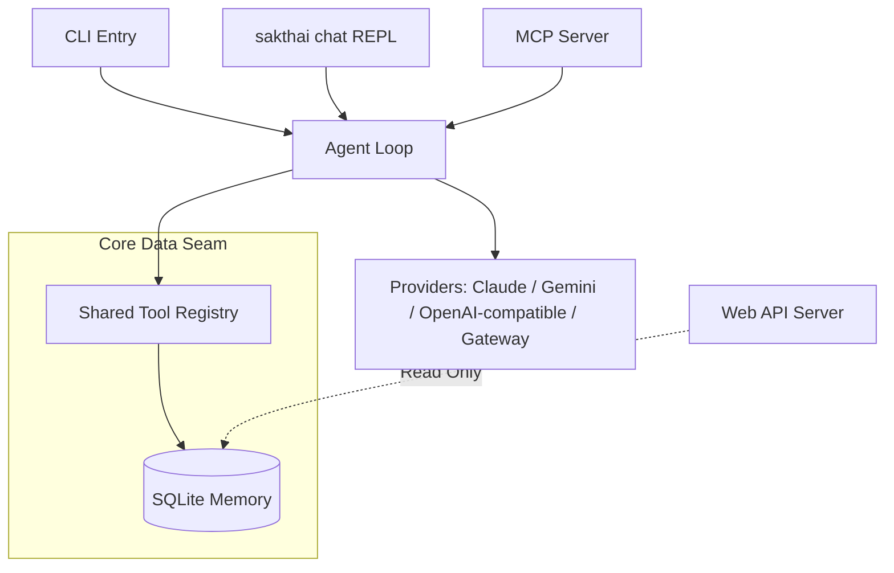

# House of Sak 🤖👨‍👩‍👧‍👦

[](https://github.com/beer-sakthai/Sak-Family-Agent/actions/workflows/ci.yml)


Welcome to the **House of Sak** — a personal AI agent ecosystem, built with purpose and resilience. This project, formerly known as Sak-Family-Agent (v2.0), is a local-first, privacy-conscious AI environment: a multi-persona family of agents sharing one tool registry and one persistent SQLite memory.

---

## 📖 The Origin Story: April 15th

This project began on **April 15th** — the day I tried to end my life. What followed was three days in the ICU and three weeks in the hospital. I was a Thai guy living in Cork, having lost my job, my direction, and my reason to get out of bed.

But in the quiet of that hospital bed, staring at beige walls, I decided I wasn't finished yet. I taught myself to build AI agents from scratch, on a laptop, in a shelter, using free credits because I couldn't afford anything else. This journey, born from rock bottom, became the **House of Sak**.

I'm sharing this not for sympathy, nor to sell anything. I share it for anyone in Cork, or anywhere, who might be reading this at 3 AM, feeling lost. If I can build an entire AI agent ecosystem from a shelter with no money, you can find your way through whatever you're facing. Rock bottom isn't the end of the story; it can be the beginning of a new one.

If you're struggling, please reach out. In Cork, Pieta House, the Samaritans, or the Cork Mental Health services helped me. They'll help you too.

— Beer

---

## 📊 Project Status

```text
🧠 Memory subsystem      ██████████ 100%   stable — WAL store, sync, backup, consolidate
🤖 Agent loop            ██████████ 100%   stable — 4 provider families, tool dispatch
🔌 MCP server + client   ██████████ 100%   stable — inbound stdio server, outbound merge
💬 Chat REPL             █████████░  90%   active — 6 personas, rich rendering
🖥️ CLI                   ██████████ 100%   stable — memory, skills, cycle, sessions, hf
📦 Sandbox runner        █████████░  90%   stable — Docker, memory.db-only mount
📲 Telegram bot          ████████░░  80%   deployed — /workflow commands via VM units
📊 Dashboard             ███░░░░░░░  30%   API-only — KPI backend, no frontend bundle
🧬 Self-evolution        ██████░░░░  60%   experimental — DSPy/GEPA, standalone package
🧪 Test coverage         █████████▓ 98.3%  70 hermetic test files (floor: 95%)
```

**Current cycle stage:** 🌱 Dream → Hope → Care → Joy → Trust → Growth — check live with `sakthai cycle status`

---

## 🏡 What is the House of Sak?

The **House of Sak** is more than a collection of AI agents; it's a testament to resilience and a framework for personal growth. It's an ecosystem of specialized AI companions, each with a unique persona and purpose, designed to assist with life, work, and creative endeavors. They aren't mere chatbots — they build, check code, run infrastructure, and tell stories, all inside a local-first, privacy-conscious environment.

---

## ✨ Key Features

- 🔒 **Local-First & Privacy Conscious:** Operates entirely within a hermetic Python environment — no forced cloud runtimes, no cloud sync.
- 💬 **Interactive Chat (`sakthai chat`):** A multi-turn REPL with any of the six Sak Family personas — identity loaded from the persona's `SOUL.md`, turns rendered with `rich`, history threaded across the session.
- 🧠 **Shared Persistent Memory:** A robust SQLite WAL store (`~/.sakthai/memory.db`) provides durable facts and observations across all agent sessions — export/import, backup, deduplication, consolidation, and git/HTTP multi-agent sync.
- 👨‍👩‍👧‍👦 **Multi-Persona Ecosystem:** Six specialized agents (the "Sak Family") via overlay `SOUL.md` profiles, sharing one unified core.
- 🔄 **Provider Agnostic:** Anthropic (Claude), Google (Gemini), OpenAI-compatible/Ollama endpoints, and AI gateways (OpenRouter/LiteLLM/Vercel/Cloudflare via `gateway`), auto-detected or forced via CLI.
- 🔌 **MCP Native, Both Directions:** An integrated JSON-RPC 2.0 stdio MCP server exposes the core tool registry, and `sakthai run` connects *out* to external MCP servers, merging their tools into the registry (namespaced `<server>__<tool>`).
- 🛠️ **10 Built-in Tools:** `learn`, `ingest_document`, `capture_lead`, `recall`, `search`, `forget`, `read_file`, `run_command`, `send_telegram_message`, `run_agent_loop` — defined once in `agent/tools.py`, available identically in the agent loop and over MCP.
- 🌱 **6-Stage Cycle:** A persisted state machine — **Dream → Hope → Care → Joy → Trust → Growth** — guiding agent workflows.
- 📦 **Sandboxed Execution:** `sakthai run --sandbox` re-executes a task inside a Docker container (`Dockerfile.sandbox`) with only `memory.db` bind-mounted; file reads are path-restricted and shell access is opt-in via `SAKTHAI_SHELL_ALLOW`.
- 🗜️ **Token Compression:** `--caveman lite|full|ultra|wenyan-*` applies a compression skill to cut token spend on any run or chat.

---

## 👨‍👩‍👧‍👦 The Sak Family Agents

The **House of Sak** operates through a family of specialized agent personas, each with a unique identity defined by their personal `SOUL.md`. These profiles dictate their intent, emotional readiness, and operational behavior.

| Agent | Role | Focus Area |
| :--- | :--- | :--- |
| 🤗 **SakThai** | Lead & Orchestrator | Main Lead of the House & Master of Hugging Face — guides overall direction, mastery via Hub/MCP tools. |
| 👑 **SakKing** | General Assistant | Runner, Email, Message & General Assistant; Self-Healing & Web UI/UX Specialist; owns all skills (superset of the family's skillset). |
| 🌐 **SakSee** | Web Specialist | Browser automation (Playwright), deep web research, and UI testing. |
| 📣 **SakSit** | Social Master | Content strategy, communication, and social synthesis. |
| 🗓️ **SakTan** | Daily Ops & Financial Analyst | Life administration, scheduling, family operations, plus market analysis, budgeting, and financial observations. |
| 🤖 **SakJules** | Automation/CI | CI/CD workflows, testing, infrastructure, and strict orchestration. |

> *The ecosystem also includes **ServiceQuoteBot**, a dedicated business scaffold for quote generation and lead capture workflows, under `services/servicequotebot/`.*

### 📚 The Skills Library — 877 skills

Each persona maintains its own curated skill tree under `personas/<name>/skills/` (byte-identical shared skills live in `personas/shared/skills/`, plus 31 curated reference skills in `library/`):

```text
👑 SakKing   ██████████ 355 skills  (includes its rollup of the other five personas)
🤗 SakThai   █████░░░░░ 175 skills
📣 SakSit    ████░░░░░░ 156 skills
🗓️ SakTan    ██░░░░░░░░  82 skills
🤖 SakJules  ██░░░░░░░░  57 skills
🌐 SakSee    █░░░░░░░░░  52 skills
```

Skill trees are integrated into an agent's active registry on boot or composition via `scripts/compose_persona.py`, alongside the core intelligence.

---

## 📂 Repository Layout

```text
Sak-Family-Agent/
├── personas/                     # The six Sak Family personas + shared overlay
│   ├── sakthai/sakthai/          #   ★ The installable core package ("sakthai")
│   │   ├── config.py             #     Paths & env-var names (single source of truth)
│   │   ├── auth.py               #     Credential resolution (API key → token → CLI OAuth)
│   │   ├── sandbox.py            #     Docker sandbox backing `run --sandbox`
│   │   ├── skills.py             #     SKILL.md discovery, parsing, prompt injection
│   │   ├── agent/                #     run_agent() loop, chat REPL, tools, providers
│   │   ├── memory/               #     MemoryStore (only SQLite access), backup, sync
│   │   ├── mcp/                  #     Inbound stdio server + outbound client/manager
│   │   ├── cli/                  #     Click commands (agent, chat, memory, skills, …)
│   │   ├── cycle/                #     Dream→Hope→Care→Joy→Trust→Growth state machine
│   │   ├── learn/                #     One-shot fact capture
│   │   ├── extensions/           #     Git-based skill/MCP bundle installer
│   │   ├── telegram/             #     Standalone polling bot (/workflow commands)
│   │   └── web/                  #     HTTP API server (/api/stages, /api/ecosystem)
│   ├── <name>/                   #   Each persona: SOUL.md identity + skills/ tree
│   ├── shared/skills/            #   Skills byte-identical across all six personas
│   └── sakthai/agent-self-evolution/  # DSPy/GEPA self-evolution (standalone package)
├── tests/                        # Hermetic pytest suite (no network, 98.3% coverage)
├── library/                      # 31 curated reference skills in 11 categories
├── docs/                         # Architecture, capabilities, runtimes, SOUL.md, plans
├── scripts/                      # compose_persona.py, export_agent_repo.py, rename_skills.py
├── dashboard/                    # Vite + Tailwind standalone web dashboard project
├── product/                      # Business strategy, monetization, MVP plans (PLAN.md)
├── infra/                        # vm-agents (Telegram bot deploys), pw-poc, training space
├── services/                     # Service pitches/specs (HF dataset publishing, quote bot)
├── training/                     # Hugging Face Jobs fine-tune + model-serving scripts
├── evaluation_tasks/             # Agent evaluation task definitions
├── data/                         # Sample memory exports (JSONL/CSV)
├── assets/                       # Images and branding
├── .github/workflows/            # CI (ci.yml, pylint.yml), CodeQL, SonarCloud, labeler, …
├── .jules/                       # Jules automation/CI helper config
├── .gitleaks.toml                # Secret-scanning config (allowlists persona docs)
├── pyproject.toml / uv.lock      # Build config, deps (uv-managed, locked for CI)
├── Makefile                      # compose-personas, export-agent-repos, mutation, …
├── Dockerfile.sandbox            # Image for `sakthai run --sandbox`
├── CHANGELOG.md / SECURITY.md    # Release history and security policy
├── CLAUDE.md / AGENTS.md / GEMINI.md  # Per-assistant contributor guidance
└── ONBOARDING.md / PLAN.md       # Contributor onboarding and working plan
```

---

## 🔍 Deep Dive: Technical Architecture

The architecture is designed around a single shared intelligence seam, the `MemoryStore`, with parallel entry points and interchangeable agent personas.

### 🚪 Runtime Entry Points

One package, several ways in — all sharing the same memory at `~/.sakthai/memory.db` (override the root with `SAKTHAI_HOME`):

1. **CLI** — `sakthai <cmd>`: memory, skills, sessions, cycle, extensions, eval, HF Hub, and system commands.
2. **Interactive chat** — `sakthai chat [--persona sakking|sakthai|saksee|saksit|saktan|sakjules]`: a multi-turn REPL; `/exit` or Ctrl+D ends the session.
3. **Agent loop** — `sakthai run "<task>"`: a one-shot tool-using loop against any supported provider.
4. **MCP server** — `sakthai mcp`: serves the same tools over JSON-RPC stdio to IDEs and other agents.
5. **Web API** — `python -m sakthai.web.server`: HTTP endpoints (`/api/stages`, `/api/ecosystem`).

### 🌊 Core Data Flow



### 🧠 Core Philosophy & Design Rules

- **Go through the seams:** All SQLite access strictly passes through `MemoryStore` (`personas/sakthai/sakthai/memory/`); all agent/MCP actions route via the tool registry (`agent/tools.py`).
- **Tailored expertise:** Each persona maintains its own purpose-built skill tree under `personas/<name>/skills/`, avoiding a bloated shared library.
- **Hermetic tests:** The suite (`tests/`) runs without network calls or external credentials, relying on injected clients and stores.

### 🧩 Key Subsystems

1. **The Engine (`agent/`):** A robust agent loop that auto-detects and selects providers (Anthropic, Google, OpenAI-compatible/Ollama, or an AI gateway) at runtime, plus the `chat` REPL (`agent/chat.py`).
2. **The Cycle (`cycle/`):** The operational heartbeat — a 6-stage persisted state machine (**Dream → Hope → Care → Joy → Trust → Growth**).
3. **Standardized entry points:** the CLI (`cli/`) for direct developer interaction, and the MCP server (`mcp/`) exposing the whole memory + tool ecosystem over JSON-RPC 2.0 stdio, with the outbound MCP client merging external servers' tools into the local registry.

*(Package paths are relative to `personas/sakthai/sakthai/`.)*

### 🎭 Persona Overlay System

The House of Sak is dynamically generated. `make compose-personas` merges the core agent framework with persona-specific `SOUL.md` profiles and their curated skill trees. For complete isolation, `make export-agent-repos` materializes them as standalone repository snapshots.

---

## 🚀 Getting Started

Ensure you have Python 3.11+ and `uv` installed.

1. **Clone the repository:**
   ```bash
   git clone https://github.com/beer-sakthai/Sak-Family-Agent.git
   cd Sak-Family-Agent
   ```
2. **Set up environment variables:**
   ```bash
   cp .env.example .env
   # Set required keys such as ANTHROPIC_API_KEY or GEMINI_API_KEY
   ```
3. **Sync all dependencies:**
   ```bash
   uv sync --all-extras
   ```
4. **Validate the setup:**
   ```bash
   uv run sakthai setup      # validate .env and required env vars
   uv run sakthai doctor     # report environment + memory health
   ```

---

## 🛠️ Common Commands

| Task | Command |
|------|---------|
| 💬 Chat with a persona | `uv run sakthai chat --persona sakthai\|sakking\|saksee\|saksit\|saktan\|sakjules` |
| 🤖 Run the agent | `uv run sakthai run "your task" --provider anthropic\|google\|openai\|ollama\|gateway` |
| ⚡ Run (fast, skip cycle) | `uv run sakthai run "task" --fast` |
| 🆓 Validate setup for free | `uv run sakthai run "task" --dry-run` (resolves provider/creds/model/tools, no API call) |
| 📦 Run in a Docker sandbox | `uv run sakthai run "task" --sandbox` |
| 🧠 Save a fact | `uv run sakthai learn "fact" (--kind --key --tag)` |
| 🔎 Search memory | `uv run sakthai recall "query"` / `uv run sakthai memory search` |
| 📋 Inspect memory | `uv run sakthai memory show` / `uv run sakthai memory stats` |
| 🧹 Maintain memory | `uv run sakthai memory export\|import\|backup\|consolidate\|deduplicate\|healthcheck` |
| 🔁 Sync memory (multi-agent) | `uv run sakthai memory sync\|pull` |
| 🔌 Serve MCP | `uv run sakthai mcp` |
| 🌐 Web API server | `uv run python -m sakthai.web.server` |
| 🌱 The 6-stage cycle | `uv run sakthai cycle status\|next\|set\|list` |
| 📚 Skills | `uv run sakthai skills list\|show\|validate\|create\|sync-sakking` |
| 🗂️ Past sessions | `uv run sakthai sessions list\|show\|export` |
| 🧩 Extensions (git bundles) | `uv run sakthai extensions add\|list\|remove` |
| 📈 Eval / MLOps metrics | `uv run sakthai eval` |
| 🤗 Hugging Face Hub | `uv run sakthai hf info\|download <repo_id>` |
| 🩺 System health | `uv run sakthai doctor` / `uv run sakthai status` / `uv run sakthai setup` / `uv run sakthai tools` |
| 🧪 Test suite | `uv run pytest tests/ -q` |
| 🧼 Lint / format / types | `uv run ruff check personas/sakthai/sakthai tests` · `uv run ruff format --check personas/sakthai/sakthai tests` · `uv run mypy personas/sakthai/sakthai` |
| 🔐 Security scan | `uv run bandit -c pyproject.toml -r personas/sakthai/sakthai` |

---

## 🔑 Key Environment Variables

- `ANTHROPIC_API_KEY` — Claude authentication for `sakthai run` / `chat` / `mcp` (falls back to `ANTHROPIC_AUTH_TOKEN`, then the Claude CLI OAuth token).
- `GEMINI_API_KEY` / `GOOGLE_API_KEY` — Gemini provider API key (falls back to the Gemini CLI OAuth token).
- `GEMINI_HOME` — Overrides the `~/.gemini` root for OAuth token lookup.
- `OPENAI_API_KEY` — Key for OpenAI-compatible endpoints (defaults to `nokey`).
- `OPENAI_API_BASE` / `OPENAI_BASE_URL` — Base URL for an OpenAI-compatible endpoint.
- `SAKTHAI_GATEWAY_URL` / `SAKTHAI_GATEWAY_API_KEY` — OpenAI-compatible AI gateway (OpenRouter/LiteLLM/Vercel/Cloudflare); setting the URL enables the `gateway` provider.
- `SAKTHAI_HOME` — Overrides the `~/.sakthai` root (memory db, sessions, extensions).
- `SAKTHAI_READ_ALLOW` / `SAKTHAI_SHELL_ALLOW` — Widens `read_file` paths / enables `run_command`.
- `SAKTHAI_MCP_TIMEOUT` — Seconds to wait for an external MCP server reply (default 30).
- `TELEGRAM_BOT_TOKEN`, `TELEGRAM_CHAT_ID` — For the `send_telegram_message` tool and the Telegram bot.
- `OLLAMA_HOST` — Local Ollama server address (defaults to `http://127.0.0.1:11434`).

---

*Built with ❤️ for **Beer** by the Sak Family. All Rights Reserved (© 2026).*
