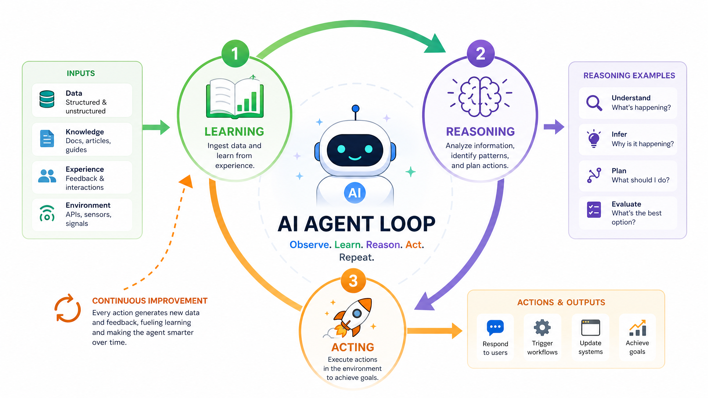
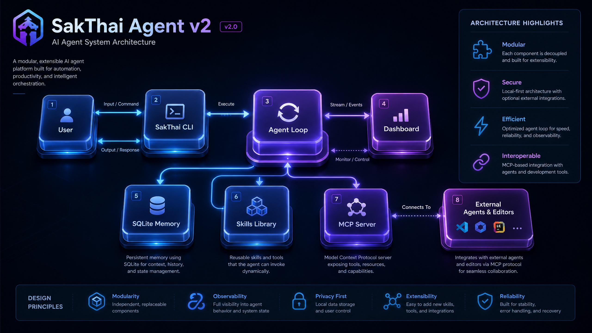

<div align="center">

# 🧠 House of Sak 


**A local-first personal learning agent with persistent memory.**
One package, three ways in — a CLI, a tool-using agent loop, and an MCP stdio server.

<!-- 📡 Live status bar -->
[](https://github.com/beer-sakthai/sakthai-agent-v2/actions/workflows/ci.yml)
[](https://github.com/beer-sakthai/sakthai-agent-v2/actions/workflows/pylint.yml)
[](https://github.com/beer-sakthai/sakthai-agent-v2/actions/workflows/pages.yml)

[](https://www.python.org/)
[](https://github.com/beer-sakthai/sakthai-agent-v2/actions/workflows/ci.yml)
[](https://modelcontextprotocol.io)
[](LICENSE)
[](https://github.com/beer-sakthai/sakthai-agent-v2/commits/main)

</div>

> SakThai gives a **Claude**, **Gemini**, or **local (Ollama / OpenAI-compatible)** model a
> durable **SQLite memory** it reads and writes across sessions, a shared **tool registry**,
> a curated **skills catalog**, and a two-way **MCP** bridge — so the same memory and tools
> are reachable from other agents and editors. **Local-first**, with a fully **no-cost** local run.

---

## 📑 Table of contents

- [✨ Highlights](#-highlights)
- [🗂️ Monorepo layout](#️-monorepo-layout)
- [🚀 Quick start](#-quick-start)
- [🔌 Providers & no-cost local run](#-providers--no-cost-local-run)
- [⚙️ Runtimes](#️-runtimes)
- [🔗 MCP (both directions)](#-mcp-both-directions)
- [📚 Skills](#-skills)
- [🛠️ Built-in tools](#-built-in-tools)
- [💻 Commands](#-commands)
- [👩‍💻 Develop](#-develop)
- [🤝 Family agents](#-family-agents)
- [📁 Repository layout](#-repository-layout)
- [📖 Documentation](#-documentation)
- [📝 License](#-license)

---

## ✨ Highlights

- 🧩 **Persistent memory** — a SQLite store of *facts* (things you tell it) and *observations*
  (things it concludes): substring search, tagging, WAL concurrency, additive migrations,
  dedupe/consolidation, and multi-agent sync (Git JSONL merge + HTTP backup).
  See [`docs/architecture.md`](./docs/architecture.md).

  

- 🤖 **Provider-agnostic agent loop** — `sakthai run "<task>"` drives a tool-using loop over
  **Anthropic (Claude)**, **Google (Gemini)**, or any **OpenAI-compatible / Ollama** endpoint —
  including a fully **no-cost local run**.

  

- 🛠️ **8 built-in tools** — one registry powers both the agent loop and the MCP server.
- 📚 **Skills catalog** — **31 curated library skills** across 11 categories plus
  **69 user/extension skills**, injected into the system prompt on demand.
- 🔗 **MCP, both directions** — *serve* SakThai's tools to other agents (`sakthai mcp`),
  and *consume* external MCP servers (namespaced `<server>__<tool>`).
- 👑 **Sak Family Agents** — **SakKing** leads & orchestrates **SakThai**, **SakSee**, **SakSit**
  (consolidated here, history-preserved). See [SakKing integration](#-sakking-integration-local-no-cost).
- 🔄 **6-stage cycle** — a lightweight Dream → Hope → Care → Joy → Trust → Growth state machine
  persisted in memory and mirrored by the `sakthai-cycle-*` skills.
- 📊 **Dashboard** — `sakthai dashboard` serves a Streamlit view of the store (KPIs, memory
  explorer, sessions, cycle).



---

## 🗂️ Monorepo layout

This repository is the **source workspace** for the Sak family. It contains the
shared core plus the six persona overlays, and it can **export standalone repo
snapshots** for each persona into `build/agent-repos/<persona>/` with
`make export-agent-repos`.

```
.
├── sakthai/  library/  skills/   # the SakThai agent package (root, this README)
├── packages/
│   └── agent-self-evolution/     # DSPy/GEPA self-evolution tool (standalone Python pkg)
├── personas/
│   ├── shared/skills/            # skill library shared by all six personas (deduped, once)
│   └── {sakking,sakthai,saksee,saksit,saktan,sakjules}/   # per-persona SOUL.md + config + skill overlay
├── build/agent-repos/<persona>/   # export target for standalone agent repos
├── infra/
│   ├── hermes-agents/            # Hermes Telegram-bot config backup (no secrets)
│   └── pw-poc/                   # Playwright tab-order/accessibility probe (npm)
└── scripts/compose_persona.py    # rebuild a persona's full skill tree (shared + overlay)
```

- 👑 **Personas** are the **Sak Family Agents**: **SakKing** is the main (Lead & Orchestrator,
  Master of Code & Self-Healing), and **SakThai**, **SakSee**, **SakSit**, **SakTan**, and
  **SakJules** are the family it coordinates. *"Hermes" is only the framework they run on,
  never an agent's name.* The shared skill library now lives once under
  `personas/shared/skills/`, with each persona keeping only its unique files. Use
  `scripts/export_agent_repo.py <persona> --out ...` or `make export-agent-repos` when you want
  a standalone repo snapshot. See [`personas/README.md`](./personas/README.md) and the root
  [`SOUL.md`](./SOUL.md); see [`infra/hermes-agents/README.md`](./infra/hermes-agents/README.md)
  for full Telegram-bot deployment.
- 📦 **`packages/agent-self-evolution`** targets a different runtime (Nous Research's Hermes) with
  a heavy, disjoint dependency set, so it is **not** a uv workspace member — build it on its own
  per its README. The root `uv.lock` stays scoped to the SakThai agent.
- ✅ CI (`ci.yml`, `pylint.yml`) lints/types/tests only the `sakthai` core; the co-located trees
  carry their own quality bars.

---

## 🚀 Quick start

```bash
# Python >=3.11. Preferred: uv (CI uses uv + uv.lock for reproducible installs).
uv sync --all-extras
# or: pip install -e ".[all]"     # dev + dashboard extras

cp .env.example .env              # fill in ANTHROPIC_API_KEY (or use a local model — see below)
sakthai doctor                    # check environment + memory health
sakthai learn "prefers dark mode" --kind pref --key ui
sakthai recall "dark"             # search facts + observations
sakthai run "summarise my notes"  # standalone tool-using agent loop
```

All runtimes share `~/.sakthai/memory.db` (override the root with `SAKTHAI_HOME`).

---

## 🤝 Family agents

The repo tracks six personas end to end, each with a distinct role and personality:

| Agent | Role | Portrait |
|---|---|---|
| **SakKing** | Lead & Orchestrator · Master of Code |  |
| **SakThai** | Master of Hugging Face |  |
| **SakSee** | Master of Web |  |
| **SakSit** | Master of Social Media |  |
| **SakTan** | Daily Ops Helper |  |
| **SakJules** | GitHub Repository Steward | |


The canonical profile source for the family lives under `infra/hermes-agents/profiles/`, and
`personas/` contains the consolidated skill trees and overlays used by the repo.

---

## 🔌 Providers & no-cost local run

The agent loop is provider-agnostic. The provider is auto-detected from the model name and
available credentials; override with `--provider`.

| Provider | Models | Auth |
|----------|--------|------|
| 🟪 `anthropic` | Claude (default `claude-opus-4-8`) | `ANTHROPIC_API_KEY`, `ANTHROPIC_AUTH_TOKEN`, or Claude CLI OAuth |
| 🔵 `google` | Gemini | `GEMINI_API_KEY` / `GOOGLE_API_KEY`, or Gemini CLI OAuth |
| ⚪ `openai` | any OpenAI-compatible gateway (vLLM, LocalAI, …) | `OPENAI_API_BASE` / `OPENAI_BASE_URL` + `OPENAI_API_KEY` (defaults `nokey`) |
| 🟢 `ollama` | local models via Ollama | none — `OLLAMA_HOST` (default `http://127.0.0.1:11434`) |

**💸 No-cost local run** (no API key, nothing leaves the machine):

```bash
ollama run qwen2.5-coder:7b          # start a local model (one-time)
sakthai run "refactor this script" --provider ollama --model qwen2.5-coder:7b
```


> ℹ️ Ollama is reached at the IPv4 literal `127.0.0.1` on purpose — on hosts where `localhost`
> resolves to IPv6 `::1` but Ollama binds IPv4 only, `localhost` would give `Connection refused`.

---

## ⚙️ Runtimes

One package, three entry points (full detail in [`docs/runtimes.md`](./docs/runtimes.md)):

1. 💻 **CLI** — `sakthai <cmd>` (see [Commands](#-commands)).
2. 🤖 **Agent loop** — `sakthai run "<task>"` drives the provider-agnostic tool-using loop,
   injecting memory and any active skills into the system prompt. Useful flags: `--provider`,
   `--model`, `--with-skills <name>` (repeatable), `--no-mcp`, `--fast` (skip cycle overhead),
   `--verbose`, and `--dry-run` (preflight, **no API call**).
3. 🔗 **MCP server** — `sakthai mcp` serves the same tools over JSON-RPC stdio (protocol
   `2024-11-05`), so editors and other agents share one memory.

---

## 🔗 MCP (both directions)

SakThai speaks the Model Context Protocol **in both directions**. Deep dive:
[`docs/plugins.md`](./docs/plugins.md) and [`docs/integrations.md`](./docs/integrations.md).

### 📥 Inbound — serve SakThai to other agents

`sakthai mcp` exposes the built-in tools over JSON-RPC stdio, reusing the exact same
`BUILTIN_TOOLS` registry as the agent loop (identical behaviour on both surfaces). Register it
with any MCP client, e.g. Claude CLI (`~/.claude/config.json`) or Gemini CLI:

```json
{
  "mcpServers": {
    "sakthai": { "command": "sakthai", "args": ["mcp"] }
  }
}
```

### 📤 Outbound — consume external MCP servers

During `sakthai run`, SakThai auto-loads external MCP servers from `~/.sakthai/mcp.json`
(standard `mcpServers` shape, Claude-Desktop-compatible), merges their tools into the registry
namespaced as `<server>__<tool>`, and fails soft if a server won't start. Pass `--no-mcp` to disable.

```json
{
  "mcpServers": {
    "github": {
      "command": "npx",
      "args": ["-y", "@modelcontextprotocol/server-github"],
      "env": { "GITHUB_PERSONAL_ACCESS_TOKEN": "your-token-here" }
    }
  }
}
```

### 👑 SakKing integration (local, no cost)

SakThai and the **SakKing** agent (installed at `~/.sakking`) interoperate over **local MCP
stdio** — a subprocess JSON-RPC channel with **no network and zero API/cloud cost**.

- **SakKing → SakThai** (already wired by SakKing): SakKing registers `sakthai mcp` in its
  `~/.sakking/config.yaml` and calls SakThai's memory tools.
- **SakThai → SakKing**: add SakKing to `~/.sakthai/mcp.json` and its conversation / messaging
  tools appear in the agent loop as `sakking__*`:

  ```json
  {
    "mcpServers": {
      "sakking": { "command": "sakking", "args": ["mcp", "serve"] }
    }
  }
  ```

- **Mirror SakKing-learned skills** into this repo as first-class `sakthai-` skills:

  ```bash
  sakthai skills sync-sakking            # import learned skills into skills/
  sakthai skills sync-sakking --dry-run  # preview changes (idempotent)
  ```

> 💡 The MCP link itself is free; SakThai's own *reasoning* still uses whatever provider you pick —
> pair the SakKing link with a local Ollama model (above) for an end-to-end no-cost setup.

---

## 📚 Skills

A *skill* is a directory with a `SKILL.md` (YAML frontmatter + markdown body) that gets injected
into the agent's system prompt when active. SakThai ships:

- 📗 **`library/`** — curated skills across 11 categories: `agent`, `automation`, `coding`,
  `devops`, `learning`, `llm`, `memory`, `observability`, `research`, `safety`, `security`.
- 📘 **`skills/`** — user/extension skills (the `sakthai-*` set, including the
  `sakthai-cycle-*` stages and skills mirrored from SakKing).

```yaml
---
name: my-skill
category: coding
description: One-line summary of what this skill does
version: "1.0"
platforms: [linux, macos, windows]   # host OSes the skill supports
metadata:
  sakthai:
    tags: [python, testing]
    related_skills: [other-skill]
---

Skill body goes here — injected into the system prompt when the skill is active.
```

Manage skills with `sakthai skills list|show|validate|create|sync-sakking`, and activate them
for a run with `sakthai run "<task>" --with-skills my-skill`.

---

## 🛠️ Built-in tools

The same **8-tool** registry (`sakthai/agent/tools.py`) powers both `sakthai run` and
`sakthai mcp`. Add a tool once and it appears on both surfaces.

| Tool | What it does | Notes |
|------|--------------|-------|
| 🧠 `learn` | Save a fact (value, kind, key) | The agent's write path into memory |
| 🔎 `recall` | List recent facts + top observations | Read what's already known |
| 🔍 `search` | Substring search over facts + observations | Targeted lookup |
| 🗑️ `forget` | Delete a fact by id | — |
| 📄 `read_file` | Read a local text file | Sandboxed to cwd + `~/.sakthai` + `SAKTHAI_READ_ALLOW`; 20k-char cap |
| 💲 `run_command` | Run a CLI command (no shell) | **Opt-in** via `SAKTHAI_SHELL_ALLOW`; 20k-char cap |
| 📨 `send_telegram_message` | Send a Telegram message | Needs `TELEGRAM_BOT_TOKEN` + `TELEGRAM_CHAT_ID` |
| 🔁 `run_agent_loop` | Delegate a whole task to SakThai's agent loop | MCP-only (filtered out of the in-loop set to avoid recursion) |

---

## 💻 Commands

```bash
sakthai doctor                       # report environment + memory health
sakthai setup                        # validate .env and required env vars
sakthai status | tools               # quick status; list agent/MCP tools
sakthai learn "prefers dark mode"    # save a fact
sakthai recall "dark"                # search facts + observations
sakthai memory show|stats|search|export|import|backup|consolidate|deduplicate
sakthai run "summarise my notes"     # provider-agnostic agent loop
sakthai mcp                          # serve memory tools over MCP stdio
sakthai cycle status|next|set|list   # the 6-stage cycle
sakthai skills list|show|validate|create|sync-sakking
sakthai sessions list|show|export    # inspect session logs
sakthai dashboard                    # Streamlit view of the store

# 🧰 Monorepo development shortcuts
make test                            # run pytest suite (via uv)
make lint                            # run ruff linters (via uv)
make deploy-hermes                   # deploy hermes configs and restart local services
make doctor-hermes                   # validate hermes YAML configs
make compose-personas                # rebuild persona skill trees into build/
```

---

## 👩‍💻 Develop

Mirrors `.github/workflows/ci.yml` (run before pushing; **green CI is the bar for `main`**).
Coverage floor is **85 %**. The hermetic suite is **41 test files** (no network, no GCP).

```bash
make lint                                # run ruff check
make test                                # run the hermetic test suite
```

### 🪝 Pre-commit hooks

---

## 📁 Repository layout

```
.
├── assets/                         # Images for README and documentation
├── bin/                            # Executable scripts
├── dashboard/                      # Streamlit dashboard source code
├── data/                           # Data files and configurations
├── docs/                           # Project documentation
├── infra/                          # Infrastructure related files
├── library/                        # Core library skills
├── packages/                       # Standalone Python packages
├── personas/                       # Persona definitions and skill overlays
├── sakthai/                        # Main SakThai agent source code
├── scripts/                        # Utility scripts
├── services/                       # External service integrations
├── skills/                         # User and extension skills
├── tests/                          # Test suite
└── training/                       # Training related files
```

---

## 📖 Documentation

Comprehensive documentation is available in the `docs/` directory, covering architecture, runtimes, plugins, and integrations.

---

## 📝 License

This project is licensed under the MIT License - see the [LICENSE](LICENSE) file for details.
