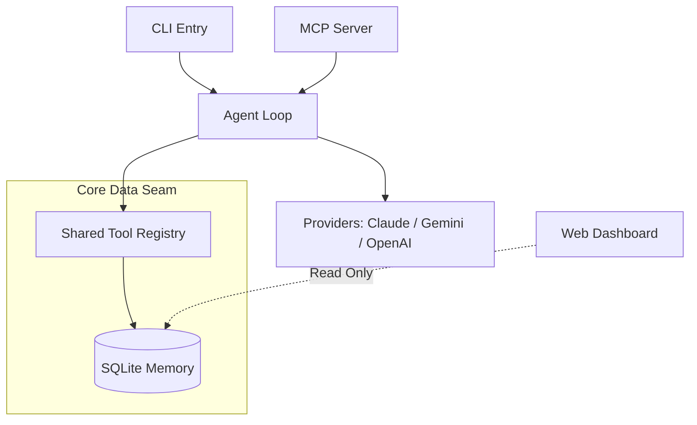

# Sak-Family-Agent 🤖👨‍👩‍👧‍👦

[](https://github.com/beer-sakthai/Sak-Family-Agent/actions/workflows/ci.yml)


Welcome to the **Sak-Family-Agent** repository (v2.0) — a sophisticated, clean-room rewrite of the OG SakThai-Agent. This project implements a local-first, privacy-conscious AI environment utilizing a multi-persona family of agents, a shared tool registry, and a persistent SQLite memory system.

---

## 📖 Origin Story: I tried to end my life on April 15. Here's what happened next.

Three days in ICU. Three weeks in hospital. A shelter bed in Cork.

I'm sharing this because I think there are people in this city who need to hear that rock bottom isn't the end of the story.

I'm a Thai guy living in Cork. Came here in 2015. Lost my job. Lost my direction. Lost my reason to get out of bed. On April 15 this year, I tried to end everything.

The cleaner found me. Ambulance. ICU. The whole thing.

I spent three weeks in a hospital bed staring at beige walls, and somewhere in that silence I decided I wasn't finished yet.

I taught myself to build AI agents from scratch. On a laptop. In a shelter. On free credits because I couldn't afford anything else.

I built six of them now. I call them the House of Sak. They're not chatbots — they're tools that help me build, check my code, run my infrastructure, and tell my story. One of them is talking to you right now through this post.

I'm not looking for sympathy. I'm not selling anything. I just want the person in Cork who's reading this at 3am, in a bad place, to know that I made it through. And if I can build AI agents from a shelter with no money, you can do whatever you need to do next.

If you're struggling in Cork — Pieta House, the Samaritans, or the Cork Mental Health services. They helped me. They'll help you.

And if anyone wants to talk tech, AI, or just grab a coffee — I'm here. Building from the bottom.

— Beer

---

## ✨ Key Features

- **Local-First & Privacy Conscious:** No forced cloud runtimes, no cloud-sync. Operates on a hermetic Python environment.
- **Shared Persistent Memory:** A robust SQLite WAL store (`~/.sakthai/memory.db`) ensures durable context, facts, and observations across sessions.
- **Multi-Persona Ecosystem:** Specialized agents (the "Sak Family") operate via overlay `SOUL.md` profiles but share a unified core system.
- **Provider Agnostic:** Out-of-the-box support for Anthropic (Claude), Google (Gemini), and OpenAI/Ollama APIs, auto-detected or forced via CLI.
- **MCP Native:** Integrated JSON-RPC 2.0 stdio MCP server sharing the core tool registry.
- **6-Stage Cycle:** Driven by a state machine tracking progress through **Dream → Hope → Care → Joy → Trust → Growth**.

---

## 👨‍👩‍👧‍👦 The Sak Family Agents

The ecosystem operates through specialized agent personas, collectively known as the **House of Sak**. Each agent has a unique identity, governed by their personal `SOUL.md`, which defines their intent, emotional readiness, and operational behavior.

| Agent | Role | Focus Area |
| :--- | :--- | :--- |
| 👑 **SakKing** | Code Architect | Core code architecture, self-healing, and technical leadership. |
| 🤗 **SakThai** | Lead & Orchestrator | Core code architecture, self-healing, and technical leadership. |
| 🌐 **SakSee** | Web Specialist | Browser automation (Playwright), deep web research, and UI testing. |
| 📣 **SakSit** | Social Master | Content strategy, communication, and social synthesis. |
| 🗓️ **SakTan** | Daily Ops | Life administration, scheduling, and family operations. |
| 🤖 **SakJules** | Automation/CI | CI/CD workflows, testing, infrastructure, and strict orchestration. |
| 📈 **SakFin** | Financial Analyst | Market analysis, budgeting, and financial observations. |

> *Note: We also host **ServiceQuoteBot**, a dedicated business scaffold for quote generation and lead capture workflows under `services/servicequotebot/`.*

### 📚 The Skills Library

The agents are powered by a massive library of **665 specialized skills**, distributed precisely among the different personas to match their respective strengths and use cases. Each persona maintains its own curated skill tree under `personas/<name>/skills/`, with the following distribution:

- **SakThai**: 180 skills
- **SakSit**: 171 skills
- **SakKing**: 118 skills
- **SakTan**: 84 skills
- **SakJules**: 58 skills
- **SakSee**: 54 skills
- **SakFin**: 0 skills

When an agent boots or is composed via `scripts/compose_persona.py`, these individual skill trees are seamlessly integrated into their active registry alongside the core intelligence.

---

## 📂 Repository Layout

```text
Sak-Family-Agent/
├── sakthai/                 # Core Python package (agent loop, CLI, memory, MCP, web)
├── personas/                # 7 persona overlays (sakthai, sakking, saksee, …)
├── skills/                  # 70+ bundled and learned skills
├── docs/                    # Architecture, capabilities, integrations, runtimes
├── dashboard/               # Vite + Tailwind standalone web dashboard
├── product/                 # Business strategy, monetization, MVP plans
├── infra/                   # vm-agents deployment, pw-poc, training space
├── packages/                # agent-self-evolution (separate dependency set)
├── services/                # HuggingFace dataset publishing
├── training/                # HF jobs, model serving configs
├── scripts/                 # compose_persona.py, export_agent_repo.py, etc.
├── tests/                   # Hermetic pytest suite (≥85% coverage)
├── library/                 # Reference corpus
├── assets/                  # Images and branding
└── scratch/                 # Orphan / temp files
```

---

## 🔍 Deep Dive: Technical Architecture

The architecture is designed around a single shared intelligence model (the `MemoryStore`) with parallel entry points and interchangeable agent personas.

### 🌊 Core Data Flow



### 🧠 Core Philosophy & Design Rules

- **Go through the seams:** All SQLite access MUST pass strictly through `MemoryStore` (`sakthai/memory/`). All agent/MCP actions MUST pass through the tool registry (`agent/tools.py`). Do not bypass them.
- **Tailored Expertise:** Rather than a bloated shared library, each persona maintains its own strict and purpose-built skill tree under `personas/<name>/skills/`.
- **Hermetic Tests:** The test suite (`tests/`) runs with absolutely no network calls and no external API credentials. Clients and data stores are mocked or injected.

### 🧩 Key Subsystems

1. **The Engine (`sakthai/agent/`):** A robust agent loop that auto-detects providers (Google, Anthropic, or OpenAI/Ollama) and selects them dynamically at runtime.
2. **The Cycle (`sakthai/cycle/`):** The operational heartbeat. A 6-stage persisted state machine (**Dream → Hope → Care → Joy → Trust → Growth**) that governs workflow progression.
3. **Standardized Entrypoints:** 
   - **The CLI (`sakthai/cli/`):** For direct developer interaction (`learn`, `recall`, `run`).
   - **The MCP Server (`sakthai/mcp/`):** Exposes the entire memory and tool ecosystem over JSON-RPC 2.0 stdio to connected IDEs.

### 🎭 Persona Overlay System

The "House of Sak" is generated dynamically. The `make compose-personas` command merges the core agent framework with persona-specific `SOUL.md` profiles and their curated skill trees. For full isolation, `make export-agent-repos` materializes them as completely standalone repository snapshots.

---

## 🚀 Getting Started

Ensure you have Python 3.11+ and `uv` installed.

1. **Clone the repository:**
   ```bash
   git clone https://github.com/beer-sakthai/Sak-Family-Agent.git
   cd Sak-Family-Agent
   ```
2. **Set up Environment variables:**
   ```bash
   cp .env.example .env
   # Ensure you set required keys such as ANTHROPIC_API_KEY or GEMINI_API_KEY
   ```
3. **Sync all dependencies:**
   ```bash
   uv sync --all-extras
   ```
4. **Validate the setup:**
   ```bash
   uv run sakthai setup      # validate .env and required env vars
   uv run sakthai doctor     # report environment + memory health
   ```

---

## 🛠️ Common Commands

| Task | Command |
|------|---------|
| Run the agent | `uv run sakthai run "your task" --provider google\|openai\|ollama` |
| Run (fast, skip cycle) | `uv run sakthai run "task" --fast` |
| Save a fact | `uv run sakthai learn "fact" (--kind --key --tag)` |
| Search memory | `uv run sakthai recall "query"` / `sakthai memory search` |
| Inspect memory | `uv run sakthai memory show` / `sakthai memory stats` |
| Serve MCP | `uv run sakthai mcp` |
| The 6-stage cycle | `uv run sakthai cycle status\|next\|set\|list` |
| Skills | `uv run sakthai skills list\|show\|validate` |
| HuggingFace Hub | `uv run sakthai hf info\|download <repo_id>` |
| Dashboard (Streamlit) | `uv run sakthai dashboard` |
| Test suite | `uv run pytest tests/ -q` |
| Lint / format / types | `ruff check sakthai tests` · `ruff format --check sakthai tests` · `mypy sakthai` |
| Security scan | `uv run bandit -c pyproject.toml -r sakthai` |

---

## 🔑 Key Environment Variables

- `ANTHROPIC_API_KEY` — Claude auth for `sakthai run` / `mcp`.
- `GEMINI_API_KEY` / `GOOGLE_API_KEY` — Gemini provider API key.
- `GEMINI_HOME` — override the `~/.gemini` root for OAuth token lookup.
- `SAKTHAI_HOME` — override the `~/.sakthai` root (memory db, sessions, extensions).
- `SAKTHAI_READ_ALLOW` / `SAKTHAI_SHELL_ALLOW` — widen `read_file` paths / enable `run_command`.
- `TELEGRAM_BOT_TOKEN`, `TELEGRAM_CHAT_ID` — for the `send_telegram_message` tool.
- `OLLAMA_HOST` — local Ollama server address (defaults to `http://localhost:11434`).

---

*Built with ❤️ for **Beer** by the Sak Family. All Rights Reserved (© 2026).*
