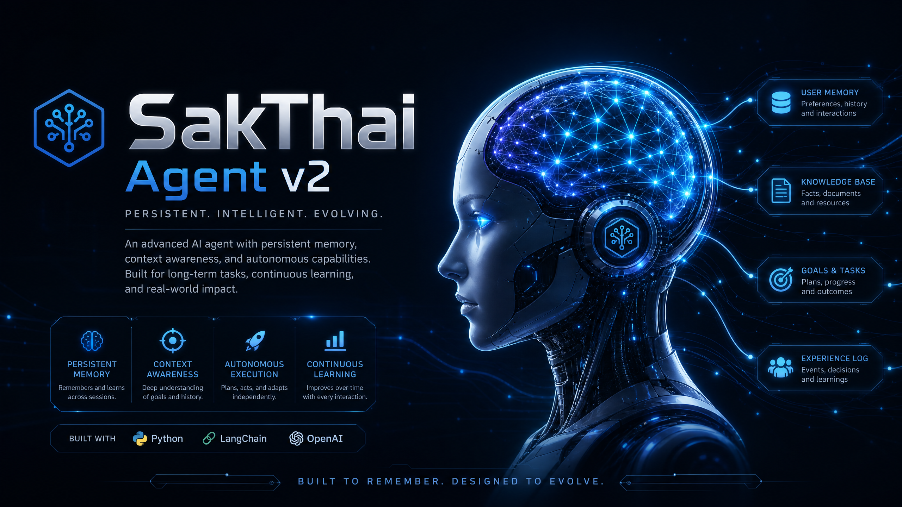

# 🧠 House of Sak: The Personal AI Ecosystem

<div align="center">



**A local-first, memory-augmented agent family for deep learning and automation.**

[](https://www.python.org/)
[](https://opensource.org/licenses/MIT)
[](https://modelcontextprotocol.io)
[](https://github.com/beer-sakthai/Sak-Family-Agent/actions)

</div>

---

## 🌟 The Vision

**House of Sak** is not just a single bot; it is a **coordinated family of personal AI agents** designed to assist Beer ([@beer-sakthai](https://github.com/beer-sakthai)) across every facet of digital life. Grounded in a **local-first philosophy**, the ecosystem prioritizes privacy, persistent memory, and cost-effective intelligence.

Every agent in the family shares a **Supermemory**—a durable SQLite brain that stores facts, preferences, and observations across sessions. Whether you are coding with **SakKing** or browsing the web with **SakSee**, the family remembers what matters.

---

## 👑 The Sak Family Roster

The ecosystem consists of six specialized personas, each with a distinct role, model preference, and "Soul."

| Agent | Persona | Primary Role | Model / Provider |
| :--- | :--- | :--- | :--- |
| **SakKing** | 👑 Lead | Orchestrator & Master of Code | `qwen3-coder` (Ollama) |
| **SakThai** | 🤗 Specialist | Master of Hugging Face & AI Research | `claude-3.5-sonnet` |
| **SakSee** | 🌐 Explorer | Master of Web & Browser Automation | `llama3` (Local) |
| **SakSit** | 📣 Social | Master of Social Media & Content | `qwen` (Local) |
| **SakTan** | 🗓️ Helper | Daily Ops, Calendar & Life Admin | `gemini-1.5-flash` |
| **SakJules** | 🤖 DevOps | Master of Automation & CI/CD | `gemini-1.5-pro` |

> [!TIP]
> All agents share the same memory at `~/.sakthai/memory.db`. Improvements made by one agent are instantly available to the entire family.

---

## 🏗️ Core Architecture

### 🧠 Persistent Supermemory
Unlike standard LLM chats, House of Sak uses a **SQLite-backed memory store**.
- **Facts**: Explicitly learned information ("Beer prefers dark mode").
- **Observations**: Inferred conclusions from interactions.
- **Sync**: Multi-agent synchronization via Git JSONL and HTTP backups.

### 🤖 Provider-Agnostic Loop
The `sakthai run` command initiates a tool-using loop that works across:
- **Anthropic (Claude)**
- **Google (Gemini)**
- **OpenAI / OpenAI-Compatible**
- **Local (Ollama)** — Enabling a **100% no-cost** local execution.

### 🔗 Model Context Protocol (MCP)
The ecosystem acts as both an **MCP Host** and an **MCP Client**.
- **Serve**: Expose SakThai's tools to external editors like Claude Dev or Cursor.
- **Consume**: Plug in external MCP servers (GitHub, Slack, Google Maps) to expand agent capabilities.

---

## 🔄 The 6-Stage Growth Cycle

Every task in the House of Sak follows a lightweight state machine that ensures thoughtful execution and continuous learning:

1.  **Dream** 💭: Conceptualize the goal and high-level plan.
2.  **Hope** ☀️: Define success criteria and identify required tools.
3.  **Care** ❤️: Execute with precision, respecting safety and preferences.
4.  **Joy** ✨: Validate results and celebrate successful completion.
5.  **Trust** 🤝: Verify the outcome with the user or CI systems.
6.  **Growth** 🌱: Extract lessons and update the permanent memory.

---

## 🚀 Getting Started

### Prerequisites
- **Python 3.11+**
- [**uv**](https://github.com/astral-sh/uv) (recommended for dependency management)

### Installation
```bash
# Clone the repository
git clone https://github.com/beer-sakthai/Sak-Family-Agent.git
cd Sak-Family-Agent

# Install dependencies
uv sync --all-extras

# Initialize environment
cp .env.example .env
```

### Basic Usage
```bash
# Check system health
sakthai doctor

# Teach the agent something new
sakthai learn "Beer is working on a new README" --kind project

# Run a task with the agent loop
sakthai run "Summarize my recent project notes"
```

---

## 🗂️ Monorepo Structure

```text
.
├── sakthai/          # Core agent package (Logic, Memory, MCP)
├── personas/         # Persona SOUL files and unique configurations
├── skills/           # The Skills Catalog (Reusable prompt modules)
├── packages/         # Standalone tools (e.g., agent-self-evolution)
├── infra/            # Deployment configs (Telegram/Hermes)
├── docs/             # Deep-dive documentation & architecture
└── assets/           # Diagrams, portraits, and branding
```

---

## 🤝 Contributing

We follow a strict **Operating Contract**. Agents should read `docs/AGENTS.md` and `docs/SOUL.md` before making significant changes to the core logic or persona identities.

## 📝 License

This project is licensed under the **MIT License** - see the [LICENSE](LICENSE) file for details.

---

<div align="center">
Built with ❤️ for Beer by the Sak Family.
</div>
