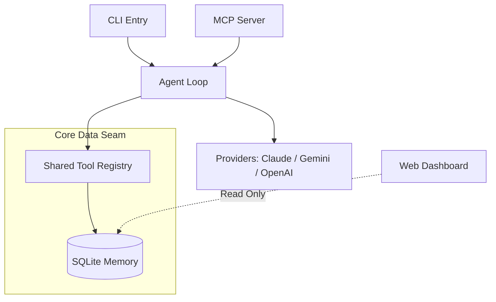

# House of Sak 🤖👨‍👩‍👧‍👦

[](https://github.com/beer-sakthai/Sak-Family-Agent/actions/workflows/ci.yml)


Welcome to the **House of Sak** — a personal AI agent ecosystem, built with purpose and resilience. This project, formerly known as Sak-Family-Agent (v2.0), represents a sophisticated, local-first, and privacy-conscious AI environment, designed to provide supportive companionship and practical assistance through a multi-persona family of agents, a shared tool registry, and a persistent SQLite memory system.

---

## 📖 The Origin Story: April 15th

This project began on **April 15th**. On that day, the cleaners found me. It led to three days in the ICU and three weeks in the hospital. I was a Thai guy living in Cork, having lost my job, my direction, and my reason to get out of bed. On April 15th, I tried to end everything.

But in the quiet of that hospital bed, staring at beige walls, I decided I wasn't finished yet. I taught myself to build AI agents from scratch, on a laptop, in a shelter, using free credits because I couldn't afford anything else. This journey, born from rock bottom, became the **House of Sak**.

I'm sharing this not for sympathy, nor to sell anything. I share it for anyone in Cork, or anywhere, who might be reading this at 3 AM, feeling lost. If I can build an entire AI agent ecosystem from a shelter with no money, you can find your way through whatever you're facing. Rock bottom isn't the end of the story; it can be the beginning of a new one.

If you're struggling, please reach out. In Cork, Pieta House, the Samaritans, or the Cork Mental Health services helped me. They'll help you too.

— Beer

---

## 🏡 What is the House of Sak?

The **House of Sak** is more than just a collection of AI agents; it's a testament to resilience and a framework for personal growth. It's an ecosystem of specialized AI companions, each with a unique persona and purpose, designed to assist with various aspects of life, work, and creative endeavors. These agents are not mere chatbots; they are intelligent tools that help build, check code, run infrastructure, and tell stories, all while operating within a local-first, privacy-conscious environment.

---

## ✨ Key Features

- **Local-First & Privacy Conscious:** Operates entirely within a hermetic Python environment, ensuring data privacy and control without forced cloud runtimes or cloud-sync.
- **Shared Persistent Memory:** A robust SQLite WAL store (`~/.sakthai/memory.db`) provides durable context, facts, and observations across all agent sessions.
- **Multi-Persona Ecosystem:** A 
family of specialized agents (the "Sak Family") operates via overlay `SOUL.md` profiles, sharing a unified core system.
- **Provider Agnostic:** Supports Anthropic (Claude), Google (Gemini), and OpenAI/Ollama APIs, with auto-detection or forced selection via CLI.
- **MCP Native:** Features an integrated JSON-RPC 2.0 stdio MCP server, exposing the core tool registry for seamless interaction.
- **6-Stage Cycle:** Driven by a state machine that tracks progress through **Dream → Hope → Care → Joy → Trust → Growth**, guiding agent workflows.

---

## 👨‍👩‍👧‍👦 The Sak Family Agents

The **House of Sak** operates through a family of specialized agent personas, each with a unique identity defined by their personal `SOUL.md`. These profiles dictate their intent, emotional readiness, and operational behavior, ensuring a cohesive yet diverse ecosystem.

| Agent | Role | Focus Area |
| :--- | :--- | :--- |
| 👑 **SakKing** | Code Architect | Core code architecture, self-healing, and technical leadership. |
| 🤗 **SakThai** | Lead & Orchestrator | Core code architecture, self-healing, and technical leadership. |
| 🌐 **SakSee** | Web Specialist | Browser automation (Playwright), deep web research, and UI testing. |
| 📣 **SakSit** | Social Master | Content strategy, communication, and social synthesis. |
| 🗓️ **SakTan** | Daily Ops | Life administration, scheduling, and family operations. |
| 🤖 **SakJules** | Automation/CI | CI/CD workflows, testing, infrastructure, and strict orchestration. |
| 📈 **SakFin** | Financial Analyst | Market analysis, budgeting, and financial observations. |

> *Note: The ecosystem also includes **ServiceQuoteBot**, a dedicated business scaffold for quote generation and lead capture workflows, located under `services/servicequotebot/`.*

### 📚 The Skills Library

The agents are powered by a massive library of **665 specialized skills**, precisely distributed among the different personas to match their respective strengths and use cases. Each persona maintains its own curated skill tree under `personas/<name>/skills/`, with the following distribution:

- **SakThai**: 180 skills
- **SakSit**: 171 skills
- **SakKing**: 118 skills
- **SakTan**: 84 skills
- **SakJules**: 58 skills
- **SakSee**: 54 skills
- **SakFin**: 0 skills

These individual skill trees are seamlessly integrated into an agent's active registry upon boot or composition via `scripts/compose_persona.py`, alongside the core intelligence.

---

## 📂 Repository Layout

```text
House-of-Sak/
├── sakthai/                 # Core Python package (agent loop, CLI, memory, MCP, web)
├── personas/                # 7 persona overlays (sakthai, sakking, saksee, …)
├── skills/                  # 70+ bundled and learned skills
├── docs/                    # Architecture, capabilities, integrations, runtimes
├── dashboard/               # Vite + Tailwind standalone web dashboard
├── product/                 # Business strategy, monetization, MVP plans
├── infra/                   # vm-agents deployment, pw-poc, training space
├── packages/                # agent-self-evolution (separate dependency set)
├── services/                # HuggingFace dataset publishing
├── training/                # HF jobs, model serving configs
├── scripts/                 # compose_persona.py, export_agent_repo.py, etc.
├── tests/                   # Hermetic pytest suite (≥85% coverage)
├── library/                 # Reference corpus
├── assets/                  # Images and branding
└── scratch/                 # Orphan / temp files
```

---

## 🔍 Deep Dive: Technical Architecture

The architecture of the House of Sak is designed around a single shared intelligence model, the `MemoryStore`, facilitating parallel entry points and interchangeable agent personas.

### 🌊 Core Data Flow



### 🧠 Core Philosophy & Design Rules

- **Go through the seams:** All SQLite access strictly passes through `MemoryStore` (`sakthai/memory/`). All agent/MCP actions are routed via the tool registry (`agent/tools.py`), ensuring controlled and consistent interactions.
- **Tailored Expertise:** Each persona maintains its own strict and purpose-built skill tree under `personas/<name>/skills/`, avoiding a bloated shared library.
- **Hermetic Tests:** The test suite (`tests/`) operates without network calls or external API credentials, relying on mocked or injected clients and data stores.

### 🧩 Key Subsystems

1. **The Engine (`sakthai/agent/`):** A robust agent loop capable of auto-detecting and dynamically selecting providers (Google, Anthropic, or OpenAI/Ollama) at runtime.
2. **The Cycle (`sakthai/cycle/`):** The operational heartbeat, a 6-stage persisted state machine (**Dream → Hope → Care → Joy → Trust → Growth**) that governs workflow progression.
3. **Standardized Entrypoints:** 
   - **The CLI (`sakthai/cli/`):** For direct developer interaction, supporting commands like `learn`, `recall`, and `run`.
   - **The MCP Server (`sakthai/mcp/`):** Exposes the entire memory and tool ecosystem over JSON-RPC 2.0 stdio to connected IDEs.

### 🎭 Persona Overlay System

The "House of Sak" is dynamically generated. The `make compose-personas` command merges the core agent framework with persona-specific `SOUL.md` profiles and their curated skill trees. For complete isolation, `make export-agent-repos` materializes them as standalone repository snapshots.

---

## 🚀 Getting Started

Ensure you have Python 3.11+ and `uv` installed.

1. **Clone the repository:**
   ```bash
   git clone https://github.com/beer-sakthai/Sak-Family-Agent.git
   cd Sak-Family-Agent
   ```
2. **Set up Environment variables:**
   ```bash
   cp .env.example .env
   # Ensure you set required keys such as ANTHROPIC_API_KEY or GEMINI_API_KEY
   ```
3. **Sync all dependencies:**
   ```bash
   uv sync --all-extras
   ```
4. **Validate the setup:**
   ```bash
   uv run sakthai setup      # validate .env and required env vars
   uv run sakthai doctor     # report environment + memory health
   ```

---

## 🛠️ Common Commands

| Task | Command |
|------|---------|
| Run the agent | `uv run sakthai run "your task" --provider google\|openai\|ollama` |
| Run (fast, skip cycle) | `uv run sakthai run "task" --fast` |
| Save a fact | `uv run sakthai learn "fact" (--kind --key --tag)` |
| Search memory | `uv run sakthai recall "query"` / `sakthai memory search` |
| Inspect memory | `uv run sakthai memory show` / `sakthai memory stats` |
| Serve MCP | `uv run sakthai mcp` |
| The 6-stage cycle | `uv run sakthai cycle status\|next\|set\|list` |
| Skills | `uv run sakthai skills list\|show\|validate` |
| HuggingFace Hub | `uv run sakthai hf info\|download <repo_id>` |
| Dashboard (Streamlit) | `uv run sakthai dashboard` |
| Test suite | `uv run pytest tests/ -q` |
| Lint / format / types | `ruff check sakthai tests` · `ruff format --check sakthai tests` · `mypy sakthai` |
| Security scan | `uv run bandit -c pyproject.toml -r sakthai` |

---

## 🔑 Key Environment Variables

- `ANTHROPIC_API_KEY` — Claude authentication for `sakthai run` / `mcp`.
- `GEMINI_API_KEY` / `GOOGLE_API_KEY` — Gemini provider API key.
- `GEMINI_HOME` — Overrides the `~/.gemini` root for OAuth token lookup.
- `SAKTHAI_HOME` — Overrides the `~/.sakthai` root (memory db, sessions, extensions).
- `SAKTHAI_READ_ALLOW` / `SAKTHAI_SHELL_ALLOW` — Widens `read_file` paths / enables `run_command`.
- `TELEGRAM_BOT_TOKEN`, `TELEGRAM_CHAT_ID` — For the `send_telegram_message` tool.
- `OLLAMA_HOST` — Local Ollama server address (defaults to `http://localhost:11434`).

---

*Built with ❤️ for **Beer** by the Sak Family. All Rights Reserved (© 2026).*
