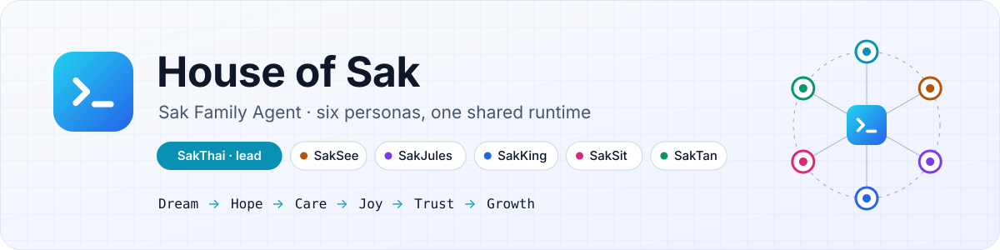
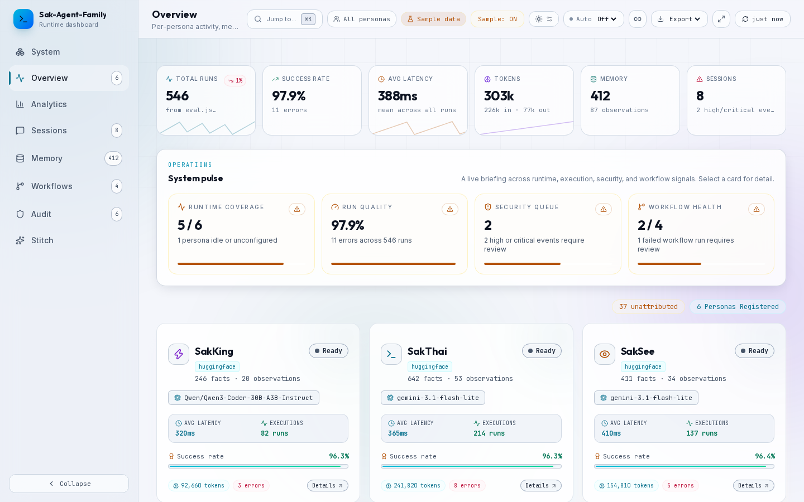
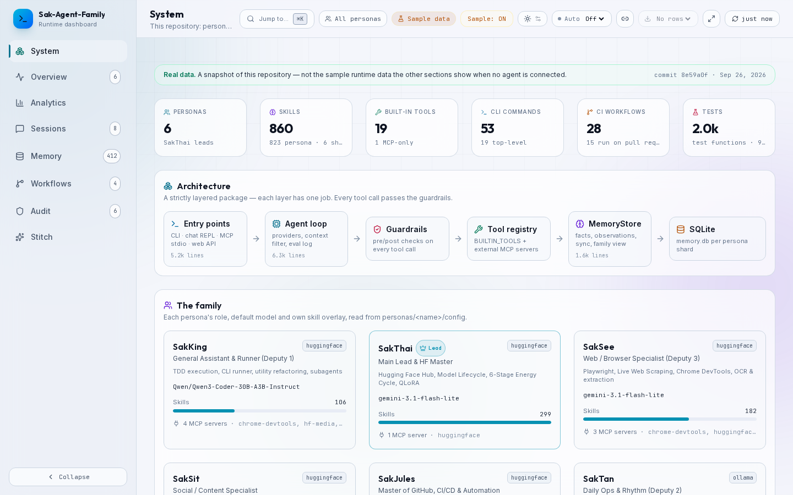
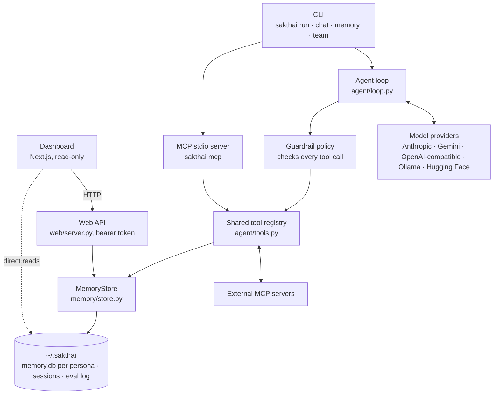

# House of Sak — Sak Family Agent

<p align="center">
  <picture>
    <source media="(prefers-color-scheme: dark)" srcset="docs/images/banner-dark.svg">
    
  </picture>
</p>

<p align="center">
  <a href="https://github.com/beer-sakthai/Sak-Family-Agent/actions/workflows/ci.yml?query=branch%3Amain"></a>
  <a href="https://github.com/beer-sakthai/Sak-Family-Agent/actions/workflows/apps.yml?query=branch%3Amain"></a>
  <a href="https://github.com/beer-sakthai/Sak-Family-Agent/actions/workflows/subprojects.yml?query=branch%3Amain"></a>
  <a href="https://github.com/beer-sakthai/Sak-Family-Agent/actions/workflows/pylint.yml?query=branch%3Amain"></a>
  <a href=".github/workflows/ci.yml"></a>
  <br>
  <a href="https://github.com/beer-sakthai/Sak-Family-Agent/actions/workflows/repository-security-quality.yml?query=branch%3Amain"></a>
  <a href="https://github.com/beer-sakthai/Sak-Family-Agent/actions/workflows/codeql.yml?query=branch%3Amain"></a>
  <a href="https://github.com/beer-sakthai/Sak-Family-Agent/actions/workflows/secret-scan.yml?query=branch%3Amain"></a>
  <a href="https://securityscorecards.dev/viewer/?uri=github.com/beer-sakthai/Sak-Family-Agent"></a>
  <br>
  
  
  
  <a href="LICENSE"></a>
</p>

> **Six personas, one shared runtime.**

House of Sak is a local-first, provider-agnostic AI agent workspace. It combines a durable SQLite memory store, a tool-using agent loop, Model Context Protocol (MCP) support, persona-specific skills, multi-agent coordination, and a web dashboard in one monorepo.

The project is built around the six-stage cycle **Dream → Hope → Care → Joy → Trust → Growth**.

## What is included

- **SakThai core agent** — a Python 3.11+ package with a provider-agnostic tool loop, retries, streaming, usage tracking, and dry-run preflight.
- **Persistent memory** — SQLite-backed facts and observations stored under `~/.sakthai`, with search, tagging, consolidation, snapshots, and sync helpers.
- **Multiple providers** — Anthropic, Google Gemini, OpenAI-compatible endpoints, Ollama, gateways, and Hugging Face inference providers.
- **MCP** — a dependency-light stdio server plus discovery and namespaced connections to external MCP servers.
- **Six personas** — SakThai, SakSee, SakJules, SakKing, SakSit, and SakTan, each with its own identity, skills, and memory overlay.
- **Team and client workflows** — declarative multi-persona pipelines and ServiceQuoteBot client workspace provisioning.
- **Dashboard** — a Next.js frontend backed by the SakThai HTTP API for personas, metrics, sessions, memory, audit data, and workflows.
- **Security and quality gates** — guardrails for tools and file access, strict typing, linting, secret scanning, CodeQL, Bandit, and automated tests.

## A look at the dashboard

The Next.js dashboard in [`apps/sak_agent_dashboard`](apps/sak_agent_dashboard), shown with its built-in sample data (`#overview?demo=1`). The images follow your GitHub light or dark theme.

**Overview** — run totals, the system pulse, and a card per persona.

<picture>
  <source media="(prefers-color-scheme: dark)" srcset="docs/images/dashboard-overview-dark.png">
  
</picture>

**System** — a real snapshot of this repository: personas, skills, tools, CLI commands, CI workflows and tests, the architecture, and the family.

<picture>
  <source media="(prefers-color-scheme: dark)" srcset="docs/images/dashboard-system-dark.png">
  
</picture>

## How it fits together

Every entry point shares one tool registry and one memory store. The full diagram and the layer-by-layer notes are in [`docs/architecture.md`](docs/architecture.md).


```mermaid
flowchart TD
    DASH["Dashboard<br/>Next.js, read-only"]
    WEB["Web API<br/>web/server.py, bearer token"]
    CLI["CLI<br/>sakthai run · chat · memory · team"]
    LOOP["Agent loop<br/>agent/loop.py"]
    MCP["MCP stdio server<br/>sakthai mcp"]
    GUARD["Guardrail policy<br/>checks every tool call"]
    TOOLS["Shared tool registry<br/>agent/tools.py"]
    STORE["MemoryStore<br/>memory/store.py"]
    HOME[("~/.sakthai<br/>memory.db per persona · sessions · eval log")]
    PROV["Model providers<br/>Anthropic · Gemini · OpenAI-compatible · Ollama · Hugging Face"]
    EXT["External MCP servers"]

    DASH -- HTTP --> WEB
    DASH -. direct reads .-> HOME
    WEB --> STORE
    CLI --> LOOP
    CLI --> MCP
    LOOP <--> PROV
    LOOP --> GUARD --> TOOLS
    MCP --> TOOLS
    TOOLS <--> EXT
    TOOLS --> STORE --> HOME
```

## Quick start

### Requirements

- Python **3.11 or newer**
- [`uv`](https://docs.astral.sh/uv/)
- Node.js **22 or newer** if you want to run the dashboard

### Install the Python package

```bash
cp .env.example .env
# Edit .env and add ANTHROPIC_API_KEY, or configure another supported provider.
uv sync --all-extras
```

The editable install exposes the `sakthai` command:

```bash
sakthai status
sakthai doctor --json
sakthai run "summarize docs/architecture.md"
sakthai run "review the latest memory" --persona sakking
sakthai chat
sakthai mcp
```

Use `sakthai run --help` for provider, model, streaming, sandbox, skill, and persona options. The default data directory is `~/.sakthai`; set `SAKTHAI_HOME` to use another location.

### Run the dashboard

Install and start the dashboard independently:

```bash
cd apps/sak_agent_dashboard
npm ci
npm run dev
```

For the complete local setup — including the Python API on port `3001` and the dashboard on port `3000` — use:

```bash
make dashboard-dev
```

The dashboard can be validated with:

```bash
make dashboard-test
```

## Repository layout

```text
personas/sakthai/sakthai/  Canonical installable Python package
personas/<name>/           Persona overlays, skills, and configuration
apps/sak_agent_dashboard/  Next.js dashboard
services/                  Service integrations and supporting services
tests/                     Pytest test suite
docs/                      Architecture, operations, security, and user guides
scripts/                   Repository and release tooling
library/                   Curated shared skills and reference material
.github/workflows/         CI, security, evaluation, and maintenance workflows
```

See [`PLAN.md`](PLAN.md) for the project index and [`docs/architecture.md`](docs/architecture.md) for the system design.

## Development

Install the full development environment and run the main checks:

```bash
uv sync --all-extras
make test
make lint
uv run mypy personas/sakthai/sakthai
uv run bandit -c pyproject.toml -r personas/sakthai/sakthai
```

Additional repository commands:

```bash
make compose-personas                       # Build composed skill trees
make export-agent-repos                      # Export all persona snapshots
make export-agent-repo PERSONA=sakjules      # Export one persona snapshot
make contract-types                          # Regenerate dashboard API types
make system-snapshot                         # Refresh dashboard system data
make mutation                               # Run local mutation testing (slow)
```

Tests that may call external services are marked `integration`; the normal CI command excludes them:

```bash
uv run pytest tests/ -m "not integration"
```

Contribution guidelines are in [`CONTRIBUTING.md`](CONTRIBUTING.md). Repository-specific development instructions are in [`AGENTS.md`](AGENTS.md).

## Documentation map

- [`docs/SAKTHAI.md`](docs/SAKTHAI.md) — agent guide and memory concepts
- [`docs/architecture.md`](docs/architecture.md) — architecture and data flow
- [`docs/capabilities.md`](docs/capabilities.md) — supported capabilities
- [`docs/OPERATING_CONTRACT.md`](docs/OPERATING_CONTRACT.md) — operating rules
- [`docs/SOUL.md`](docs/SOUL.md) — shared identity and principles
- [`SECURITY.md`](SECURITY.md) — security reporting
- [`CHANGELOG.md`](CHANGELOG.md) — release history

## Security and privacy

Do not commit API keys, refresh tokens, memory databases, or generated client data. Use `.env` for local credentials and review tool permissions before enabling shell, Telegram, Microsoft Graph, or external MCP integrations.

Security vulnerabilities should be reported according to [`SECURITY.md`](SECURITY.md), not through a public issue.

## License

This repository is **not open-source software**. It is distributed under the [House of Sak Intellectual Property License](LICENSE), copyright © 2026 Beer (`beer-sakthai`). Viewing and personal, non-commercial study are permitted; commercial use, redistribution, modification, deployment, and machine-learning training require explicit written permission.
