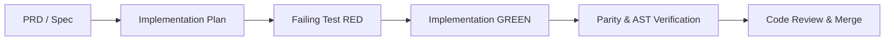

# Development Workflow & Quality Gates

## 1. Conductor Lifecycle Rules
All feature development and refactoring in `Sak-Family-Agent` must follow the Context-Driven Development (CDD) lifecycle:



---

## 2. Invariants & Security Gates

### Deterministic Path Traversal Defense
Every filesystem access must pass `_resolve_and_validate_path` with strict ASCII control character rejection:
```python
if any(ord(c) < 32 or ord(c) == 127 for c in path_str):
    raise ValueError("Control characters are not allowed in file paths")
```

### Hermetic Testing Rule
- Unit tests must **never** make external network calls or write to un-isolated user home directories.
- Always use `tmp_path` fixtures or `:memory:` SQLite connections.

### Shared Package Parity Gate
- Code changes in `personas/sakthai/sakthai/` must be synchronized with `personas/shared/sakthai/`.
- Verify with `pytest tests/test_shared_package_divergence.py`.

### AST Verification Gate
- Every `.py` file must parse to AST cleanly.
- Verify with `pytest tests/test_repo_parses.py`.

---

## 3. Standard Verification Command Matrix

| Target | Command | Expected Output |
|---|---|---|
| **Fast Tests** | `uv run pytest tests/ -m "not integration"` | 100% passed |
| **Lint & Format** | `uv run ruff check && uv run ruff format --check` | 0 errors |
| **Type Check** | `uv run mypy personas/sakthai/sakthai` | Success: no issues found |
| **Dashboard** | `cd apps/sak_agent_dashboard && pnpm typecheck && pnpm lint` | 0 errors |
| **AST Parse** | `uv run pytest tests/test_repo_parses.py` | 100% passed |
| **Parity** | `uv run pytest tests/test_shared_package_divergence.py` | 100% passed |
