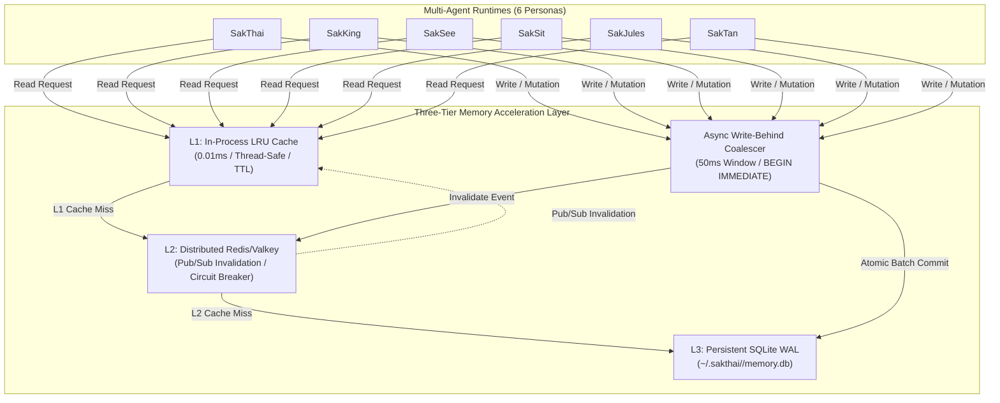

# Distributed Memory Caching & SQLite Scaling Guide

## 1. Overview

In the Sak Family multi-agent system, 6 personas (SakThai, SakKing, SakSee, SakSit, SakJules, SakTan) execute parallel reasoning loops, query factual knowledge bases, and write episodic observations to SQLite.

Because SQLite enforces single-writer serialization at the database file level, concurrent writes under high load historically risked `SQLITE_BUSY` database lock contention. Furthermore, repeated disk I/O on every memory retrieval added latency to multi-turn agent turns.

This subsystem provides a **Three-Tier Distributed Memory Acceleration Architecture**:
- **L1 In-Process Cache**: Thread-safe bounded LRU cache with TTL eviction (0.01ms latency).
- **L2 Distributed Cache**: Redis / Valkey client with Pub/Sub invalidation channels (`agent:memory:invalidations`) and automatic circuit breaker fallback.
- **L3 Persistence Layer**: SQLite WAL journal mode coupled with an asynchronous **Write-Behind Coalescer** committing batched mutations via `BEGIN IMMEDIATE` transactions.



---

## 2. Component Reference

### 2.1 Python Core (`personas/sakthai/sakthai/memory/`)

#### `MemoryLRUCache` ([`cache.py`](file:///home/beern/Sak-Family-Agent/personas/sakthai/sakthai/memory/cache.py))
- **Role**: Process-local LRU storage for hot entity facts and observations.
- **Thread Safety**: Backed by `threading.RLock()`.
- **Eviction**: Bounded capacity (`default: 1000`) with time-to-live expiration (`default: 30s`).
- **Telemetry**: Exposes `hits`, `misses`, `hit_rate`, and `evictions` via `.stats()`.

```python
from sakthai.memory.cache import MemoryLRUCache

cache = MemoryLRUCache(capacity=500, ttl_seconds=60.0)
cache.set("fact:user_role", {"role": "owner", "tier": "premium"})
data = cache.get("fact:user_role")
```

#### `DistributedMemoryCache` & `CircuitBreaker` ([`cache.py`](file:///home/beern/Sak-Family-Agent/personas/sakthai/sakthai/memory/cache.py))
- **Role**: Multi-process shared cache across distributed VM agents.
- **Resilience**: Integrated `CircuitBreaker` tracking consecutive connection failures.
- **Fail-Safe Fallback**: When `REDIS_URL` / `VALKEY_URL` is empty, unreachable, or tripped to `OPEN`, the client automatically falls back to local L1 mode with zero errors.

```python
from sakthai.memory.cache import DistributedMemoryCache

dist_cache = DistributedMemoryCache()
dist_cache.set("persona:facts:sakthai", {"count": 42}, ttl_seconds=120)
```

#### `AsyncWriteCoalescer` ([`write_coalescer.py`](file:///home/beern/Sak-Family-Agent/personas/sakthai/sakthai/memory/write_coalescer.py))
- **Role**: Decouples concurrent writer threads from disk transactions.
- **Batching**: Buffers SQL mutation statements in a thread-safe `queue.Queue` and flushes batches every 50ms (or max 100 items) using an exclusive `BEGIN IMMEDIATE` lock.
- **Zero Lock Contention**: Completely prevents `SQLITE_BUSY` errors across all 6 personas.

```python
from sakthai.memory.write_coalescer import AsyncWriteCoalescer

coalescer = AsyncWriteCoalescer(db_path="/tmp/memory.db", batch_interval_ms=50)
coalescer.enqueue("INSERT INTO facts (kind, value) VALUES (?, ?)", ("note", "deployment clean"))
coalescer.flush()
coalescer.close()
```

---

### 2.2 Next.js Dashboard Subsystem (`apps/sak_agent_dashboard/`)

#### `ServerMemoryCache` ([`src/lib/memoryCache.ts`](file:///home/beern/Sak-Family-Agent/apps/sak_agent_dashboard/src/lib/memoryCache.ts))
- **Role**: In-memory cache singleton for multi-persona SQLite database shard reads.
- **Telemetry**: Tracks `hitRate`, `l1Hits`, `misses`, `cachedShardsCount`, and rolling `latencyAvgMs`.
- **API Integration**: Automatically attached to the `/api/memory` payload.

#### `WorkflowEngine` DAG Validation ([`src/lib/workflowEngine.ts`](file:///home/beern/Sak-Family-Agent/apps/sak_agent_dashboard/src/lib/workflowEngine.ts))
- **`validateWorkflowDAG(workflow)`**: Evaluates graph invariants, validates dependency IDs, and runs Kahn's algorithm to detect circular dependencies.
- **`buildTopologicalBatches(workflow)`**: Sorts DAG stages into parallel execution batches.

---

## 3. Configuration & Environment Variables

| Variable | Default | Purpose |
|:---|:---|:---|
| `VALKEY_URL` | `None` | Valkey connection URI (e.g., `redis://localhost:6379/0`). |
| `REDIS_URL` | `None` | Redis connection URI fallback. |
| `SAKTHAI_HOME` | `~/.sakthai` | Root storage directory for persona SQLite shards (`~/.sakthai/<persona>/memory.db`). |

---

## 4. Verification & Testing

To verify the distributed memory caching layer and DAG pipeline engine:

```bash
# 1. Run Python Unit & Concurrency Stress Test (6 parallel writer threads)
uv run pytest tests/test_memory_cache.py tests/test_memory_store.py

# 2. Verify Zero Package Drift Across Personas
uv run pytest tests/test_shared_package_divergence.py

# 3. Run Dashboard Typecheck & Vitest Suites
cd apps/sak_agent_dashboard
npm run typecheck
npx vitest run src/tests/memory_cache.test.ts src/tests/ui_utils_refactor.test.ts
```
