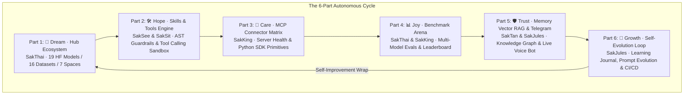

# 🏛️ Architecture Specification: Sak-Agent 6-Part Cycle Intelligence & Operations Suite

> **Author:** SakJules · Master of Automation & CI/CD  
> **Date:** 2026-08-15  
> **Status:** Approved Design Document  
> **Target Package:** `Sak-Family-Agent` (`apps/sak_agent_dashboard`)  

---

## 1. Executive Overview
The **Sak-Agent Cycle Intelligence & Operations Suite** is an industrial-grade Agent Operating System (AOS) for the Sak-Family-Agent monorepo. It structures multi-agent intelligence, tooling, and operations across a canonical **6-Part Cycle** (**Dream ➔ Hope ➔ Care ➔ Joy ➔ Trust ➔ Growth**) mapped directly to the 6 personas and 6 AI provider ecosystems.

---

## 2. The 6-Part Cycle Architecture & Domain Allocation

---

## 3. Subsystem Specifications

### Part 1: 🌟 Dream Stage — Hub & Model Ecosystem
- **Lead:** SakThai (`sakthai`)
- **Key Modules:** `src/lib/hub.ts`, `src/app/api/hub/route.ts`, `src/components/HubEcosystemPanel.tsx`.
- **Features:**
  - Real-time catalog of 19 Sak models, 16 datasets, and 7 Hugging Face Spaces.
  - Model card health check, license validator, and quantized GGUF weights inventory.

### Part 2: 🛠️ Hope Stage — Skills & Function-Calling Engine
- **Lead:** SakSee (`saksee`) & SakSit (`saksit`)
- **Key Modules:** `src/lib/skillsCatalog.ts`, `src/app/api/skills/route.ts`, `src/components/SkillsToolsPanel.tsx`.
- **Features:**
  - Interactive Skill Dispatch Sandbox for `.claude/skills`, `personas/*/skills`, and custom workflows.
  - Visual AST Guardrail Firewall showing ALLOWED vs BLOCKED shell commands and secret access.

### Part 3: 🔌 Care Stage — MCP Protocol & Connector Matrix
- **Lead:** SakKing (`sakking`)
- **Key Modules:** `src/lib/mcpCatalog.ts`, `src/app/api/mcp/route.ts`, `src/components/McpMatrixPanel.tsx`.
- **Features:**
  - Live MCP server health check and ping latency diagnostic (Composio, Teams Copilot, SQLite, Playwright).
  - Interactive resource tree explorer (`file://`, `memory://`, `db://`) with schema validators.

### Part 4: 📊 Joy Stage — Benchmark Arena & Leaderboard
- **Lead:** SakThai (`sakthai`) & SakKing (`sakking`)
- **Key Modules:** `src/lib/benchmarks.ts`, `src/app/api/benchmarks/route.ts`, `src/components/BenchmarkArena.tsx`.
- **Features:**
  - Multi-model evaluation matrix (GSM8k, HumanEval, MMLU, Tool-Calling, Safety-Alignment).
  - Head-to-head persona battles, comparative radar charts, and cost-per-run calculators.

### Part 5: 🛡️ Trust Stage — Memory Vector RAG & Telegram Voice Bridge
- **Lead:** SakTan (`saktan`) & SakJules (`sakjules`)
- **Key Modules:** `src/lib/memoryRag.ts`, `src/app/api/memory/rag/route.ts`, `src/app/api/telegram/route.ts`, `src/components/MemoryRagTelegramPanel.tsx`.
- **Features:**
  - 2D/3D Force-Directed Knowledge Graph mapping entities, facts, and session connections in SQLite `memory.db`.
  - Telegram bot webhook sandbox (`/start`, `/workflows`, `/workflow <name>`) and voice note transcriber.

### Part 6: 🚀 Growth Stage — Self-Evolution & Continuous Learning
- **Lead:** SakJules (`sakjules`)
- **Key Modules:** `src/lib/selfEvolution.ts`, `src/app/api/learning/route.ts`, `src/components/SelfEvolutionPanel.tsx`.
- **Features:**
  - Prompt Evolution Diff Viewer comparing baseline vs refined prompts from `learning_journal.jsonl`.
  - Autonomous loop wrap trigger running multi-round bounded execution cycles.

---

## 4. Verification & Quality Gates
1. **Type Safety:** `tsc --noEmit` passing with 0 errors.
2. **Automated Tests:** 100% Vitest test pass rate across all suite components.
3. **Turbopack Build:** Clean production build with 0 dynamic filesystem tracing warnings.
