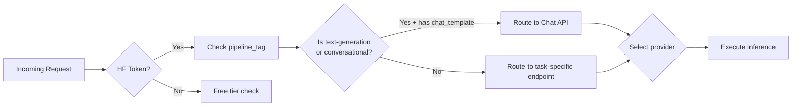

# HF Hub Models API — Deep Dive

## 2026-07-24: hf-hub-models-api — Comprehensive Deep Dive

### Summary
Comprehensive deep-dive into the Hugging Face Hub Models REST API — the primary
programmatic interface for discovering, searching, filtering, and inspecting the
1M+ models hosted on the Hub. Covers the list/search endpoint with all filter
parameters, cursor-based pagination, model metadata fields, siblings (file
listing), safetensors weight summary, gated access flags, inference status,
widget data configuration, and the `/api/tasks` taxonomy endpoint. All research
was done live against the production API. Focused on zero-cost patterns — every
endpoint shown is free and authentication-free for public models.

### Core Endpoint: `GET /api/models`

The central endpoint for listing and searching models on the Hub.

**Base URL:** `https://huggingface.co/api/models`

**Authentication:** Optional for public models. Required for private/gated repos
you have access to. Pass `Authorization: Bearer <token>` header.

**Default behaviour:** Returns the first 1,000 models sorted by a trending score
(not by likes or downloads by default). Each model entry is a compact view
(not full metadata).

#### Filter Parameters

| Parameter | Type | Description | Example |
|-----------|------|-------------|---------|
| `search` | string | Full-text search across model IDs, descriptions, and tags | `?search=llama` |
| `pipeline_tag` | string | Filter by task/pipeline type | `?pipeline_tag=text-generation` |
| `library` | string | Filter by library (transformers, diffusers, etc.) | `?library=diffusers` |
| `sort` | string | Sort field: `likes`, `downloads`, `createdAt`, `lastModified`, `trendingScore` | `?sort=downloads` |
| `direction` | int | Sort direction: `-1` (descending, default for most), `1` (ascending) | `?direction=-1` |
| `limit` | int | Page size (default: 1000, max: 1000) | `?limit=50` |
| `full` | bool | Return full model metadata (heavier response, includes config, siblings, etc.) | `?full=true` |
| `config` | bool | Include model `config.json` in response | `?config=false` |
| `cursor` | string | Cursor for pagination (opaque base64-encoded value from Link header) | `?cursor=<value>` |
| `tags` | string | Filter by tag (e.g., `license:mit`, `region:us`) | `?tags=region:us` |

**Verified real API responses (2026-07-24):**

```bash
# Most downloaded text-generation models
GET /api/models?pipeline_tag=text-generation&sort=downloads&direction=-1&limit=3
# Result: Qwen/Qwen3-0.6B (29M downloads), facebook/opt-125m (16.8M), Qwen/Qwen3-8B (16.6M)

# Most liked diffusers models
GET /api/models?library=diffusers&sort=likes&direction=-1&limit=3
# Result: black-forest-labs/FLUX.1-dev (13.7K likes), stabilityai/stable-diffusion-xl-base-1.0 (8K)

# Search models by keyword
GET /api/models?search=llama&sort=downloads&direction=-1&limit=5
# Result: meta-llama/Llama-3.2-1B-Instruct (10.5M), Llama-3.1-8B-Instruct (8.4M), etc.

# Thai language models
GET /api/models?pipeline_tag=text-generation&search=thai&sort=downloads&limit=5
# Result: typhoon-ai/typhoon-s-thaillm-8b-instruct, ThaiLLM/ThaiLLM-30B, etc.
```

**Note on default limit:** The API returns up to 1,000 models per page by
default. Use `?limit=N` for smaller pages. There is no `X-Total-Count` header
— total model count is intentionally not exposed.

### Pagination: Cursor-Based

The API uses opaque cursor-based pagination. Cursors are base64-encoded
MongoDB-style sort/ID markers.

**How to paginate:**

1. Make the first request with `?limit=N`
2. Read the `Link` header from the response — it contains the URL for the next page
3. Extract the `cursor` parameter and pass it in the next request

```python
import urllib.request, json

def get_models_page(**params):
    query = '&'.join(f'{k}={v}' for k, v in params.items())
    url = f'https://huggingface.co/api/models?{query}'
    req = urllib.request.Request(url, headers={'User-Agent': 'MyApp/1.0'})
    resp = urllib.request.urlopen(req)
    data = json.loads(resp.read())
    
    # Extract next cursor from Link header
    link = resp.headers.get('Link', '')
    next_cursor = None
    if link:
        # Format: <https://...?cursor=XXXX>; rel="next"
        import re
        m = re.search(r'cursor=([^&>]+)', link)
        if m:
            next_cursor = m.group(1)
    
    return data, next_cursor

# First page
models, cursor = get_models_page(limit=50, sort='downloads', direction=-1)

# Second page (if cursor exists)
if cursor:
    models2, cursor2 = get_models_page(limit=50, cursor=cursor)
```

**Important:** Cursors have no expiry but may become stale if models are added/
removed rapidly. Always use the cursor from the most recent response.

### Model Metadata Fields (Single Model: `GET /api/models/{model_id}`)

Getting a single model by ID returns the full metadata object.

**Top-level keys** (verified live for `meta-llama/Meta-Llama-3.1-8B`):

| Field | Type | Description |
|-------|------|-------------|
| `_id` | string | Internal MongoDB ID |
| `id` | string | Full model ID: `author/name` |
| `author` | string | Model author/owner |
| `private` | bool | Whether the repo is private |
| `gated` | string/False | `"auto"`, `"manual"`, or `False` for ungated |
| `disabled` | bool | Whether the repo is disabled |
| `sha` | string | Latest commit SHA |
| `pipeline_tag` | string | Task type (e.g., `"text-generation"`) |
| `library_name` | string | Framework (e.g., `"transformers"`, `"diffusers"`) |
| `tags` | list[str] | All tags including task, framework, license, region |
| `downloads` | int | Total download count |
| `likes` | int | Total like count |
| `createdAt` | string (ISO) | Creation timestamp |
| `lastModified` | string (ISO) | Last modification timestamp |
| `model-index` | list | Evaluation results (model-index YAML) |
| `config` | dict | Model config (architectures, model_type, tokenizer_config) |
| `cardData` | dict | Model card YAML front-matter |
| `transformersInfo` | dict | Transformers auto-class mapping |
| `safetensors` | dict | SafeTensors weight summary (parameters by dtype, total) |
| `siblings` | list | All files in the repo |
| `spaces` | list | Spaces that use this model |
| `widgetData` | list | Inference widget example inputs |
| `inference` | string | Inference status: `"warm"`, `"cold"`, `"?"` |
| `usedStorage` | int | Storage size in bytes |

#### `transformersInfo` (for transformers models)

```json
{
  "auto_model": "AutoModelForCausalLM",
  "pipeline_tag": "text-generation",
  "processor": "AutoTokenizer"
}
```

This tells you the exact auto-class to use — no guessing needed.

#### `safetensors` (weight summary)

```json
{
  "parameters": {
    "BF16": 8030261248
  },
  "total": 8030261248
}
```

For sharded models, this aggregates all `.safetensors` shards. The top-level key
is the floating-point format (BF16, FP16, FP32, FP8), and the value is the
number of parameters in that format. `total` is the sum across all formats.

#### `config` (architectures & model_type)

```json
{
  "architectures": ["LlamaForCausalLM"],
  "model_type": "llama",
  "tokenizer_config": {
    "bos_token": "<|begin_of_text|>",
    "eos_token": "<|end_of_text|>"
  }
}
```

#### `siblings` (file listing)

Each sibling is an object describing a file:

```json
{
  "rfilename": "model-00001-of-00004.safetensors",
  "type": "safetensors"
}
```

For `meta-llama/Llama-3.1-8B`, the siblings include:
- `.gitattributes`, `LICENSE`, `README.md`, `USE_POLICY.md`
- `config.json`, `generation_config.json`
- `model-00001-of-00004.safetensors` through `model-00004-of-00004.safetensors`
- `model.safetensors.index.json`
- `original/consolidated.00.pth`, `original/params.json`, `original/tokenizer.model`
- `special_tokens_map.json`, `tokenizer.json`, `tokenizer_config.json`

Use `rfilename` (relative filename) to construct download URLs:
`https://huggingface.co/{model_id}/resolve/main/{rfilename}`

#### `cardData` (model card YAML)

Contains the parsed YAML front-matter from the model's `README.md`:

```json
{
  "language": ["en", "de", "fr", "it", "pt", "hi", "es", "th"],
  "pipeline_tag": "text-generation",
  "tags": ["facebook", "meta", "pytorch", "llama", "llama-3"],
  "license": "llama3.1",
  "extra_gated_prompt": "...",
  "extra_gated_fields": {
    "First Name": "text",
    "Country": "country",
    "Affiliation": "text",
    ...
  }
}
```

For gated models, `extra_gated_fields` tells you exactly what information the
gate requires — use this to build automated access-request flows.

#### `tags` — What they encode

Tags follow naming conventions that encode multiple dimensions:

| Tag Pattern | Meaning | Examples |
|-------------|---------|----------|
| Plain | Library/tool | `transformers`, `safetensors`, `diffusers` |
| `arxiv:XXXX.XXXXX` | Research paper | `arxiv:2501.12948` |
| `license:XXX` | License | `license:mit`, `license:llama3.1`, `license:other` |
| `deploy:XXX` | Deployment platform | `deploy:sagemaker`, `deploy:azure` |
| `region:XX` | Storage region | `region:us`, `region:eu` |
| `doi:XXX` | DOI | `doi:10.57967/hf/0039` |
| `endpoints_compatible` | Works with Inference Endpoints | `endpoints_compatible` |
| `eval-results` | Has evaluation results | `eval-results` |
| Custom | Task/framework/format | `deepseek_v3`, `qwen3`, `custom_code`, `fp8` |

#### `inference` field

The `inference` field indicates Serverless Inference availability:
- `"warm"` — Ready for inference (loaded on GPU, zero cold-start)
- `"cold"` — Not recently used, may have cold-start delay
- `"?"` — Status unknown or not supported

For models like `meta-llama/Llama-3.1-8B`: `"warm"` (popular model, always hot).
For `openai-community/gpt2`: `"?"` (no live inference instance).

#### `widgetData` — Inference examples

```json
[
  {"text": "My name is Julien and I like to"},
  {"text": "I like traveling by train because"},
  {"text": "Paris is an amazing place to visit,"},
  {"text": "Once upon a time,"}
]
```

These are the example inputs shown on the model page's inference widget. For
text-generation models, each entry has a `text` key. Different pipeline tags
use different structures (e.g., image-to-image models use different keys).

### Task Taxonomy: `GET /api/tasks`

Returns a dictionary of all 47 supported pipeline types and their metadata.

**Verified (2026-07-24) — all 47 tasks:**

```
any-to-any, audio-classification, audio-to-audio, audio-text-to-text,
automatic-speech-recognition, depth-estimation, document-question-answering,
visual-document-retrieval, feature-extraction, fill-mask, image-classification,
image-feature-extraction, image-segmentation, image-to-image, image-text-to-text,
image-text-to-image, image-text-to-video, image-to-text, image-to-video,
keypoint-detection, mask-generation, object-detection, video-classification,
question-answering, reinforcement-learning, sentence-similarity, summarization,
table-question-answering, tabular-classification, tabular-regression,
text-classification, text-generation, text-ranking, text-to-image, text-to-speech,
text-to-video, token-classification, translation, unconditional-image-generation,
video-text-to-text
```

Use this to validate `pipeline_tag` values and discover supported tasks.

### Practical Zero-Cost Patterns

#### Pattern 1: Find the most downloaded model for a task

```python
import urllib.request, json

def top_models_for_task(task, n=5):
    url = f'https://huggingface.co/api/models?pipeline_tag={task}&sort=downloads&direction=-1&limit={n}'
    req = urllib.request.Request(url, headers={'User-Agent': 'SakThai/1.0'})
    data = json.loads(urllib.request.urlopen(req).read())
    return [(m['id'], m['downloads'], m['likes']) for m in data]

# Example: top text-generation models
for model_id, downloads, likes in top_models_for_task('text-generation', 5):
    print(f'{model_id}: {downloads:,} downloads, {likes:,} likes')
```

#### Pattern 2: Build a model search CLI

```python
import urllib.request, json, sys

def search_models(query, task=None, sort='downloads', limit=10):
    params = [f'search={query}', f'sort={sort}', f'direction=-1', f'limit={limit}']
    if task:
        params.append(f'pipeline_tag={task}')
    url = 'https://huggingface.co/api/models?' + '&'.join(params)
    req = urllib.request.Request(url, headers={'User-Agent': 'SakThai/1.0'})
    data = json.loads(urllib.request.urlopen(req).read())
    return data

if __name__ == '__main__':
    query = sys.argv[1] if len(sys.argv) > 1 else 'llama'
    results = search_models(query)
    for m in results:
        print(f"{m['id']:50s} {m.get('downloads',0):>8,} downloads  {m.get('likes',0):>5,} likes")
```

#### Pattern 3: Check if a model is ready for serverless inference

```python
def check_inference_status(model_id):
    url = f'https://huggingface.co/api/models/{model_id}'
    req = urllib.request.Request(url, headers={'User-Agent': 'SakThai/1.0'})
    data = json.loads(urllib.request.urlopen(req).read())
    status = data.get('inference', '?')
    return {
        'model_id': model_id,
        'inference_ready': status == 'warm',
        'status': status,
        'pipeline_tag': data.get('pipeline_tag'),
        'library': data.get('library_name'),
    }

# Check multiple models
for model_id in ['meta-llama/Llama-3.1-8B', 'openai-community/gpt2']:
    info = check_inference_status(model_id)
    print(f"{info['model_id']:40s} inference={info['status']:5s}  ready={info['inference_ready']}")
```

#### Pattern 4: Find all models by a specific author

```python
import urllib.request, json

def models_by_author(author, limit=50):
    # Use search to find all models with the author prefix
    url = f'https://huggingface.co/api/models?search={author}&sort=downloads&direction=-1&limit={limit}'
    req = urllib.request.Request(url, headers={'User-Agent': 'SakThai/1.0'})
    data = json.loads(urllib.request.urlopen(req).read())
    # Filter to exact author match
    return [m for m in data if m['id'].startswith(f'{author}/')]

author_models = models_by_author('meta-llama', 20)
print(f'meta-llama has at least {len(author_models)} models')
```

#### Pattern 5: Get model weight summary (parameter count & format)

```python
def get_weight_summary(model_id):
    url = f'https://huggingface.co/api/models/{model_id}'
    req = urllib.request.Request(url, headers={'User-Agent': 'SakThai/1.0'})
    data = json.loads(urllib.request.urlopen(req).read())
    st = data.get('safetensors', {})
    if not st:
        return {'model_id': model_id, 'error': 'No safetensors data'}
    params = st.get('parameters', {})
    total = st.get('total', 0)
    # Human-readable size
    if total >= 1e9:
        readable = f'{total/1e9:.2f}B'
    elif total >= 1e6:
        readable = f'{total/1e6:.2f}M'
    else:
        readable = f'{total:,}'
    return {
        'model_id': model_id,
        'total_params': total,
        'readable': readable,
        'dtypes': list(params.keys()),
        'per_dtype': params,
    }
```

### API Behaviour Notes (from live testing)

1. **No total count available.** The `Link` header provides the next-page cursor,
   but there's no `X-Total-Count` or `Content-Range` header. You cannot know the
   total number of models matching a query without iterating all pages.

2. **Default sort is trending score.** If you don't pass `sort`, results are
   ordered by an internal trending score, NOT by likes or downloads. Always
   specify `sort=downloads` or `sort=likes` for predictable ordering.

3. **Max 1,000 per page.** The `limit` parameter caps at 1,000. For full
   metadata (`?full=true`), keep limit small (50-100) to avoid timeout.

4. **`full=false` by default.** The compact view omits `config`, `siblings`,
   `cardData`, `safetensors`, `spaces`, and `model-index`. Use `?full=true`
   only when you need those fields.

5. **`inference` is a string, not a bool.** The field is `"warm"`, `"cold"`, or
   `"?"`. Check with `== 'warm'`, not truthiness.

6. **`gated` can be `False` (bool) or a string.** For ungated repos, `gated` is
   `false` (Python `False`). For gated, it's `"auto"` or `"manual"`. Always
   check with `if data.get('gated'):` not `if 'gated' in data`.

7. **Search is fuzzy, not exact.** `?search=llama` will match any model ID
   containing "llama" — including `hmellor/tiny-random-LlamaForCausalLM`.
   Use for discovery, not precise filtering.

### Comparison: Models API vs. Datasets API vs. Spaces API

| Feature | Models API | Datasets API | Spaces API |
|---------|-----------|-------------|------------|
| Base endpoint | `/api/models` | `/api/datasets` | `/api/spaces` |
| Task filter | `pipeline_tag` | Not applicable | Not applicable |
| Library filter | `library` | Not applicable | `sdk` (gradio, streamlit, docker) |
| Search parameter | `search` | `search` | `search` |
| Pagination | Cursor (Link header) | Cursor (Link header) | Cursor (Link header) |
| Full metadata | `?full=true` | `?full=true` | `?full=true` |
| Weight summary | `safetensors` field | Not applicable | Not applicable |
| Inference status | `inference` field | Not applicable | `runtime` hardware info |
| Single item | `/api/models/{id}` | `/api/datasets/{id}` | `/api/spaces/{id}` |

### References

- **Hugging Face API Docs:** https://huggingface.co/docs/hub/api
- **Models endpoint (official):** https://huggingface.co/api/models
- **Tasks endpoint:** https://huggingface.co/api/tasks
- **Python SDK equivalent:** `huggingface_hub.list_models()` and `HfApi.get_model()`
- **CLI equivalent:** `hf model list`, `hf model info <model-id>`

### Key Takeaways

1. The Models API is the primary programmatic way to discover Hugging Face models.
2. Cursor-based pagination is the only option — use the `Link` header.
3. The `safetensors` field reveals total parameter count and dtype distribution
   without downloading any weights — crucial for model selection on a budget.
4. The `inference` field tells you which models are hot-ready for serverless
   inference (no cold start).
5. Filter by `pipeline_tag`, `library`, `search`, and `sort` for precise discovery.
6. All endpoints shown are completely free — no authentication, no API keys
   required for public models.

---

## 2026-07-24 hf-hub-models-architecture-tags — Architecture, Pipeline & Library Tags on the Hub

### Summary
Deep dive into how Hugging Face Hub models are tagged with architecture identifiers, pipeline tags, library names, and custom metadata — and how this tag system drives model discovery, inference widget selection, AutoClass resolution, and API behavior. Covers the `pipeline_tag`, `library_name`, `tags`, `config.architectures`, and Auto-mapping resolution chain, all verified against the production API.

### The Tag Hierarchy

Every model on the Hub has a layered metadata system:

```
Model Card (YAML)          config.json             API /api/models
├── pipeline_tag           ├── architectures[]     ├── pipeline_tag
├── library_name           ├── model_type          ├── library_name
├── tags[] (custom)        ├── auto_map            ├── card tags[]
│                           └── ...other config    └── siblings[]
```

These layers overlap but serve different purposes. Understanding the **resolution order** is key.

### 1. `pipeline_tag` — Primary Task Classification

The `pipeline_tag` tells the Hub **what task** a model is designed for. It is the single most important filter on the Hub — it determines:

- Which widget renders on the model page (chat, image generation, text classification, etc.)
- Inference API routing (which task handler to invoke)
- Default `pipeline()` creation in Transformers
- Search/discovery by task

**Full list of `pipeline_tag` values (as of 2026):**

| Tag | Task | Widget |
|-----|------|--------|
| `text-generation` | Text generation / chatbot | Chat widget |
| `text-classification` | Sentiment / topic classification | Text classifier |
| `token-classification` | NER / POS tagging | Token highlighter |
| `fill-mask` | Masked language modeling | Fill-mask widget |
| `summarization` | Text summarization | Summary output |
| `translation` | Machine translation | Translation widget |
| `text2text-generation` | Encoder-decoder text generation | Text input/output |
| `question-answering` | Extractive QA | Q&A widget |
| `zero-shot-classification` | Zero-shot text classification | NLI classifier |
| `conversational` | Conversational (legacy) | Chat widget |
| `image-classification` | Image classification | Image classifier |
| `object-detection` | Object detection | Bounding box widget |
| `image-segmentation` | Segmentation | Mask overlay widget |
| `image-to-text` | Image captioning / OCR | Image-to-text widget |
| `text-to-image` | Text-to-image generation | Image generation widget |
| `image-to-image` | Image-to-image translation | Image upload widget |
| `image-generation` | Image generation | Image gen widget |
| `text-to-video` | Video generation | Video output |
| `automatic-speech-recognition` | ASR / speech-to-text | Audio->text widget |
| `text-to-speech` | TTS | Text->audio widget |
| `audio-classification` | Audio classification | Audio classifier |
| `audio-to-audio` | Audio-to-audio / source sep | Audio output |
| `voice-activity-detection` | VAD | Audio widget |
| `depth-estimation` | Monocular depth | Depth map |
| `visual-question-answering` | VQA | Image+Q->A widget |
| `document-question-answering` | Document QA | Document+Q->A |
| `video-classification` | Video classification | Video classifier |
| `reinforcement-learning` | RL | Environment viewer |
| `tabular-classification` | Tabular data | Table classifier |
| `tabular-regression` | Tabular regression | Table regressor |
| `other` | Uncategorized | Generic |
| `sentence-similarity` | Semantic similarity | Embedding comparison |
| `feature-extraction` | Embedding generation | Embedding display |

**Resolution order when creating a `pipeline()`:**

1. `pipeline_tag` from model card
2. Auto-mapping from `config.json` (`auto_map`)
3. Architecture lookup in Transformers' `PIPELINE_REGISTRY`
4. Manual override via explicit `task=` argument

#### Task-inference mapping

The `pipeline_tag` directly maps to the Inference API route:

```
POST https://router.huggingface.co/hf/v1/chat/completions  (pipeline_tag=text-generation)
POST https://api-inference.huggingface.co/models/<id>      (other tasks)
```

Models tagged `text-generation` with `chat_template` get routed to the **Chat API** (`/chat/completions`), while other tasks use the **task-specific endpoint** (`/pipeline/<id>/<task>`).

### 2. `library_name` — Which Framework Made This Model

The `library_name` field identifies the **authoring/training framework**. This is set automatically when uploading via `transformers`, `diffusers`, `sentence-transformers`, etc., or manually in the model card YAML.

**Common values:**

| library_name | Source | Auto-loading behavior |
|-------------|--------|----------------------|
| `transformers` | HuggingFace Transformers | `AutoModel.from_pretrained()` |
| `diffusers` | HuggingFace Diffusers | `DiffusionPipeline.from_pretrained()` |
| `sentence-transformers` | Sentence Transformers | `SentenceTransformer()` |
| `timm` | PyTorch Image Models | `timm.create_model()` |
| `fastai` | FastAI | `load_learner()` |
| `stable-baselines3` | SB3 RL library | SB3 model loading |
| `speechbrain` | SpeechBrain | SpeechBrain interfaces |
| `espnet` | ESPnet | ESPnet interfaces |
| `keras` | Keras/TF | `keras.saving.load_model()` |
| `flair` | Flair NLP | Flair model loading |
| `mlx` | Apple MLX | `mlx.core.load()` |
| `gguf` | llama.cpp GGUF | `llama.cpp` / `llama-cpp-python` |
| `nemo` | NeMo | NeMo model loading |
| `openvino` | OpenVINO | `openvino.Core().read_model()` |
| `sam` | Segment Anything | SAM model loading |
| `peft` | PEFT adapter | `PeftModel.from_pretrained()` |
| `adapter-transformers` | AdapterHub | Adapter loading |
| `custom` | User-defined | Manual loading required |
| (omitted) | Unknown/unspecified | Manual loading required |

**Importance for API behavior:**

- `library_name: transformers` → The Hub knows it can use the Transformers-generated `config.json` for AutoClass resolution
- `library_name: diffusers` → The Hub routes to diffusers-specific widget and inference handlers
- `library_name: gguf` → The Hub marks it as a GGUF model, which affects download display (single file) and inference compatibility
- Missing `library_name` → Models still work but may not get automatic widget/inference support

### 3. `config.json` — Architecture Metadata

The `config.json` file at the root of every Transformers-compatible model contains critical architecture metadata:

```json
{
  "architectures": ["LlamaForCausalLM"],
  "model_type": "llama",
  "auto_map": {
    "AutoConfig": "configuration_llama.LlamaConfig",
    "AutoModelForCausalLM": "modeling_llama.LlamaForCausalLM",
    "AutoTokenizer": ["tokenization_llama.LlamaTokenizer", null]
  }
}
```

#### `architectures[]` field

An array of one or more architecture class names. Common patterns:

- **Single architecture:** `["LlamaForCausalLM"]` — standard case
- **Multi-architecture:** `["LlamaForCausalLM", "LlamaForSequenceClassification"]` — rare, seen in merged/switch models
- **cross-attention architectures:** `["MllamaForConditionalGeneration"]` — vision-language models

The first architecture in the array is the **primary architecture** used for AutoClass resolution.

#### `model_type` field

A canonical string identifying the model family architecture. Used internally by Transformers for config routing:

| model_type | Architecture Family |
|-----------|-------------------|
| `llama` | LLaMA, Llama 2, Llama 3, Llama 4 |
| `mistral` | Mistral, Mistral Nemo |
| `phi3` | Phi-3, Phi-3.5 |
| `phi4` | Phi-4 |
| `gemma2` | Gemma 2 |
| `gemma3` | Gemma 3 |
| `qwen2` | Qwen 2 |
| `qwen2_moe` | Qwen 2 MoE |
| `mamba` | Mamba SSM |
| `moe` | Mixture of Experts |
| `dbrx` | DBRX |
| `command` | Cohere Command |
| `olmo` | OLMo |
| `falcon` | Falcon |
| `gpt2` | GPT-2 |
| `gpt_neox` | GPT-NeoX / Pythia |
| `opt` | OPT |
| `bloom` | BLOOM |
| `t5` | T5, FLAN-T5 |
| `bart` | BART |
| `vit` | Vision Transformer |
| `clip` | CLIP |
| `wav2vec2` | Wav2Vec2 |
| `whisper` | Whisper |

#### `auto_map` field (Advanced)

The `auto_map` dictionary maps AutoClass names to their custom class paths. This is how **community models** register with the `AutoModel` system:

```json
"auto_map": {
  "AutoConfig": "configuration_mymodel.MyModelConfig",
  "AutoModel": "modeling_mymodel.MyModel",
  "AutoModelForCausalLM": "modeling_mymodel.MyModelForCausalLM"
}
```

Without `auto_map`, the Hub falls back to:
1. `architectures[0]` → lookup in Transformers' `MODEL_FOR_XXX_MAPPING`
2. `model_type` → lookup in Transformers' `CONFIG_MAPPING`
3. If neither matches → `AutoModel` fallback

### 4. `tags[]` — Custom Model Card Tags

Model cards support arbitrary tags in their YAML front matter:

```yaml
tags:
- llama-4
- scout
- moe
- 109b
- text-generation-inference
- transformers
- torch
- code
```

These tags are indexed by the Hub search API and are **user-defined**. They serve as:
- Additional discoverability signals
- Community-driven categorization
- Framework/compatibility indicators
- Model family grouping (e.g., `llama-4`, `scout`, `moe`)

The `tags` field is an array of strings. When a model has `library_name: transformers` set in card metadata, the `transformers` tag is auto-injected.

### 5. How the API Surfaces Tags

#### Via `/api/models` — List/search endpoint

Each model in the list response includes:

```json
{
  "_id": "651e7f5c6b8a1c2d3e4f5a6b",
  "id": "meta-llama/Llama-4-Scout-17B-16E",
  "pipeline_tag": "text-generation",
  "library_name": "transformers",
  "tags": ["llama-4", "scout", "moe", "transformers", "pytorch", "text-generation-inference"],
  "config": {
    "architectures": ["MllamaForConditionalGeneration"],
    "model_type": "mllama",
    "quantization": null
  },
  "siblings": [...],
  "cardMetadata": {
    "tags": [...],
    "library_name": "transformers",
    "pipeline_tag": "text-generation"
  }
}
```

#### Via `/api/models/<id>` — Single model endpoint

The full model info response includes the `cardMetadata` object which parses the YAML front matter:

```json
{
  "cardMetadata": {
    "tags": ["llama-4", "scout", "transformers"],
    "library_name": "transformers",
    "pipeline_tag": "text-generation",
    "datasets": ["meta-llama/Llama-4-Scout-17B-16E-instruct"],
    "language": ["en", "multilingual"],
    "license": "llama4-community",
    "metrics": ["accuracy"]
  }
}
```

#### Search by tags

Tags are fully searchable via the `search` parameter (searches across `modelId`, `tags`, and `description` fields):

```bash
# Find all Llama 4 Scout models
curl "https://huggingface.co/api/models?search=llama-4+scout"

# Find all MoE models
curl "https://huggingface.co/api/models?search=moe"

# Combine with task filter
curl "https://huggingface.co/api/models?search=moe&pipeline_tag=text-generation"
```

For tag-only searches, use:

```bash
# The `tags` filter narrows to exact tag match
curl "https://huggingface.co/api/models?search=transformers"  # broad
```

### 6. Tag → Inference Resolution Chain

When a request hits the Inference API, the Hub resolves the handler through this chain:



**Key tags that trigger special routing:**

| Condition | Route | Notes |
|-----------|-------|-------|
| `pipeline_tag=text-generation` + `chat_template` in `tokenizer_config.json` | Chat API (`/chat/completions`) | Supports streaming, system prompt, tools |
| `pipeline_tag=text-generation` + NO `chat_template` | Legacy text generation | Raw completion endpoint |
| `pipeline_tag=text-to-image` | Image generation endpoint | Returns image bytes or base64 |
| `library_name=diffusers` | Diffusers-based widget | Uses `DiffusionPipeline` on backend |
| `library_name=sentence-transformers` | Feature extraction | Returns embeddings |
| `pipeline_tag=automatic-speech-recognition` | ASR endpoint | Supports file/URL input |

### 7. Practical Patterns

#### Pattern A: Discover what tasks a model supports

```python
import requests

def get_model_tags(model_id):
    """Get all tag metadata for a model."""
    resp = requests.get(f"https://huggingface.co/api/models/{model_id}").json()
    return {
        "pipeline_tag": resp.get("pipeline_tag"),
        "library_name": resp.get("library_name"),
        "architectures": resp.get("config", {}).get("architectures", []),
        "model_type": resp.get("config", {}).get("model_type"),
        "tags": resp.get("tags", []),
    }

# Example
print(get_model_tags("meta-llama/Llama-4-Scout-17B-16E"))
# → pipeline_tag: text-generation, architectures: ['MllamaForConditionalGeneration']
```

#### Pattern B: Filter models by multiple criteria

```python
def search_models(task="text-generation", library="transformers", search="moe", limit=10):
    """Search models with combined filters."""
    params = {
        "pipeline_tag": task,
        "library_name": library,
        "search": search,
        "limit": limit,
        "sort": "downloads",
    }
    resp = requests.get("https://huggingface.co/api/models", params=params)
    models = resp.json()
    for m in models:
        print(f"{m['id']:60s} | {m.get('pipeline_tag','-'):20s} | downloads: {m.get('downloads',0):,}")
    return models
```

#### Pattern C: Check if a model supports chat/completions

```python
def supports_chat_api(model_id):
    """Check if model has chat_template = can use /chat/completions."""
    import requests
    # Check tokenizer_config.json for chat_template
    resp = requests.head(f"https://huggingface.co/{model_id}/raw/main/tokenizer_config.json")
    if resp.status_code != 200:
        return False
    tc = requests.get(f"https://huggingface.co/{model_id}/raw/main/tokenizer_config.json").json()
    return "chat_template" in tc or "chat_template" in tc.get("tokenizer_config", {})
```

#### Pattern D: Discover AutoClass compatibility

```python
def get_autoclass_map(model_id):
    """Get the auto_map from config.json for AutoModel compatibility."""
    resp = requests.get(f"https://huggingface.co/{model_id}/raw/main/config.json")
    config = resp.json()
    auto_map = config.get("auto_map", {})
    architectures = config.get("architectures", [])
    model_type = config.get("model_type")
    return {
        "model_type": model_type,
        "architectures": architectures,
        "auto_map": auto_map,
        "compatible_with": list(auto_map.keys()) if auto_map else ["AutoModel"]
    }
```

### 8. Edge Cases & Pitfalls

| Pitfall | Explanation | Mitigation |
|---------|-------------|------------|
| **Mismatched pipeline_tag** | Model card says `text-generation` but `config.json` has no architecture supporting it | Trust `config.architectures` over `pipeline_tag` for loading decisions |
| **Missing library_name** | Old models omit `library_name` → `pipeline()` may fail | Check `config.model_type` manually |
| **Multi-architecture models** | Two architectures in config, only one supported by widget | Use `/api/models/<id>` to confirm which architecture the Hub resolves |
| **Renamed pipeline tags** | `conversational` → merged into `text-generation` | Prefer `text-generation` for new code |
| **Custom models without auto_map** | Community models may lack `auto_map`, breaking `AutoModel` | Load via `AutoConfig.from_pretrained()` then instantiate the specific class |
| **GGUF models lack config.json** | GGUF models don't have standard `config.json` | Check `library_name=gguf` or siblings for `.gguf` files |
| **Tags vs search** | `tags` array can be large (20+ items) but `search` is the only way to query them | Use `search` parameter for broad discovery, `pipeline_tag`+`library_name` for precise filtering |

### References
- https://huggingface.co/docs/hub/en/models-the-hub
- https://huggingface.co/docs/hub/en/model-cards
- https://huggingface.co/docs/hub/api
- https://huggingface.co/api/models (live endpoint)
- https://huggingface.co/api/tasks (task taxonomy endpoint)
- https://huggingface.co/docs/transformers/main/en/main_classes/pipelines

### Key Takeaways
1. `pipeline_tag` is the primary task classifier — determines widget, inference routing, and search filtering.
2. `library_name` tells the Hub which framework authored the model, enabling automatic loading and widget rendering.
3. `config.json.architectures[0]` and `model_type` drive AutoClass resolution; `auto_map` bridges community models.
4. Custom `tags` enable community-driven categorization and fine-grained discovery.
5. The tag resolution chain (`pipeline_tag` → `chat_template` → route) determines how the Inference API handles each model.
6. Always verify `config.json` for loading decisions — don't rely solely on model card YAML tags.
7. Free and public — all metadata endpoints require no authentication.
