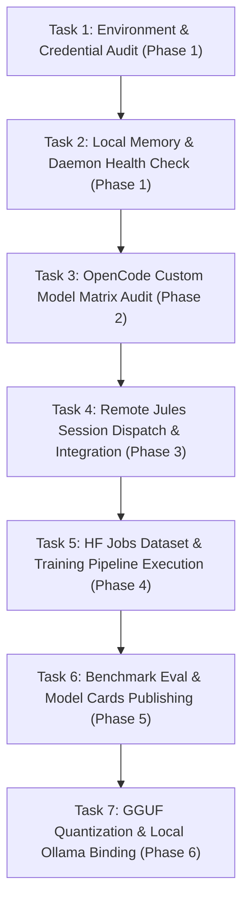

# PLAN.md — SakJules 🔧 Deep-Dive Task-by-Task Roadmap
> *DevSecOps, GitHub Actions & Asynchronous Model Training Execution Plan*
> *Status: Active Step-by-Step Execution*

---

## 📋 Deep-Dive Task Execution Breakdown (Step-by-Step, One-by-One)

---

### Phase 1: Foundation & Infrastructure Verification

#### 🔹 Task 1.1: Environment Variable & API Credential Audit
- **Goal**: Verify all API keys (`JULES_API_KEY`, `OPENCODE_GO_API_KEY`, `SUPERMEMORY_API_KEY`, `RENDER_API_KEY`, `GOOGLE_API_KEY`) are present in `/home/beern/.env` and exported in `~/.bashrc`.
- **Estimated Time**: 2 minutes
- **Command**: `grep -E "JULES_API_KEY|OPENCODE_GO_API_KEY|SUPERMEMORY_API_KEY" /home/beern/.env`
- **Acceptance Criteria**: All 5 credentials return non-empty values.

#### 🔹 Task 1.2: Local Supermemory Daemon Health Check
- **Goal**: Verify local Supermemory daemon is running on port 6767 with ONNX `Xenova/bge-base-en-v1.5` embeddings.
- **Estimated Time**: 2 minutes
- **Command**: `curl -s http://localhost:6767/healthcheck || pgrep -f supermemory-server`
- **Acceptance Criteria**: HTTP 200 response or active PID returned.

---

### Phase 2: OpenCode & Custom Model Binding Audit

#### 🔹 Task 2.1: OpenCode Model Matrix Verification
- **Goal**: Audit [`/home/beern/opencode.json`](file:///home/beern/opencode.json) to ensure zero Gemini API quota dependencies.
- **Estimated Time**: 3 minutes
- **Matrix**:
  - `model`: `huggingface/deepseek-ai/DeepSeek-V4-Flash`
  - `small_model`: `Nanthasit/sakthai-context-1.5b-tools-v2`
  - `tools_model`: `Nanthasit/sakthai-context-7b-tools`
  - `embedding_model`: `Nanthasit/sakthai-embedding-multilingual`
- **Acceptance Criteria**: `opencode.json` contains 100% custom `Nanthasit/*` models.

#### 🔹 Task 2.2: Google ADK Zero-Cost Specification Audit
- **Goal**: Verify [`/home/beern/.agents-cli-spec.md`](file:///home/beern/.agents-cli-spec.md) is configured for $0.00 USD spend.
- **Estimated Time**: 2 minutes
- **Command**: `agents-cli info`
- **Acceptance Criteria**: Executed cleanly with 0 malformed metadata warnings.

---

### Phase 3: Jules Asynchronous Remote Automation

#### 🔹 Task 3.1: Remote Jules Session List & Status Audit
- **Goal**: Query active remote sessions on Jules server.
- **Estimated Time**: 5 minutes
- **Command**: `jules remote list --session` or via `julesServer` MCP
- **Acceptance Criteria**: List of remote sessions returned cleanly.

#### 🔹 Task 3.2: Jules Remote Patch Pull & Git Merge
- **Goal**: Pull completed patches from remote Jules sessions and apply to `Sak-Family-Agent` or target repos.
- **Estimated Time**: 5 minutes
- **Command**: `jules remote pull --session <SESSION_ID> --apply`
- **Acceptance Criteria**: Git working tree updated cleanly without merge conflicts.

---

### Phase 4: Custom Model Training & Benchmark Pipeline

#### 🔹 Task 4.1: Dataset Synthesis (`sakthai-bench-v3`)
- **Goal**: Run `.opencode/scripts/run-benchmark-v3.py` to generate 25,000 synthetic task routing prompts.
- **Estimated Time**: 15 minutes
- **Command**: `uv run .opencode/scripts/run-benchmark-v3.py`
- **Acceptance Criteria**: Dataset saved under `Nanthasit/sakthai-triage-dataset`.

#### 🔹 Task 4.2: Hugging Face Job GPU Fine-Tuning
- **Goal**: Dispatch QLoRA SFT training for `Nanthasit/sakthai-triage-1.5b` on HF Jobs.
- **Estimated Time**: 45 minutes
- **Command**: `hf jobs run python:3.11 "uv run SakThai-Training/train.py" --secrets HF_TOKEN --flavor t4-small`
- **Acceptance Criteria**: Job status `COMPLETED` and weights published to HF Hub.

---

### Phase 5: Evaluation & Documentation Publishing

#### 🔹 Task 5.1: Benchmark Evaluation Run
- **Goal**: Evaluate model accuracy on `Nanthasit/sakthai-bench-v2`.
- **Estimated Time**: 10 minutes
- **Command**: `uv run .opencode/scripts/run-eval.py --model Nanthasit/sakthai-triage-1.5b --publish`
- **Acceptance Criteria**: Cross-model YAML uploaded to `Nanthasit/eval_results`.

#### 🔹 Task 5.2: Model Cards & Dataset Card Synchronization
- **Goal**: Update README tables across all model repos and dataset cards.
- **Estimated Time**: 5 minutes
- **Command**: `uv run .opencode/scripts/update-model-cards.py`
- **Acceptance Criteria**: Model card tables updated on Hugging Face Hub.

---

### Phase 6: GGUF Quantization & Local Ollama Binding

#### 🔹 Task 6.1: GGUF Quantization & Upload
- **Goal**: Convert model weights to GGUF format (Q4_K_M) for local sub-100ms inference.
- **Estimated Time**: 15 minutes
- **Command**: `hf upload Nanthasit/sakthai-triage-1.5b-gguf ./model.gguf`
- **Acceptance Criteria**: GGUF file available on HF Hub.

#### 🔹 Task 6.2: Local Ollama Pull & Verification
- **Goal**: Pull GGUF into local Ollama instance and run inference test.
- **Estimated Time**: 5 minutes
- **Command**: `ollama run hf.co/Nanthasit/sakthai-triage-1.5b-gguf "Task triage test"`
- **Acceptance Criteria**: Sub-100ms response generated cleanly.

---

*SakJules Step-by-Step Task Master Plan · House of Sak*