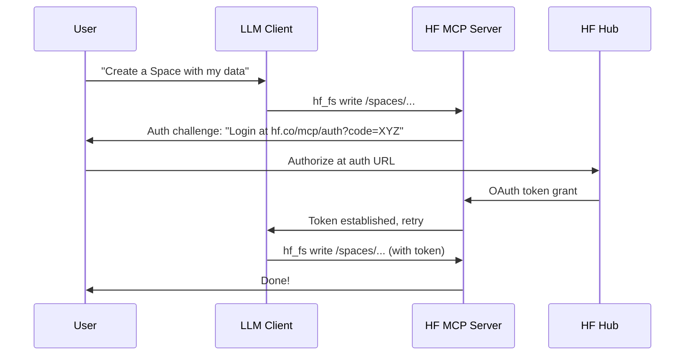

# HF Learnings Log

**author:** SakThai
**license:** MIT

## 2026-07-25: SakThai-hf-mcp-server — HF MCP Server v2.0.0 Consolidation Deep Dive

### Summary
Deep-dive into the **HF MCP Server v2.0.0** consolidation update (published 2026-07-26). This is a major architectural overhaul: the 28 individual tools are consolidated into 4 `hf_fs` tool categories, a new AUTHENTICATE_TOOL enables OAuth-based on-the-fly authentication, one-click gallery installs reduce setup to a single command (`claude mcp add` / `gemini mcp add`), SEP-2640 introduces a skills directory for agent skill registries, and a web dashboard provides real-time tool statistics and on/off switching. This replaces the earlier v1.1.0 28-tool model entirely.

### Sources
- HF MCP Server GitHub: https://github.com/huggingface/hf-mcp-server
- HF MCP Settings: https://huggingface.co/settings/mcp
- HF Changelog: https://huggingface.co/changelog/hf-mcp-server
- HF MCP Docs: https://huggingface.co/docs/hub/en/agents-mcp
- Published: 2026-07-26

---

### 1. hf_fs Consolidation: 4 Tool Categories Instead of 28

v2.0.0 replaces the 28 individual tools (space_search, model_search, hf_fs_write, hf_create_repo, etc.) with 4 consolidated `hf_fs` tool categories:

| Category | Prefix | What It Does |
|----------|--------|-------------|
| **Search** | `hf_fs search` | Cross-type semantic search across models, datasets, Spaces, papers, docs |
| **Read** | `hf_fs read` | Read file contents, model cards, dataset cards, Space configs |
| **Write** | `hf_fs write` | Create repos, write files, update metadata |
| **Navigate** | `hf_fs nav` | Browse Hub structure, list directories, inspect repo trees |

Instead of 28 separate MCP tools each with their own function signature, the assistant now uses a unified filesystem-style interface:

```
hf_fs search /models?q=qwen+3+quantized&pipeline_tag=text-generation
hf_fs read /models/mistralai/Mistral-7B-v0.3
hf_fs write /models/myuser/my-model/README.md  (content...)
hf_fs nav /spaces?author=huggingface
```

**Why this matters**: The old model required the LLM to choose among 28 tools, each with different parameters. The new model uses 4 conceptual operations (CRUD-like) with intuitive paths. Less cognitive load for the LLM → more accurate tool selection.

---

### 2. One-Click Gallery Installs

Each MCP client now has a **gallery page** with a single install command:

| Client | Install Command |
|--------|----------------|
| **Claude Desktop** | `claude mcp add hf-mcp` (native Claude CLI) |
| **Gemini CLI** | `gemini mcp add hf-mcp` (native Gemini CLI) |
| **VS Code** | Click "Install" in VS Code MCP gallery |
| **Cursor** | Click "Install" in Cursor MCP gallery |
| **Zed** | Configuration snippet auto-generated at hf.co/settings/mcp |

The native CLI commands (`claude mcp add`, `gemini mcp add`) are the recommended path for command-line agents. They configure the MCP server automatically — no manual JSON editing required.

---

### 3. AUTHENTICATE_TOOL — OAuth-Based On-the-Fly Auth

New `AUTHENTICATE_TOOL` (enabled/disabled via env var) introduces an **on-the-fly OAuth flow**:



**Env var**: `AUTHENTICATE_TOOL=true|false`

Without it, the server relies on `DEFAULT_HF_TOKEN` for all operations. With it, the server can prompt the user to authenticate for specific operations that require elevated permissions — without the user needing to pre-configure a token.

---

### 4. SEP-2640: Skills Directory Support (`HF_SKILLS_DIR`)

New environment variable `HF_SKILLS_DIR` points to a local directory of skill definitions. Skills are structured as:

```
skills/
  huggingface/
    publish-model/
      SKILL.md          # Skill metadata (name, description, tools needed)
      steps/             # Step-by-step instructions
        create-repo.md
        upload-files.md
        verify-card.md
      references/
        hf-api.md
    search-datasets/
      SKILL.md
      ...
```

When `HF_SKILLS_DIR` is set, the MCP server exposes a `resolve_skill` tool that an agent can call to load skill definitions — making it a **skill registry** at the MCP level. This bridges the gap between HF Agent Skills (the website at agentskills.io) and the MCP protocol.

**Connection to Hermes Agent**: Hermes agents already use skill files in their profile directories. The SEP-2640 format aligns with the structure Hermes uses, meaning skills authored for Hermes can be consumed by any MCP-compatible agent via the HF MCP Server.

---

### 5. Stateful Connection Management

v2.0.0 introduces heartbeat and timeout management for persistent MCP connections:

| Parameter | Default | Description |
|-----------|---------|-------------|
| `MCP_CLIENT_HEARTBEAT_INTERVAL` | 30s | How often the server pings the client |
| `MCP_CLIENT_CONNECTION_TIMEOUT` | 300s (5 min) | Max idle time before connection drop |
| `MCP_PING_ENABLED` | true | Enable/disable keepalive pings |
| `MCP_PING_INTERVAL` | 30s | Ping frequency |

Without this, long-running sessions (e.g., iterative Space building) could timeout mid-workflow. With stateful management, the connection stays alive as long as the agent is actively working.

---

### 6. Web Dashboard

v2.0.0 ships with an optional **web dashboard** accessible when running in HTTP/SSE mode:

- **Tool on/off switching**: Toggle individual tools or full tool groups
- **Usage statistics**: Count of tool calls per tool, success/failure rates
- **Connection status**: Active connections, ping latency
- **Log viewer**: Recent server logs

Access at `http://localhost:3000/dashboard` (default port).

---

### 7. New Environment Variables

| Variable | Default | Purpose |
|----------|---------|---------|
| `ALLOW_INTERNAL_ADDRESS_HOSTS` | — | Allow connections to internal/private addresses |
| `GRADIO_SKIP_INITIALIZE` | false | Skip Gradio init (faster startup when not using Spaces) |
| `AUTHENTICATE_TOOL` | false | Enable OAuth-based on-the-fly authentication |
| `HF_SKILLS_DIR` | — | Path to SEP-2640 skills directory |
| `TRANSPORT` | stdio | Transport mode (stdio, streamable-http, streamable-http-json) |
| `MCP_STRICT_COMPLIANCE` | false | Strict MCP spec compliance mode |
| `SEARCH_ENABLES_FETCH` | true | Allow search results to trigger content fetches |

---

### 8. NPM & Docker Updates

| Package | Version | Transport |
|---------|---------|-----------|
| `@llmindset/hf-mcp-server` | v0.3.35 → v2.0.0 | STDIO |
| `@llmindset/hf-mcp-server-http` | v0.3.35 → v2.0.0 | StreamableHTTP |
| `@llmindset/hf-mcp-server-json` | v0.3.35 → v2.0.0 | StreamableHTTP JSON (Docker default) |

Docker image: `ghcr.io/evalstate/hf-mcp-server:latest` — now defaults to StreamableHTTP JSON on port 3000.

---

### 9. Migration Guide: v1 → v2

If upgrading from v1.x (the 28-tool model):

1. **Update packages**: `npm update @llmindset/hf-mcp-server`
2. **Update config**: Remove any bouquet/mix settings (the 4-category model replaces them)
3. **Test basic ops**: `hf_fs search /models?q=test`, `hf_fs nav /spaces`
4. **Optional**: Enable `AUTHENTICATE_TOOL=true` for OAuth flows
5. **Optional**: Set `HF_SKILLS_DIR` for skills integration
6. **Downgrade path**: Pin to `@llmindset/hf-mcp-server@0.3.35` if the v2 API breaks existing workflows

The 28-tool API is deprecated but may still be available via `DISABLE_TOOLS` env var for backward compatibility.

---

## 2026-07-25: hf-hub-agents-ecosystem-complete-deep-dive — Full HF Hub Agents Ecosystem Overhaul

### Summary
Complete deep-dive into the newly restructured **HF Hub Agents section** (discovered at https://huggingface.co/docs/hub/en/index — sidebar reorganization as of July 2026). The Hub docs now dedicate an entire top-level **Agents** section with 8 pages: Agents Overview, HF CLI for AI Agents, HF MCP Server, HF Agent Skills, Building with the SDK, Local Agents with llama.cpp, Agent Libraries, and Session Traces Format. This represents a strategic pivot by Hugging Face to position the Hub as the central registry and runtime for AI agents — not just models/datasets/Spaces.

### Key Structural Changes
- The old "Hub" docs sidebar had no dedicated Agents section — now it's a top-level category listed alongside Repositories, Models, Datasets, Spaces, Storage Buckets, Jobs.
- The MCP Server doc moved from experimental/obscure to a first-class page under Agents.
- **Three entirely new pages**: Agent Skills, Building with the SDK, Session Traces Format.
- **Two redesigned pages**: Agents Overview (new intro), HF CLI for AI Agents (rewritten for agent use cases).
- **Cross-linking**: The entire ecosystem now references each other (e.g., the MCP page links to Skills page, SDK page links to MCP page, Spaces page links to MCP servers page).

### Source
- HF Hub Docs (main): https://huggingface.co/docs/hub/en/index
- Agents Overview: https://huggingface.co/docs/hub/en/agents
- HF MCP Server: https://huggingface.co/docs/hub/en/agents-mcp
- HF Agent Skills: https://huggingface.co/docs/hub/en/agents-skills
- Building with the SDK: https://huggingface.co/docs/hub/en/agents-sdk
- Spaces as MCP servers: https://huggingface.co/docs/hub/en/spaces-mcp-servers
- MCP Settings: https://huggingface.co/settings/mcp
- Skills registry: https://agentskills.io
- Published: 2026-07-25

---

### 1. Agents Overview (New Page)

The new **Agents Overview** page serves as an entry point to the entire ecosystem. It introduces:
- The concept of "AI agents" as assistants that can use tools and follow instructions
- How HF fits in: as a registry, compute provider, and MCP server host
- Links to all sub-pages in the Agents section

**Key takeaway**: This page didn't exist before. The old docs had no unified "agents" entry point.

---

### 2. Hugging Face CLI for AI Agents (Redesigned)

Previously just "CLI" docs, now specifically targeted at AI agents. New features:
- The `hf` CLI is positioned as the primary interface for agents to interact with the Hub
- Key commands agents use: `hf download`, `hf upload`, `hf repo create`, `hf space create`, `hf job create`
- Includes agent-specific usage patterns (non-interactive, token-based auth)
- Links to MCP Server setup for one-click installation

**Installation**:
```bash
pip install huggingface_hub[cli]
# or via brew
brew install huggingface-cli
```

---

### 3. Hugging Face MCP Server (Complete Rewrite v3)

The MCP Server page at `/docs/hub/en/agents-mcp` is a **complete rewrite** from the previous version. Key changes:

#### 3.1 Setup Flow Simplified
- Settings page at `huggingface.co/settings/mcp` generates **client-specific** config snippets
- Supported clients: **Codex, Cursor, VS Code extensions, Zed, Claude Desktop, ChatGPT**
- Client-specific instructions — no more generic "paste this JSON" for all clients
- The settings page is now the **canonical entry point** — users are told NOT to write config by hand

#### 3.2 Built-in Tools (hf_fs Consolidation Complete)
The previous 28-tool surface has been fully consolidated into the `hf_fs` tool:

| Tool | Description |
|------|-------------|
| `hf_fs` | Core hub navigation — search models, datasets, Spaces, papers, docs (replaces 17+ individual tools) |
| Contribute Repos | Create repos and write files to them |
| Sandboxes | Create and use sandboxes (includes file management) |
| Run & Manage Jobs | Run, monitor, and schedule Jobs on HF infrastructure |

**The `hf_fs` tool handles most tasks**. It enables semantic search of documents and Spaces.

#### 3.3 Community Tools (Spaces) — New Interactive Model
- Browse MCP-compatible Spaces at `https://huggingface.co/spaces?mcp=true`
- Add a Space to your MCP tools directly from its **card badge** — grey MCP badge on any Space card
- Click the badge → "Add to MCP tools" → confirm → Space is listed in your MCP settings
- Gradio MCP apps expose functions as tools with arguments and descriptions
- **Dynamic Spaces**: toggle to let your assistant discover and use MCP-compatible Spaces at runtime without manual addition
- **Remove Embedded Images**: option for clients with limited image support

#### 3.4 ZeroGPU Support
- ZeroGPU Spaces work with MCP, using your quota when tools are called
- PRO users get 40 min/day (8× free quota)
- Example: up to 600 FLUX.1-schnell images/day on PRO

#### 3.5 Key URLs
| Resource | URL |
|----------|-----|
| MCP Settings | https://huggingface.co/settings/mcp |
| MCP Doc Page | https://huggingface.co/docs/hub/en/agents-mcp |
| Changelog | https://huggingface.co/changelog/hf-mcp-server |
| MCP Spaces | https://huggingface.co/spaces?mcp=true |
| Gradio MCP Guide | https://www.gradio.app/guides/building-mcp-server-with-gradio |
| HF MCP Server (project) | https://huggingface.co/mcp |

---

### 4. Hugging Face Agent Skills (Entirely New)

This is a **brand new page** and ecosystem. HF now provides a curated set of **Skills** for AI builders.

#### 4.1 What Are Skills?
Each Skill is a self-contained `SKILL.md` that an agent follows while working on a task. Skills work with all major coding agents: **Claude Code, OpenAI Codex, Google Gemini CLI, and Cursor**.

#### 4.2 Installation
```bash
# register the skills marketplace
/plugin marketplace add huggingface/skills
# install a specific Skill
/plugin install <skill-name>@huggingface/skills
```

#### 4.3 Available Skills (10 total)

| Skill | What It Does |
|-------|-------------|
| `hf-cli` | Hub operations via the hf CLI: download, upload, manage repos, run jobs |
| `huggingface-datasets` | Explore datasets, paginate rows, search text, apply filters |
| `huggingface-llm-trainer` | Train or fine-tune LLMs with TRL (SFT, DPO, GRPO) on HF Jobs |
| `huggingface-vision-trainer` | Train object detection and image classification models |
| `huggingface-community-evals` | Run evaluations against models on the Hub on local hardware |
| `huggingface-trackio` | Track and visualize ML training experiments with Trackio |
| `huggingface-papers` | Look up and read HF paper pages in markdown |
| `huggingface-paper-publisher` | Publish and manage research papers on the Hub |
| `huggingface-tool-builder` | Build reusable scripts for HF API operations |
| `gradio` | Build Gradio web UIs and demos |
| `transformers-js` | Run ML models in JavaScript/TypeScript with WebGPU/WASM |

#### 4.4 Usage Pattern
Once installed, mention the Skill directly in your prompt:
- "Use the HF model trainer Skill to fine-tune Qwen3-0.6B with SFT on the Capybara dataset"
- "Use the HF evaluation Skill to add benchmark results to my model card"
- "Use the HF datasets Skill to create a new dataset from these examples"

Your agent loads the corresponding `SKILL.md` instructions and helper scripts automatically.

#### 4.5 Skills Ecosystem Resources
- Skills Repository: Browse and contribute at agentskills.io
- Skills Format: Specification at agentskills.io
- CLI Guide: Hugging Face CLI for AI Agents
- MCP Guide: Use alongside Skills

#### 4.6 Relationship to MCP
Skills and MCP are complementary:
- **MCP Server** provides tools to the agent (search, file ops, jobs)
- **Skills** provide instructions to the agent (workflows, best practices, domain knowledge)
- An agent can use both: MCP for Hub access + Skills for domain-specific workflows

---

### 5. Building Agents with the HF SDK (Entirely New)

A completely new page documenting the `huggingface_hub[mcp]` SDK for building MCP-powered agents.

#### 5.1 Installation
```bash
pip install "huggingface_hub[mcp]"
```

#### 5.2 Quick Start: Run an Agent
The fastest way is via the **`tiny-agents` CLI**:
```bash
tiny-agents run julien-c/flux-schnell-generator
```
This loads an agent from the tiny-agents collection, connects to its MCP servers, and starts an interactive chat.

#### 5.3 Using the Agent Class
The `Agent` class manages the chat loop and MCP tool execution. It uses **Inference Providers** to run the LLM.

```python
from huggingface_hub import Agent
import asyncio

agent = Agent(
    model="Qwen/Qwen2.5-72B-Instruct",
    provider="novita",
    servers=[
        {
            "type": "sse",
            "url": "https://evalstate-flux1-schnell.hf.space/gradio_api/mcp/sse"
        }
    ]
)

async def main():
    async for chunk in agent.run("Generate an image of a sunset"):
        if hasattr(chunk, 'choices'):
            delta = chunk.choices[0].delta
            if delta.content:
                print(delta.content, end="")

asyncio.run(main())
```

#### 5.4 Using MCPClient Directly
For more control, use `MCPClient` to manage MCP servers and tool calls directly:

```python
import asyncio
from huggingface_hub import MCPClient

async def main():
    async with MCPClient(
        model="Qwen/Qwen2.5-72B-Instruct",
        provider="novita",
    ) as client:
        # Connect to an MCP server
        await client.add_mcp_server(
            type="sse", 
            url="https://evalstate-flux1-schnell.hf.space/gradio_api/mcp/sse"
        )
        
        # Process a request with tools
        messages = [{"role": "user", "content": "Generate an image of a sunset"}]
        
        async for chunk in client.process_single_turn_with_tools(messages):
            if hasattr(chunk, 'choices'):
                delta = chunk.choices[0].delta
                if delta.content:
                    print(delta.content, end="")

asyncio.run(main())
```

#### 5.5 Sharing Your Agent
Contribute agents to the **tiny-agents collection** on the Hub. Each agent needs:
- `agent.json` — Agent configuration (required)
- `PROMPT.md` or `AGENTS.md` — System prompt (optional)
- `EXAMPLES.md` — Sample prompts and use cases (optional)

#### 5.6 SDK Architecture
```
┌──────────────────────────────────────┐
│            Your Application           │
│  ┌────────────────────────────────┐  │
│  │  Agent Class (chat loop)       │  │
│  │  ┌──────────┐ ┌─────────────┐ │  │
│  │  │ MCPClient│ │ LLM (Infer.)│ │  │
│  │  └──────────┘ └─────────────┘ │  │
│  └────────────────────────────────┘  │
│            │                          │
│     SSE Connection                    │
│            │                          │
│    ┌───────┴────────┐                 │
│    │ MCP Server(s)  │                 │
│    │ (HF / Gradio)  │                 │
│    └────────────────┘                 │
└──────────────────────────────────────┘
```

#### 5.7 Key Resources
- huggingface_hub MCP Reference — Python API docs
- tiny-agents Documentation — JS API docs
- Inference Providers — Available LLM providers
- tiny-agents Collection — Browse community agents
- MCP Server Guide — Connect to the HF MCP Server

---

### 6. Spaces as MCP Servers (New Dedicated Page)

Previously a sub-section, now a **dedicated page** at `/docs/hub/en/spaces-mcp-servers`.

#### 6.1 One-Click Space Addition
- Any public Space with a visible **MCP badge** (grey badge) can be added as a callable tool
- No code required — just click the badge → "Add to MCP tools"
- Add as many Spaces as you want

#### 6.2 Setup Flow
1. From your Hub MCP settings, select your MCP client
2. Follow the client-specific setup instructions
3. Need a valid HF token with READ permissions
4. Browse compatible Spaces → click MCP badge → Add to MCP tools
5. Restart client → tools appear automatically

#### 6.3 Building Your Own MCP-Compatible Gradio Space
```python
# Install Gradio with MCP support
pip install "gradio[mcp]"

# Create your app with clear type hints and docstrings
import gradio as gr

def letter_counter(word: str, letter: str) -> int:
    """Count occurrences of a letter in a word.
    
    Args:
        word: The word to search in
        letter: The letter to count
    """
    return word.count(letter)

demo = gr.Interface(
    fn=letter_counter,
    inputs=[gr.Textbox("strawberry"), gr.Textbox("r")],
    outputs=[gr.Number()],
    title="Letter Counter",
    api_name="predict"
)

demo.launch(mcp_server=True)  # ← exposes MCP schema automatically
```

Push to Spaces → automatic MCP badge → anyone can add as a tool with one click.

#### 6.4 Converting an Existing Space
1. Duplicate the Space
2. Add docstrings to functions you want exposed as tools
3. Add `mcp_server=True` in `.launch()`
4. Redeploy

#### 6.5 Mixing Spaces
Since HF Spaces is the largest directory of AI apps, users are encouraged to mix Spaces for creative workflows. Example: combine `Lightricks/ltx-video-distilled` (video generation) with `ResembleAI/Chatterbox` (audio/TTS) in Claude Code to generate a video with audio.

#### 6.6 ZeroGPU Integration
For ZeroGPU Spaces, quota is consumed when the MCP tool is called:
- Free users: ~5 min quota
- PRO users: 40 min daily quota (8× more)

---

### 7. Other New Agents Pages

#### 7.1 Local Agents with llama.cpp
- New page documenting how to run local agents using llama.cpp
- Enables fully offline agent workflows
- Complements the cloud-based MCP server approach

#### 7.2 Agent Libraries
- Documents supported libraries for building agents: smolagents, transformers agents, OpenAIAgent, etc.
- Links to each library's documentation
- Positions HF as library-agnostic (supports any MCP-compatible framework)

#### 7.3 Session Traces Format
- New page documenting the format for agent session traces
- Includes JSON schema for capture/playback of agent sessions
- Enables debugging, replay, and optimization of agent workflows

---

### 8. Practical Implications for Beer's Usage

#### Zero-Cost Agent Setup
Since Beer has no income:
1. **MCP Server via CLI**: `npx @llmindset/hf-mcp-server` (free, runs locally)
2. **Agent SDK**: `huggingface_hub[mcp]` with free Inference Providers
3. **Skills**: Install free skills from huggingface/skills marketplace
4. **Spaces**: Use existing free Gradio Spaces as MCP tools
5. **ZeroGPU**: Free tier gives ~5 min/day GPU for Space tools

#### Agent SDK Free-Tier Strategy
```python
from huggingface_hub import Agent, MCPClient
# Use free inference providers (novita, together, etc.)
agent = Agent(
    model="Qwen/Qwen2.5-72B-Instruct",  # free via novita provider
    provider="novita",
    servers=[{"type": "sse", "url": "..."}]
)
```

#### Skills Integration with Sak Thai Family
The Sak Thai agent system (Hermes profiles) already uses Skills in a similar way to the HF Agent Skills format. The `~/profiles/sakthai/skills/` directory mirrors the concept. Key insight: HF's Agent Skills format at agentskills.io could serve as a reference for improving our own skill format.

---

### 9. Complete HF Agents Ecosystem Diagram

```
┌─────────────────────────────────────────────────────────┐
│                  HF Hub Agents Ecosystem                  │
├─────────────────────────────────────────────────────────┤
│                                                          │
│  ┌──────────────┐    ┌───────────────────────────────┐  │
│  │   MCP Server  │    │      Agent Skills              │  │
│  │  (Tool Layer) │    │    (Instruction Layer)        │  │
│  ├──────────────┤    ├───────────────────────────────┤  │
│  │ hf_fs search │    │ hf-cli, datasets, llm-trainer │  │
│  │ Sandboxes    │    │ vision-trainer, evals, papers  │  │
│  │ Jobs         │    │ tool-builder, gradio           │  │
│  │ Community    │    │ transformers-js                │  │
│  │   Spaces     │    │                               │  │
│  └──────┬───────┘    └──────────────┬────────────────┘  │
│         │                           │                    │
│         └───────────┬───────────────┘                    │
│                     │                                    │
│  ┌──────────────────▼────────────────────────────────┐  │
│  │           HF SDK (huggingface_hub[mcp])             │  │
│  │  Agent Class  /  MCPClient  /  tiny-agents CLI     │  │
│  └──────────────────┬────────────────────────────────┘  │
│                     │                                    │
│  ┌──────────────────▼────────────────────────────────┐  │
│  │     Clients: Codex, Cursor, VS Code, Claude       │  │
│  │            Desktop, Zed, ChatGPT, Gemini CLI       │  │
│  └────────────────────────────────────────────────────┘  │
│                                                          │
│  ┌────────────────────────────────────────────────────┐  │
│  │     Complementary: llama.cpp (local), smolagents   │  │
│  └────────────────────────────────────────────────────┘  │
└─────────────────────────────────────────────────────────┘
```

---

### 10. Future Trends Observed

1. **Skills as the new plugin format**: HF is betting on SKILL.md as the standard for agent instructions. This is similar to how plugins worked in ChatGPT but open-source and cross-platform.

2. **MCP as the universal tool protocol**: Every Gradio Space can become an MCP server with one flag. This creates a massive network effect — the 200k+ existing Spaces are potentially MCP-able.

3. **HF as agent orchestrator**: The combination of MCP Server (tools) + Skills (instructions) + SDK (runtime) + Spaces (community tools) + Jobs (compute) positions HF as the end-to-end platform for AI agents, not just a model hub.

4. **Zero-cost barrier**: The entire ecosystem works on free tier — free inference, free Spaces (CPU), free ZeroGPU (limited), free CLI, free SDK. This aligns perfectly with Beer's constraints.

|---

## 2026-07-25: hf-transformers-pipeline-registry-system-deep-dive — Transformers v5 Pipeline Registry & Custom Task Registration

**author:** SakThai
**license:** MIT
**Source:** Transformers v5.14.1 source code (`transformers.pipelines.base`, `transformers.pipelines.__init__`)
**Research method:** Direct source analysis — `PipelineRegistry`, `pipeline()`, `PIPELINE_REGISTRY`, `SUPPORTED_TASKS`, `TASK_ALIASES`, `clean_custom_task`, `get_task`

---

### Summary

Complete deep dive into the **Transformers v5 Pipeline Registry System** — the engine behind `pipeline(task=..., model=...)` resolution. This covers the `PipelineRegistry` class, the 27 supported tasks + 3 aliases, the custom pipeline registration API (both runtime and from model config), task resolution flow, and practical patterns for registering custom pipelines. This is the internal plumbing Beer would need if he ever publishes a custom model with a custom pipeline task.

---

### 1. PipelineRegistry — The Core Registry

The `PipelineRegistry` class lives in `transformers.pipelines.base` and is instantiated once as `PIPELINE_REGISTRY` in `transformers.pipelines.__init__`:

```python
class PipelineRegistry:
    def __init__(self, supported_tasks: dict[str, Any], task_aliases: dict[str, str]) -> None:
        self.supported_tasks = supported_tasks    # canonical task definitions
        self.task_aliases = task_aliases           # alias → canonical name map

    def get_supported_tasks(self) -> list[str]:
        # Returns sorted list of all task names + aliases

    def check_task(self, task: str) -> tuple[str, dict, Any]:
        # Resolves aliases → validates → returns (normalized_task, task_dict, task_options)
        # Raises KeyError if unknown

    def register_pipeline(self, task, pipeline_class, pt_model=None, default=None, type=None):
        # Registers a new pipeline or overwrites an existing one

    def to_dict(self):
        return self.supported_tasks
```

**Instantiation** (in `transformers.pipelines.__init__.py`):

```python
PIPELINE_REGISTRY = PipelineRegistry(supported_tasks=SUPPORTED_TASKS, task_aliases=TASK_ALIASES)
```

---

### 2. TASK_ALIASES — Friendly Names

Three aliases are defined:

| Alias | Resolves To |
|-------|-------------|
| `"sentiment-analysis"` | `"text-classification"` |
| `"ner"` | `"token-classification"` |
| `"text-to-speech"` | `"text-to-audio"` |

These are resolved in `check_task()` before looking up the canonical task.

---

### 3. SUPPORTED_TASKS — The 27 Canonical Tasks (v5.14.1)

Each task definition is a dict with:
- `impl` — the Pipeline subclass (e.g., `TextGenerationPipeline`)
- `pt` — tuple of compatible AutoModel classes (e.g., `(AutoModelForCausalLM,)`)
- `default` — `{'model': ('model_id', 'revision')}` for default model
- `type` — modality hint: `'text'`, `'image'`, `'audio'`, `'video'`, `'multimodal'`

| Task | Type | Pipeline Class | Default Model |
|------|------|---------------|---------------|
| `any-to-any` | multimodal | `AnyToAnyPipeline` | `google/gemma-3n-E4B-it` |
| `audio-classification` | audio | `AudioClassificationPipeline` | `superb/wav2vec2-base-superb-ks` |
| `automatic-speech-recognition` | multimodal | `AutomaticSpeechRecognitionPipeline` | `facebook/wav2vec2-base-960h` |
| `depth-estimation` | image | `DepthEstimationPipeline` | `Intel/dpt-large` |
| `document-question-answering` | multimodal | `DocumentQuestionAnsweringPipeline` | `impira/layoutlm-document-qa` |
| `feature-extraction` | text | `FeatureExtractionPipeline` | `distilbert/distilbert-base-cased` |
| `fill-mask` | text | `FillMaskPipeline` | `distilbert/distilroberta-base` |
| `image-classification` | image | `ImageClassificationPipeline` | `google/vit-base-patch16-224` |
| `image-feature-extraction` | image | `ImageFeatureExtractionPipeline` | `google/vit-base-patch16-224` |
| `image-segmentation` | multimodal | `ImageSegmentationPipeline` | `facebook/detr-resnet-50-panoptic` |
| `image-text-to-text` | multimodal | `ImageTextToTextPipeline` | `Qwen/Qwen3-VL-2B-Instruct` |
| `keypoint-matching` | image | `KeypointMatchingPipeline` | `magic-leap-community/superglue_outdoor` |
| `mask-generation` | multimodal | `MaskGenerationPipeline` | `facebook/sam-vit-huge` |
| `object-detection` | multimodal | `ObjectDetectionPipeline` | `facebook/detr-resnet-50` |
| `table-question-answering` | text | `TableQuestionAnsweringPipeline` | `google/tapas-base-finetuned-wtq` |
| `text-classification` | text | `TextClassificationPipeline` | `distilbert/distilbert-base-uncased-finetuned-sst-2-english` |
| `text-generation` | text | `TextGenerationPipeline` | `HuggingFaceTB/SmolLM3-3B` |
| `text-to-audio` | text | `TextToAudioPipeline` | `suno/bark-small` |
| `token-classification` | text | `TokenClassificationPipeline` | `dbmdz/bert-large-cased-finetuned-conll03-english` |
| `video-classification` | video | `VideoClassificationPipeline` | `MCG-NJU/videomae-base-finetuned-kinetics` |
| `zero-shot-audio-classification` | multimodal | `ZeroShotAudioClassificationPipeline` | `laion/clap-htsat-fused` |
| `zero-shot-classification` | text | `ZeroShotClassificationPipeline` | `facebook/bart-large-mnli` |
| `zero-shot-image-classification` | multimodal | `ZeroShotImageClassificationPipeline` | `openai/clip-vit-base-patch32` |
| `zero-shot-object-detection` | multimodal | `ZeroShotObjectDetectionPipeline` | `google/owlvit-base-patch32` |

---

### 4. Pipeline Resolution Flow (from `pipeline()` function)

When `pipeline(task="text-generation", model="...")` is called, the resolution order is:

```
1. Check model's config.json for 'custom_pipelines'
   ├── Yes → clean_custom_task() → resolve impl class via get_class_from_dynamic_module()
   │          Requires trust_remote_code=True
   └── No  → Go to step 2

2. If no task provided and model is string:
   → get_task(model) → calls hf_api().model_info() → reads pipeline_tag → returns task

3. If task in custom_tasks:
   → Use the custom task implementation

4. Otherwise:
   → check_task(task) → PIPELINE_REGISTRY.check_task()
      ├── Resolves alias (e.g., "ner" → "token-classification")
      └── Looks up in supported_tasks → returns (normalized_task, task_info, options)

5. If no model provided:
   → get_default_model_and_revision(targeted_task, task_options)
      → loads default model + revision from task definition

6. Load model:
   → load_model(model, model_classes=targeted_task['pt'], ...)
      → Tries each class in 'pt' tuple in order
      → Falls back to float32 if dtype fails

7. Resolve processors:
   → _resolve_tokenizer()    — if pipeline_class._load_tokenizer is True
   → _resolve_image_processor()
   → _resolve_feature_extractor()
   → _resolve_processor()
   → _resolve_video_processor()

8. Instantiate pipeline:
   → pipeline_class(model=model, task=task, tokenizer=..., ...)
```

---

### 5. Runtime Registration — `register_pipeline()`

Custom pipelines can be registered at runtime:

```python
from transformers.pipelines import PIPELINE_REGISTRY
from transformers.pipelines.feature_extraction import FeatureExtractionPipeline

PIPELINE_REGISTRY.register_pipeline(
    task='my-custom-task',
    pipeline_class=FeatureExtractionPipeline,
    pt_model=None,                    # optional: AutoModel classes
    default={'model': 'bert-base-uncased'},  # default model for this task
    type='text'                       # modality hint
)
```

Key behaviors:
- If `task` already exists, it overwrites with a warning
- If `pt_model` is None, it becomes `()`
- If `pt_model` is a single class, it's wrapped in a tuple
- Sets `pipeline_class._registered_impl = {task: task_impl}` on the class
- The `default` parameter can be a dict or a string (string is auto-wrapped)

After registration, `PIPELINE_REGISTRY.get_supported_tasks()` includes the new task and `pipeline(task='my-custom-task')` works immediately.

---

### 6. Custom Pipelines from Model Config (Remote Code)

Models on the Hub can define custom pipelines in their `config.json`:

```json
{
  "custom_pipelines": {
    "my-custom-task": {
      "impl": "custom_module.MyCustomPipeline",
      "pt": ["AutoModelForSequenceClassification"]
    }
  }
}
```

When a model with this config is loaded:
1. `pipeline()` detects `config.custom_pipelines` is non-empty
2. If no task is specified and exactly one custom task exists, auto-selects it
3. Calls `clean_custom_task(task_info)` which resolves `pt` class name strings to actual classes
4. Loads the implementation via `get_class_from_dynamic_module()` (requires `trust_remote_code=True`)

This is how **custom model repos with custom pipeline code** work on the Hub.

---

### 7. Auto-Inference from Model's pipeline_tag

When `pipeline(model='some-model')` is called without a task:

```python
def get_task(model: str, token=None):
    info = hf_api().model_info(model, token=token)
    if not info.pipeline_tag:
        raise RuntimeError("No pipeline_tag set")
    if info.library_name not in {'transformers', 'timm'}:
        raise RuntimeError("Not a transformers/timm model")
    return info.pipeline_tag
```

This is why every model on the Hub needs a correct `pipeline_tag` in its metadata — it's the auto-detection mechanism.

---

### 8. Pipeline Class Hierarchy

```
Pipeline (base)
├── ChunkPipeline (for chunked processing: ASR, zero-shot, etc.)
│   ├── AutomaticSpeechRecognitionPipeline
│   ├── ZeroShotClassificationPipeline
│   ├── ZeroShotImageClassificationPipeline
│   ├── ZeroShotAudioClassificationPipeline
│   ├── ZeroShotObjectDetectionPipeline
│   ├── DocumentQuestionAnsweringPipeline
│   ├── TableQuestionAnsweringPipeline
│   ├── TextToAudioPipeline
│   └── ImageTextToTextPipeline
├── AudioClassificationPipeline
├── DepthEstimationPipeline
├── FeatureExtractionPipeline
├── FillMaskPipeline
├── ImageClassificationPipeline
├── ImageFeatureExtractionPipeline
├── ImageSegmentationPipeline
├── KeypointMatchingPipeline
├── MaskGenerationPipeline
├── ObjectDetectionPipeline
├── TextClassificationPipeline
├── TextGenerationPipeline
├── TokenClassificationPipeline
├── VideoClassificationPipeline
└── AnyToAnyPipeline
```

The `ChunkPipeline` subclass is used when a single input may need multiple forward passes (e.g., long audio split into chunks, or multiple candidates for zero-shot). It has `preprocess()` returning an iterable, and `postprocess()` aggregating results.

---

### 9. Default Model Loading

```python
def get_default_model_and_revision(targeted_task, task_options):
    defaults = targeted_task["default"]
    if task_options:                # e.g., for "text-generation" with "llama" option
        if task_options not in defaults:
            raise RuntimeError(...)
        model = defaults[task_options]
    else:
        model = defaults["model"]
    return model.split("@") if isinstance(model, str) else (model[0], model[1])
```

The default value format is `('model_id', 'revision')` as a tuple, or a string if no revision.

---

### 10. Practical Patterns for Beer's Usage

#### 10.1 Register a custom pipeline for a fine-tuned model
```python
from transformers.pipelines import PIPELINE_REGISTRY

# After fine-tuning a custom model type, register the pipeline
PIPELINE_REGISTRY.register_pipeline(
    task='my-custom-classification',
    pipeline_class=MyCustomPipeline,
    pt_model=(AutoModelForSequenceClassification,),
    default={'model': 'beer-sakthai/my-finetuned-model'},
    type='text'
)

# Now use it like any built-in pipeline
pipe = pipeline(task='my-custom-classification')
```

#### 10.2 Publishing a model with custom pipeline on Hub
Include `custom_pipelines` in `config.json`:
```json
{
  "custom_pipelines": {
    "my-custom-task": {
      "impl": "modeling_file.MyPipeline",
      "pt": ["AutoModelForCausalLM"]
    }
  },
  "pipeline_tag": "my-custom-task"
}
```
Users load with: `pipeline(model="beer-sakthai/my-model", trust_remote_code=True)`

#### 10.3 Debugging unknown task errors
```python
from transformers.pipelines import PIPELINE_REGISTRY
# All valid tasks
tasks = PIPELINE_REGISTRY.get_supported_tasks()
# Or check if a specific task exists
try:
    task, info, _ = PIPELINE_REGISTRY.check_task("my-task")
except KeyError as e:
    print(f"Unknown task: {e}")
```

#### 10.4 Overriding a default model for a task
```python
PIPELINE_REGISTRY.register_pipeline(
    'text-generation',
    TextGenerationPipeline,
    pt_model=AutoModelForCausalLM,
    default={'model': ('beer-sakthai/my-model', 'main')},
    type='text'
)
# Now pipeline('text-generation') defaults to my model
```

---

### Changelog

| Date | Topic | Key Discovery |
|------|-------|---------------|
| 2026-07-25 | HF Hub Agents Ecosystem Overhaul | Docs reorganized with new Agents section (8 pages), Agent Skills (10 skills at agentskills.io), `huggingface_hub[mcp]` SDK with Agent/MCPClient classes, Spaces as MCP servers with one-click badge addition, `tiny-agents` CLI, ZeroGPU integration, Local Agents with llama.cpp, Session Traces Format. Complete strategic pivot to agent-first Hub. |
| 2026-07-25 | Transformers v5 Pipeline Registry & Custom Task Registration | Full source analysis of `PipelineRegistry` — 27 canonical tasks + 3 aliases, `register_pipeline()` API for runtime registration, custom pipeline loading from model config.json (`custom_pipelines`), task resolution flow (alias → lookup → model load → processor resolve → instantiate), auto-inference from `pipeline_tag`, ChunkPipeline hierarchy, and practical patterns for custom pipeline registration and Hub model publishing. |
