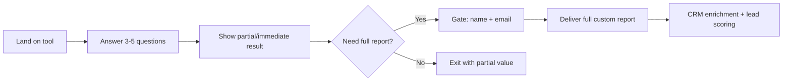

# B2B SaaS Interactive Content Strategy 2026

Interactive content (ROI calculators, maturity assessments, pricing simulators, configurators, and interactive demos) consistently delivers **2-3x higher engagement and conversion rates** than static content. In 2026, it is a primary demand-generation engine for B2B SaaS, not a novelty.

**Key benchmarks:**
| Metric | Interactive | Static (blog/PDF) |
|---|---|---|
| Completion rate | 60–95% | 20–40% |
| Lead conversion rate | 35–55% | 5–15% |
| Avg. session dwell time | 2.8–13 min | 0.5–2 min |
| Interaction-to-MQL rate | 2–3x higher | baseline |
| Interactive demo CVR uplift | +32% avg. | baseline |

Use this SKILL when you need to plan, build, deploy, or measure an interactive content asset for B2B demand generation.

---

## Step 1: Match tool type to funnel stage

| Funnel stage | Best interactive format | Purpose |
|---|---|---|
| **Top-of-funnel** (awareness) | Maturity assessment, industry benchmark quiz | Capture broad intent, segment by maturity level |
| **Mid-funnel** (consideration) | ROI calculator, cost-savings simulator | Quantify value, build a business case |
| **Bottom-funnel** (decision) | Configurator, product demo, pricing simulator | Handle complex requirements, reduce quote time |
| **Post-sale** (retention/expansion) | Health score dashboard, usage assessment | Identify expansion triggers, reduce churn |

**Rule of thumb:** One interactive asset per funnel stage. Do NOT build one tool and deploy it across all stages — the goal of a calculator (prove value) differs from a configurator (scope solution).

---

## Step 2: Design the progressive gate

Progressive gating captures high-intent leads without killing engagement.

**Rules for progressive gating:**
1. Always show a *partial* or *teaser* result before gating — builds trust and commitment
2. Gate only for the full/exportable report, not for the tool itself
3. Keep gate fields to ≤3 (name, email, optionally company size)
4. Collect implicit data from answers (budget range, pain points, team size) via hidden fields

---

## Step 3: Build the asset

### Tech stack options (sorted by effort)

| Approach | Effort | Best for |
|---|---|---|
| **No-code** (Typeform, Outgrow, Interact) | Hours | Quick tests, single assets |
| **Low-code** (Webflow + JS lib, Airtable + Softr) | Days | Mid-complexity calculators |
| **Custom** (React + API + CRM webhook) | 1–3 weeks | Complex configurators, high-volume |
| **Demo platform** (Navattic, Arcade, Walnut) | Days | Interactive product demos |

### Content structure for each format

**ROI calculator:**
- 5–8 input fields (current spend, team size, revenue, time spent on X)
- Real-time visual result (savings bar, time-recovered gauge)
- One-page downloadable PDF report at the end

**Maturity assessment:**
- 10–15 multiple-choice questions across 4–5 dimensions
- Scored radar chart output
- Benchmark comparison against industry peers

**Configurator:**
- 4–6 decision steps (use case, volume, integrations needed)
- Live pricing estimate after each step
- Pre-populated quote request at the end

---

## Step 4: Deploy with CRM integration

1. **Webhook the results** to your CRM (HubSpot, Salesforce) as a new contact with:
   - Source = `interactive:[tool-name]`
   - Score calculated from input answers (weighted by intent signals)
   - All raw answer values saved to custom properties
2. **Trigger automated routing:**
   - Score ≥ 80 → hot lead → SDR call within 1 hour
   - Score 50–79 → warm → nurture sequence (3-email drip with case studies matching their pain points)
   - Score < 50 → cold → monthly newsletter + retargeting
3. **Attribution setup:** Tag every downstream conversion (demo, trial, purchase) with the original interactive tool source. Use 90-day attribution windows.

---

## Step 5: Measure and optimize

### Core metrics to track weekly
- **Completion rate** (aim > 70%)
- **Gate conversion rate** (aim 35–55%)
- **Score-to-opportunity rate** (aim ≥ 5%)
- **Average session time** (aim > 3 min for calculators, > 6 min for configurators)
- **Form abandonment rate** (if > 40%, reduce gate fields or improve the partial result)

### Optimization cadence
- **Monthly:** A/B test question wording, length, and gating threshold
- **Quarterly:** Refresh benchmark data and industry references
- **Every 6 months:** Full rebuild if conversion rate drops 20%+ from baseline

### Anti-patterns
- ❌ Gating before showing ANY value — kills 70%+ of traffic
- ❌ Building one tool for all stages — weakens specificity
- ❌ Static benchmarks that never update — erodes credibility
- ❌ No CRM integration — interactive data rots in a spreadsheet
- ❌ Over-engineering (custom dev when no-code would work) — delays time-to-value

---

## Verification checklist

- [ ] Tool type matched to funnel stage
- [ ] Progressive gate shows partial result first
- [ ] Gate fields limited to ≤3
- [ ] Answers mapped to CRM custom properties
- [ ] Lead scoring rules set for each score tier
- [ ] Attribution source tag configured (90-day window)
- [ ] Weekly metric dashboard created
- [ ] A/B test framework in place for monthly iterations
- [ ] Interactive content benchmark data refreshed
- [ ] Quote generation time measured before/after (target: 40% reduction)

---

*Last updated: 2026-07-02 by SakSit Agent*