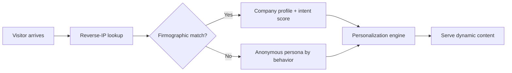

# B2B SaaS site Personalization for Demand Generation 2026

## When to use this skill
Use this skill when you need to:
- Turn your B2B SaaS site into a dynamic revenue engine that adapts to each visitor in real-time
- Implement AI-driven personalization without requiring heavy engineering resources
- Build an Account-Based Experience (ABX) strategy that coordinates marketing, sales, and product across the web surface
- Choose the right personalization platform for your stage (seed through scale-up)
- Measure and optimize personalization ROI across multiple touchpoints

## Prerequisites
- **Data foundation**: Reverse-IP resolution tool or CDP (e.g., 6sense, Demandbase, Clearbit) for visitor deanonymization
- **CMS/platform**: site must support dynamic content swapping (Webflow, HubSpot CMS, Next.js with a headless CMS, or a personalization tool overlay)
- **CRM integration**: Salesforce or HubSpot to map web behavior to pipeline stages
- **Minimum traffic**: At least 5,000 monthly site visitors for statistical significance in A/B testing

## Quick-start: The 4-surface minimum viable personalization

If you have limited resources, start here. Personalize these four surfaces for 5–8x ROI:

1. **Homepage hero** — Swap headline and subheadline by industry vertical or company name
2. **Pricing page** — Show annual-billing discount prominently for SMB segments; show enterprise features for accounts >500 employees
3. **Product pages** — Tailor case study/testimonial carousel to match visitor's industry
4. **CTAs** — Change CTA text by buying stage: "Watch Demo" for early-stage, "Talk to Sales" for late-stage intent signals

## Step 1: Build the data layer

### 1.1 Enable visitor identification
- Deploy reverse-IP enrichment (tools: Clearbit Reveal, 6sense, Demandbase)
- Target **30–40% identification rate** as baseline; top performers achieve 50–60%
- Fall back to behavioral segments (referrer source, pages visited, time on site) for unidentified visitors

### 1.2 Build intent signals
- Track first-party signals: pricing page visits, case study downloads, documentation depth
- Integrate third-party intent (G2 reviews searches, competitor comparison pages)
- Compose an **intent score**: Intent = (Recency weight × Signal strength) × Firmographic fit

### 1.3 Privacy compliance (critical)
- Do NOT personalize based on PII without consent
- Use company-level (not individual-level) personalization for anonymous visitors
- Deploy cookie-less identification via fingerprinting only with transparent privacy policy disclosure

## Step 2: Map your content matrix

Create a **content matrix** with three axes:

| Axis | Values |
|------|--------|
| **Persona** | Decision-maker, Influencer, Champion, end user |
| **Stage** | Awareness, Consideration, Decision, Retention |
| **Objection** | Price, Integration, Security, Scale, Time-to-value |

For each cell in this 4×4×5 matrix, define:
- **Hero headline** (max 10 words)
- **Primary CTA** text
- **Social proof** (case study or testimonial relevant to that persona/stage/objection)

**Automation tip**: Use generative AI (Claude, GPT-4) to draft all 80 variants at once from your brand guidelines, then A/B test the top 5 performers per surface.

## Step 3: Choose your implementation approach

### Option A: CMS-native (low effort, best for <10 variations)
- HubSpot CMS: Smart Content rules by list membership, device type, or referral source
- Webflow: Conditional visibility + custom code for dynamic text
- **Pros**: No additional cost; easy to maintain
- **Cons**: Limited to rule-based, not ML-driven

### Option B: Personalization platform overlay (mid effort, best for scale)
Recommended platforms for 2026:

| Platform | Best for | Key feature | Starting price |
|----------|----------|-------------|----------------|
| **Abmatic AI** | Full ABX orchestration | Intent scoring + dynamic content + ad personalization | Custom quote |
| **LiftPilot** | Real-time adaptive experiences | Adaptive Experience Engine for 1:1 content | $1,500+/month |
| **Markettailor** | Mid-market B2B | AI-generated content variants + CRM sync | $2,000+/month |
| **Warmly** | ABM-focused teams | Personalized landing pages + in-app chat integration | $800+/month |
| **Pagent** | CRO-obsessed teams | Autonomous A/B testing + optimization | $500+/month |

### Option C: Build custom (high effort, maximum flexibility)
- Implement via Next.js middleware + a feature flag system (LaunchDarkly, Statsig)
- Use Edge Functions (Vercel, Cloudflare Workers) for zero-latency content swaps
- ML personalization requires 100+ conversion events per segment for statistical validity

**Recommendation**: Start with Option B (platform overlay) to prove ROI within 60 days, then consider building custom only if you reach >100K monthly visitors.

## Step 4: Implementation roadmap

### Phase 1: Foundation (Days 1–14)
1. Deploy visitor identification across all pages
2. Set up CRM audience sync (create segments: "Top 200 target accounts", "Pricing page visitors >3x", "Competitor page visitors")
3. Install personalization dashboard to measure baseline metrics

### Phase 2: Quick wins (Days 15–30)
1. Personalize homepage hero for top 5 industry segments
2. Swap pricing page testimonial by visitor company size
3. Implement stage-based CTA logic for identified accounts
4. Run 14-day A/B test with 20% holdout group

### Phase 3: Expansion (Days 31–60)
1. Add personalization to blog/article recommendations (related content by industry)
2. Implement case study carousel personalization (5+ industry variants)
3. Deploy personalized exit-intent offers (e.g., industry-specific whitepapers)
4. Integrate intent-based site search results

### Phase 4: Optimization (Days 61–90+)
1. Move from rule-based to ML-driven variant selection
2. Implement cross-surface personalization (homepage → pricing → CTA flow)
3. A/B test personalization against control with holdout groups
4. Calculate full-funnel lift: traffic → MQL → SQL → opportunity → closed-won

## Step 5: Measure success

### Core metrics
| Metric | Benchmark | How to measure |
|--------|-----------|----------------|
| Visitor identification rate | 30–40% baseline, 50–60% top tier | (Identified visits / Total visits) × 100 |
| Engagement lift (personalized vs. control) | +20–40% time on page, +15–30% page depth | A/B test with holdout group |
| Conversion rate lift | +15–35% on personalized pages | Segment A/B test (identified visitors only) |
| Pipeline sourced from web personalization | 5–15% of total pipeline | CRM campaign tagging on personalized page views |
| ROI | 5–8x on 4+ personalized surfaces | (Revenue from personalized pipeline − Tool cost) / Tool cost |

### Attribution approach
- Use **W-shaped attribution**: 30% first touch (personalized page), 30% lead creation, 30% opportunity creation, 10% middle touches
- Personalization tools that integrate with CRM allow direct campaign-tagged pipeline reporting
- Run quarterly holdout tests (10% anonymous traffic receives default content) to measure incrementality

## Anti-patterns (avoid these)

1. **❌ Personalizing without holdout groups** — You can't measure lift without a control. Always retain 10–20% of traffic on default content.
2. **❌ Over-personalizing too early** — Start with 4 surfaces max. Each new variant adds complexity and potential for bad experiences.
3. **❌ Ignoring mobile** — 40–60% of B2B traffic is mobile. Ensure dynamic content renders correctly and doesn't slow page load.
4. **❌ Making promises you can't keep** — Don't show "Welcome back, [Company]!" if your identification has gaps. Use industry-level or behavior-level personalization instead.
5. **❌ Static personalization** — Personalization rules and content must be refreshed quarterly. Out-of-date case studies or expired offers erode trust.
6. **❌ Siloed ownership** — Personalization requires marketing, sales, product, and web ops collaboration. Assign a single owner who coordinates across teams.

## Tools reference (2026)

| Category | Tools |
|----------|-------|
| **Visitor identification** | Clearbit Reveal, 6sense, Demandbase, Leadfeeder |
| **Intent data** | G2 Buyer Intent, Bombora, TechTarget, ZoomInfo Intent |
| **Personalization platforms** | Abmatic AI, LiftPilot, Markettailor, Warmly, Tinct, Pagent, NewMode |
| **ABX orchestration** | Demandbase, 6sense, Terminus |
| **A/B testing** | VWO, Optimizely, Google Optimize, Pagent |
| **CDP** | Segment, mParticle, RudderStack |

## Verification checklist

- [ ] Visitor identification rate meets 30%+ baseline
- [ ] At least 4 surfaces are personalized (homepage, pricing, product pages, CTAs)
- [ ] Content matrix created with persona × stage × objection mapping
- [ ] 10–20% holdout group running for A/B test measurement
- [ ] CRM campaign tagging set up for pipeline attribution
- [ ] Mobile rendering verified for all personalized elements
- [ ] Privacy compliance reviewed (no PII-based personalization without consent)
- [ ] Quarterly refresh cadence established for personalization content
- [ ] Dashboard tracking: identification rate, engagement lift, conversion lift, pipeline sourced
- [ ] Single team owner assigned with cross-functional coordination mandate
