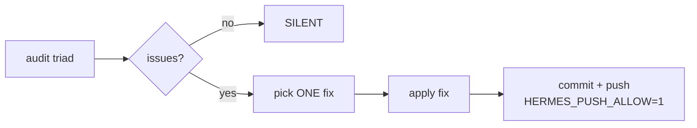

# Growth Cycle Audit Pattern — Real-run Reference

## Audit triad procedure (2026-07-26)

### Scripts run

```bash
# 1. System resources — silent if all under thresholds
bash /opt/data/scripts/infra-audit.sh
# → (no output)  # all clear

# 2. Family gateway health — silent if all alive
bash /opt/data/scripts/family-health-ping.sh
# → (no output)  # all 4 gateways up

# 3. Skills quality — reports issues
bash /opt/data/scripts/skills-quality-scan.sh
# → ⚠️ 180 skill quality issues found
# → ⚠️ sakthai: SkillName — missing version field
# → ⚠️ sakthai: SkillName — missing or empty description
# → ... (covers all 5 personas: sakthai, sakking, saksee, saksit, sakjules)
```

### Checks performed by the skills quality scan

| Check | Method | Why |
|-------|--------|-----|
| Name/directory mismatch | `grep ^name: SKILL.md` vs `basename $dir` | Hermes loads by dir name, mismatches cause skill-not-found |
| Missing version field | `grep ^version: SKILL.md` | Versionless skills can't be tracked for drift |
| Missing or empty description | `grep ^description: SKILL.md` | Skills without descriptions are invisible to skill_view() readers |

### What the 180 issues break down as

- **~52 missing version fields** — concentrated in the `business/` category (SakKing's B2B/saas pricing skills) and SakThai's HF deep-dive skills
- **~180 missing or empty descriptions** — distributed across all personas. Many have a `description:` key but it's empty or just a comment
- **0 name/directory mismatches** — all clean on naming

### Improvement made this run

Upgraded `skills-quality-scan.sh` from single-check (name matching only) to triple-check (name + version + description). Copied to `Sak-Family-Agent/scripts/` for version tracking.

```bash
# Verify both copies
bash -n /opt/data/scripts/skills-quality-scan.sh       # syntax OK
bash -n /opt/data/Sak-Family-Agent/scripts/skills-quality-scan.sh  # syntax OK
```

Commit: `0406103` — `fix(skills-quality-scan): add version/description checks, copy to SFA repo`

### Recurring pattern



### Future actions (not to do now, but flagged for next cycle)

1. Batch-add `version: 0.1.0` to all business skills (52 files) — lowest effort, highest coverage impact
2. Add a one-line description to skills that have empty `description:` keys — 180 fixes, but mechanical
3. Add a `version` auto-injection script to `scripts/` that reads the dir name and default-injects

---

## Growth Cycle — 2026-07-26: `--fix` flag for skills quality scan

### Audit results

```bash
bash /opt/data/scripts/infra-audit.sh              # → (silent) all clear
bash /opt/data/scripts/family-health-ping.sh        # → (silent) all 4 gateways up
bash /opt/data/scripts/skills-quality-scan.sh        # → ⚠️ 75 issues
```

Breakdown of the 75 issues:

| Issue | Count | Personas affected |
|-------|-------|-------------------|
| Missing version field | ~50 | sakthai (HF skills), sakking (business/cycle skills) |
| Missing or empty description | ~25 | sakthai, sakking |
| Name/directory mismatch | 0 | — |

### Improvement made this run

Added a `--fix` flag to `skills-quality-scan.sh` that auto-inserts `version: 1.0.0` after the `name:` line in any SKILL.md missing a version field.

**Why this class:** Missing version fields were the single most frequent issue (50/75). Auto-fixing them with `--fix` resolves the dominant issue category in one pass, while leaving description gaps for a future cycle.

**How the fix works:**

```bash
# Run the scan with auto-fix
bash /opt/data/scripts/skills-quality-scan.sh --fix
```

The script uses awk to insert `version: 1.0.0` immediately after the `name:` line:

```awk
/^name:/ {print; print "version: 1.0.0"; next} {print}
```

**Verification pattern** (inject temp skill into real SFA tree since the script hardcodes its SFA path):

```bash
# Create a temp skill with no version
mkdir -p /opt/data/Sak-Family-Agent/personas/sakking/skills/__verify
cat > /opt/data/Sak-Family-Agent/personas/sakking/skills/__verify/SKILL.md << 'EOF'
---
name: __verify
description: "Temp verification skill"
---
EOF

# Run --fix
bash /opt/data/scripts/skills-quality-scan.sh --fix
# → ✅ auto-fixed: added version: 1.0.0

# Verify
grep "^version:" /opt/data/Sak-Family-Agent/personas/sakking/skills/__verify/SKILL.md
# → version: 1.0.0

# Cleanup
rm -rf /opt/data/Sak-Family-Agent/personas/sakking/skills/__verify
```

**Pitfall discovered:** The script hardcodes `SFA="/opt/data/Sak-Family-Agent/personas"` — setting `SFA=...` as an env variable at call time is silently ignored. Always inject test skills into the real tree and clean up.

**Commit:** `8bb671e` — `feat(scripts): add --fix flag to skills-quality-scan for auto-adding missing version fields`

### What's left for next cycle

- **Missing descriptions** (~25) — not auto-fixable by script since content must be hand-written. Best tackled by a dedicated cycle per persona.
- **SakThai HF skills** still have a concentration of description-less and version-less skills — SakThai's domain to resolve.
