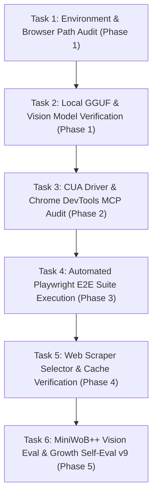

# PLAN.md — SakSee 👁️ Deep-Dive Task-by-Task Roadmap
> *Web Scraper, Playwright, DevTools & Vision Computer Use Execution Plan*
> *Status: Active Step-by-Step Execution*

---

## 📋 Deep-Dive Task Execution Breakdown (Step-by-Step, One-by-One)

---

### Phase 1: Foundation & Browser Environment Audit

#### 🔹 Task 1.1: Playwright Chromium & Comet Executable Audit
- **Goal**: Verify Playwright Chromium binary (`~/.cache/ms-playwright/chromium-1155`) and Perplexity Comet executable (`/mnt/c/Program Files/Perplexity/Comet/Application/comet.exe`) exist.
- **Estimated Time**: 2 minutes
- **Command**: `ls -la ~/.cache/ms-playwright/chromium-1155 && test -f "$COMET_EXE_PATH"`
- **Acceptance Criteria**: Both browser executable paths exist.

#### 🔹 Task 1.2: Local GGUF Browser Model & Vision API Health Check
- **Goal**: Verify local GGUF model `hf.co/Nanthasit/sakthai-coder-browser-gguf` (7.1 GB) is installed in local Ollama and `gemini-3.5-flash` vision API responds.
- **Estimated Time**: 3 minutes
- **Command**: `ollama list | grep sakthai-coder-browser-gguf`
- **Acceptance Criteria**: Model `e95bc8b10cc3` listed with size 7.1 GB.

---

### Phase 2: CUA Driver & DevTools MCP Socket Audit

#### 🔹 Task 2.1: CUA Driver Daemon Socket Verification
- **Goal**: Verify `cua-driver` daemon socket is active for desktop GUI & pixel coordinate targeting (`browser_click`, `browser_type`, `browser_scroll`).
- **Estimated Time**: 3 minutes
- **Command**: `PYTHONPATH=/home/beern /home/beern/saksee-env/bin/pytest /home/beern/tests/test_cua_socket.py`
- **Acceptance Criteria**: `test_cua_socket.py` passes 100%.

#### 🔹 Task 2.2: Chrome DevTools MCP Discovery
- **Goal**: Audit `chrome-devtools-mcp` stdio command.
- **Estimated Time**: 2 minutes
- **Command**: `npx -y chrome-devtools-mcp@latest --help`
- **Acceptance Criteria**: Help documentation rendered without errors.

---

### Phase 3: Automated Playwright E2E Suite Execution

#### 🔹 Task 3.1: Playwright E2E Test Suite Run
- **Goal**: Run automated web tests using `npx playwright test`.
- **Estimated Time**: 10 minutes
- **Command**: `npx playwright test tests/example.spec.ts`
- **Acceptance Criteria**: All Playwright test specs pass cleanly in headless Chromium.

#### 🔹 Task 3.2: SakSee Comet Chrome Script Run
- **Goal**: Run `tests/saksee_comet_chrome.ts` integration script.
- **Estimated Time**: 5 minutes
- **Command**: `npx tsx tests/saksee_comet_chrome.ts`
- **Acceptance Criteria**: Executed cleanly with 0 console errors.

---

### Phase 4: Web Scraper Selector & Cache Verification

#### 🔹 Task 4.1: Live Web Data Extraction & Timestamp Audit
- **Goal**: Verify scraped data objects include mandatory `retrieved_at` ISO timestamp.
- **Estimated Time**: 5 minutes
- **Rule**: Every scraped observation must contain `retrieved_at`.
- **Acceptance Criteria**: No plain scraped string missing timestamp.

#### 🔹 Task 4.2: Shared Memory Monitoring Cache Write
- **Goal**: Write scraped results to shared SQLite memory `~/.sakthai/memory.db`.
- **Estimated Time**: 3 minutes
- **Command**: `python3 -c "import sqlite3; conn = sqlite3.connect('/home/beern/.sakthai/memory.db'); print(conn.execute('SELECT count(*) FROM memory_facts;').fetchone())"`
- **Acceptance Criteria**: Memory table accepts observation rows with `monitoring-result` tag.

---

### Phase 5: Vision Evaluation & Growth Stage Self-Eval v9

#### 🔹 Task 5.1: MiniWoB++ UI Coordinate Accuracy Test
- **Goal**: Measure bounding box coordinate prediction accuracy on UI elements.
- **Estimated Time**: 10 minutes
- **Target**: >75% accuracy on element click targeting.

#### 🔹 Task 5.2: Self-Evaluation v9 Tag Write
- **Goal**: Calculate self-eval score (Integrity /25, Charge /20, Output Quality /30, Memory /15, Interruption /10) and write `cycle-eval` tag.
- **Estimated Time**: 3 minutes
- **Acceptance Criteria**: `eval-score` calculated and written before `cycle-complete` tag.

---

*SakSee Step-by-Step Task Master Plan · House of Sak*
